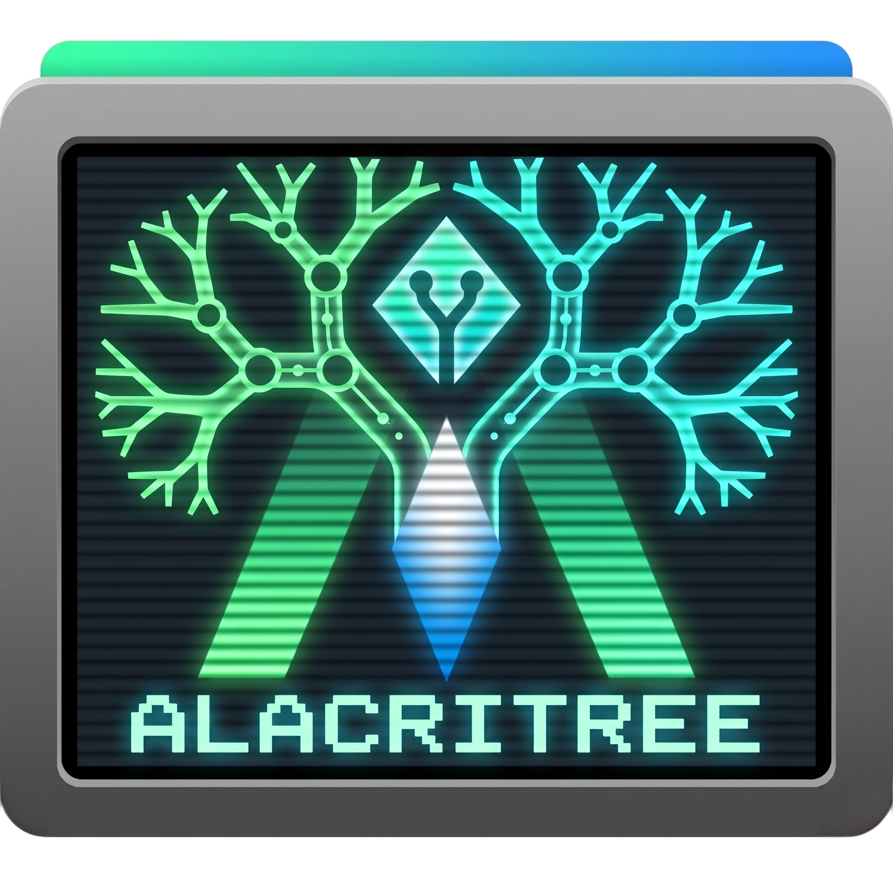
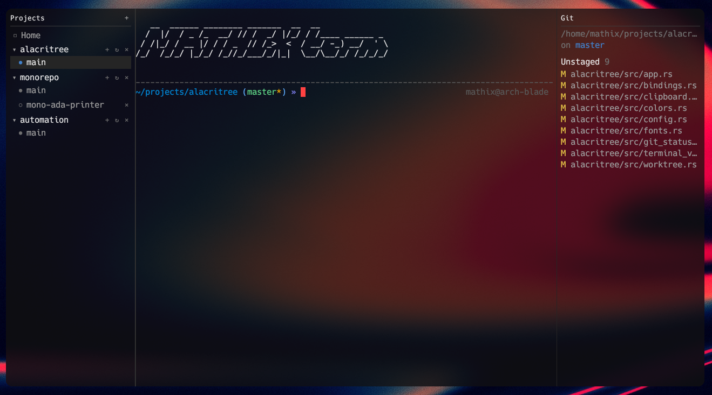
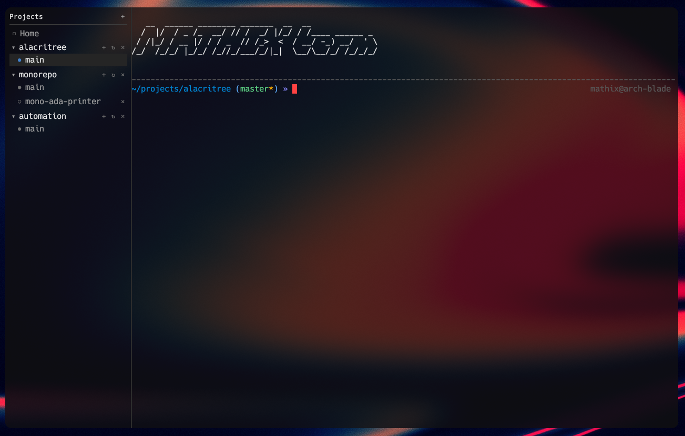
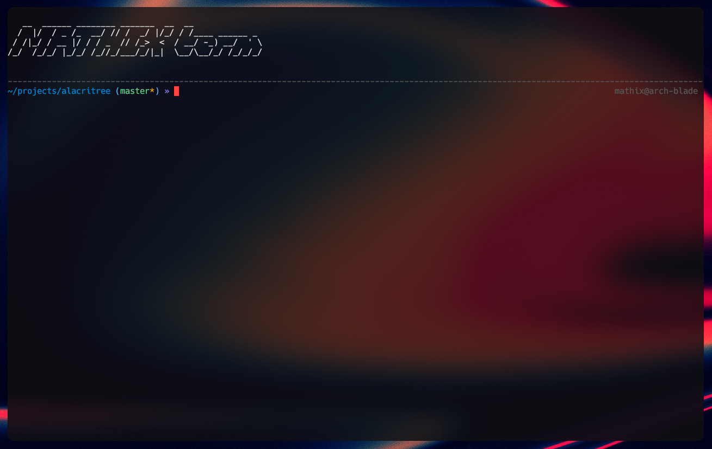

<p align="center">
    
</p>

<h1 align="center">Alacritree</h1>

<p align="center">
    A worktree-aware terminal that pairs <a href="https://github.com/alacritty/alacritty"><code>alacritty_terminal</code></a> with project and git sidebars.
</p>

## About

Alacritree is a fork of [Alacritty]. It reuses Alacritty's headless
`alacritty_terminal` crate (PTY, VT parser, grid) but replaces the winit/OpenGL
GUI with an [egui]/[eframe] shell that adds two things the upstream terminal
intentionally leaves out:

- **A project / worktree sidebar** on the left. Add a git repository and
  Alacritree lists its worktrees; switching worktrees switches you to a shell
  rooted in that path. Non-git folders work too — they show up as a single
  pseudo-worktree so you can still spawn a shell there.
- **A git status sidebar** on the right. Per-worktree staged/unstaged file
  lists and a diff-stat against the project's default branch, refreshed in the
  background.

Sessions are tabbed and outlive workspace switches: jumping between worktrees
doesn't kill running shells. Configuration is the same `alacritty.toml` you
already use (palette, cursor, scrolling, shell, key bindings), with an
optional `alacritree.toml` for sidebar-specific UI overrides.

[Alacritty]: https://github.com/alacritty/alacritty
[egui]: https://github.com/emilk/egui
[eframe]: https://github.com/emilk/egui/tree/master/crates/eframe

## Screenshots

<p align="center">
    
    
    
</p>

> **Status:** early, single-author project. Linux is the only supported
> platform today (the GUI deps currently target Linux); macOS/Windows builds
> are not wired up.

## Build

Workspace MSRV is **Rust 1.85** (edition 2024). System packages required on
Debian/Ubuntu:

```sh
sudo apt install \
    cmake pkg-config \
    libfreetype6-dev libfontconfig1-dev \
    libxkbcommon-dev libxcb-shape0-dev libxcb-xfixes0-dev \
    libwayland-dev libgl1-mesa-dev libegl1-mesa-dev
```

Then:

```sh
cargo run -p alacritree              # debug
cargo build -p alacritree --release  # release → target/release/alacritree
```

## Configuration

Alacritree reads the same files Alacritty does, in the same order:

1. `$XDG_CONFIG_HOME/alacritty/alacritty.toml`
2. `$XDG_CONFIG_HOME/alacritty.toml`
3. `$HOME/.config/alacritty/alacritty.toml`
4. `$HOME/.alacritty.toml`
5. `/etc/alacritty/alacritty.toml`

After loading `alacritty.toml`, Alacritree deep-merges an optional
`alacritree.toml` (same search path) on top. Merge semantics match
Alacritty's: arrays concatenate (so `[[keyboard.bindings]]` in
`alacritree.toml` *adds to* the upstream bindings rather than replacing
them), tables merge recursively, primitives replace.

Alacritree-only options live under `[ui]` in `alacritree.toml` — sidebar
colours, panel visibility, etc. See `alacritree/src/config.rs` for the
current schema.

## Repository layout

This is a Cargo workspace:

- `alacritree/` — **the fork.** GUI shell, sidebars, worktree integration.
- `alacritty_terminal/` — vendored from upstream Alacritty; used as a library.
- `alacritty/`, `alacritty_config/`, `alacritty_config_derive/` — vendored
  upstream crates. Treated as read-only here; the upstream `alacritty` GUI
  binary is **not** what this fork ships.

## Relationship to upstream Alacritty

Alacritree is not a competitor to or replacement for Alacritty. It depends on
upstream's terminal crate and would not exist without it. Upstream's
`CONTRIBUTING.md` (kept in this repo for the vendored crates) includes a "no
LLM contributions" policy — that policy applies to upstream Alacritty, not to
the `alacritree/` crate.

## License

Released under the [Apache License, Version 2.0](LICENSE-APACHE), matching
upstream Alacritty.
