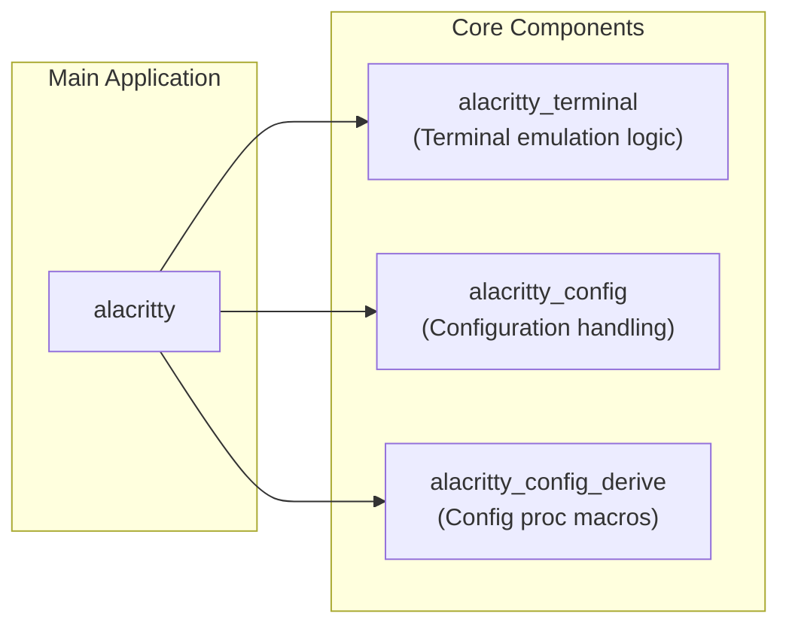
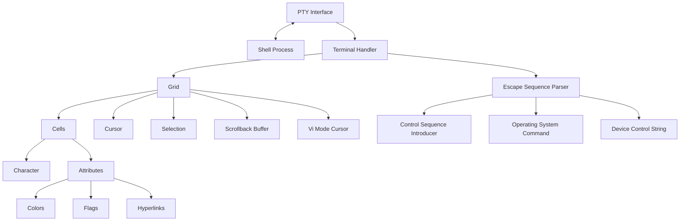
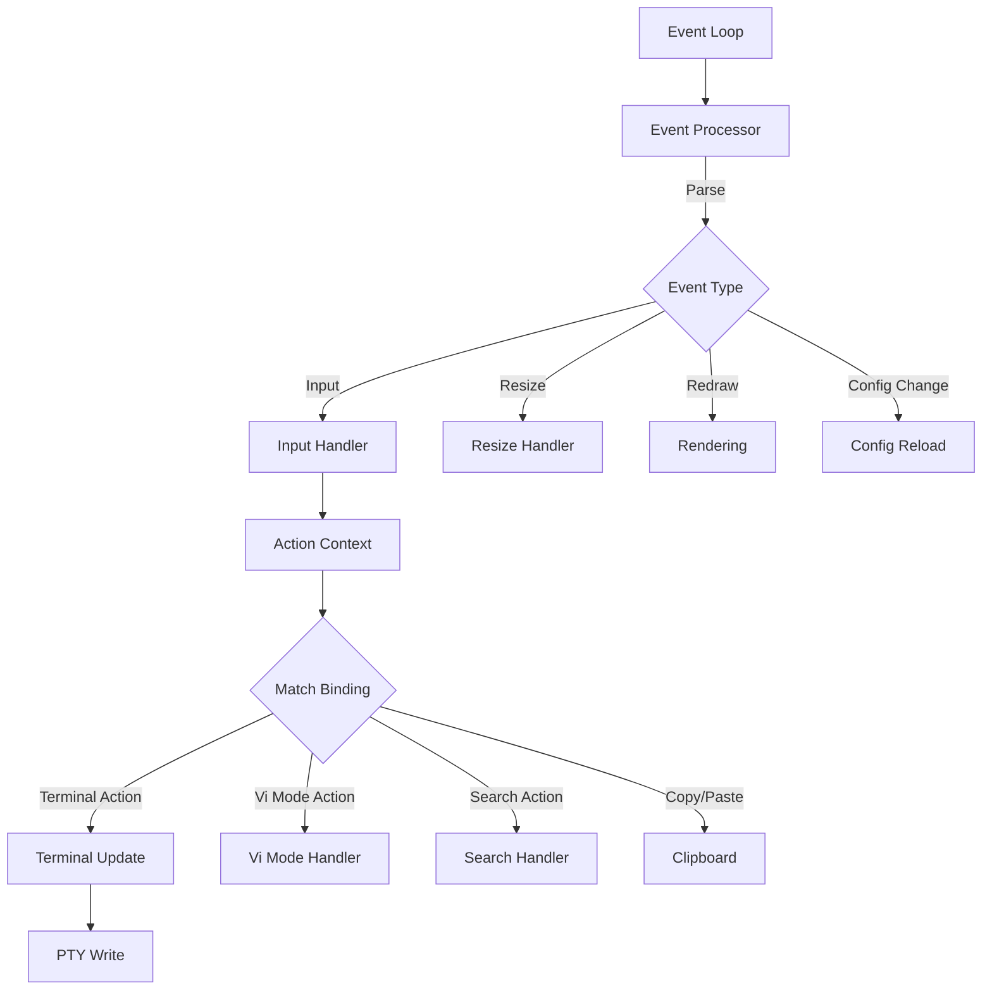
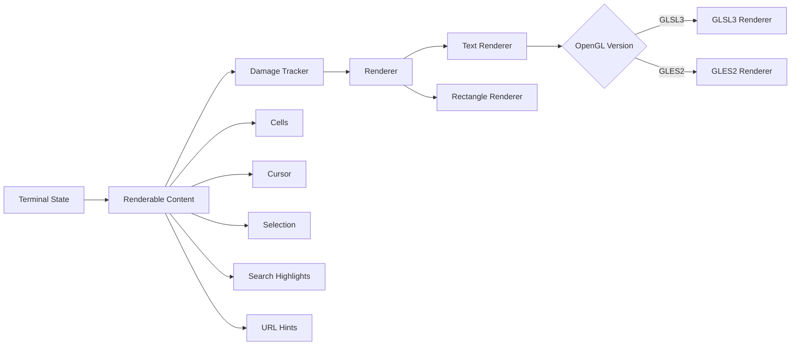
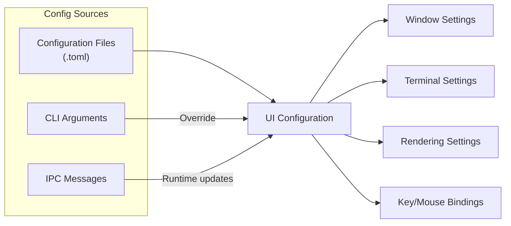
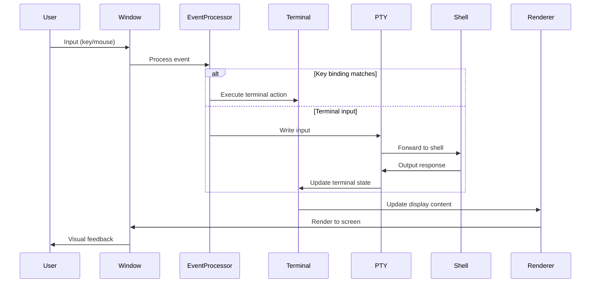

# Overview

<details>
<summary>Relevant source files</summary>

The following files were used as context for generating this wiki page:

- [.editorconfig](https://github.com/alacritty/alacritty/blob/a0c4dfe9/.editorconfig)
- [.github/workflows/release.yml](https://github.com/alacritty/alacritty/blob/a0c4dfe9/.github/workflows/release.yml)
- [CHANGELOG.md](https://github.com/alacritty/alacritty/blob/a0c4dfe9/CHANGELOG.md)
- [Cargo.lock](https://github.com/alacritty/alacritty/blob/a0c4dfe9/Cargo.lock)
- [INSTALL.md](https://github.com/alacritty/alacritty/blob/a0c4dfe9/INSTALL.md)
- [Makefile](https://github.com/alacritty/alacritty/blob/a0c4dfe9/Makefile)
- [README.md](https://github.com/alacritty/alacritty/blob/a0c4dfe9/README.md)
- [alacritty/Cargo.toml](https://github.com/alacritty/alacritty/blob/a0c4dfe9/alacritty/Cargo.toml)
- [alacritty_terminal/Cargo.toml](https://github.com/alacritty/alacritty/blob/a0c4dfe9/alacritty_terminal/Cargo.toml)

</details>


This document provides a high-level overview of Alacritty, a fast, cross-platform, OpenGL terminal emulator written in Rust. It covers the general architecture, core components, and how they interact to deliver high-performance terminal emulation.

For detailed information on installation procedures, see [Getting Started](#2), and for in-depth details about specific subsystems, refer to the respective sections in the [Architecture](#3) documentation.

## What is Alacritty?

Alacritty is a modern terminal emulator that focuses on performance and simplicity. Unlike many other terminal emulators, Alacritty leverages GPU acceleration through OpenGL to render terminal content, resulting in faster rendering speeds even with large amounts of rapidly changing text.

Key characteristics include:

- **Performance-oriented**: Fast rendering with minimal latency
- **Cross-platform**: Runs on Linux, macOS, BSD, and Windows
- **GPU-accelerated**: Uses OpenGL for rendering
- **Minimalist philosophy**: Provides core terminal functionality without built-in tabs or splits
- **Extensive configuration**: Supports customization through TOML configuration files
- **Vi mode**: Enables Vi-like navigation and text selection

Alacritty emphasizes integration with other tools rather than reimplementing functionality that can be provided by window managers or terminal multiplexers like tmux.

Sources: [README.md:5-18](https://github.com/alacritty/alacritty/blob/a0c4dfe9/README.md#L5-L18), [Cargo.toml:3-11](https://github.com/alacritty/alacritty/blob/a0c4dfe9/Cargo.toml#L3-L11)

## System Architecture Overview

Alacritty is structured into several distinct subsystems that interact to create a complete terminal emulation experience.

```mermaid
flowchart TD
    subgraph "User Interface Layer"
        UI["Window & Event System"]
        R["Rendering System"]
        CB["Clipboard"]
    end
    
    subgraph "Core Terminal Logic"
        TE["Terminal Emulator Core"]
        PTY["PTY System"]
    end
    
    subgraph "External Process"
        SP["Shell Process"]
    end
    
    subgraph "Configuration & Control"
        CONF["Configuration System"]
        IPC["CLI/IPC"]
    end
    
    U["User"] -- "Input" --> UI
    UI -- "Events" --> TE
    TE -- "Content" --> R
    R -- "Output" --> U
    
    TE <--> "I/O" --> PTY
    PTY <--> "I/O" --> SP
    
    CONF --> UI
    CONF --> TE
    CONF --> R
    
    IPC --> CONF
    IPC --> UI
    
    CB <--> UI
```

The system is organized around these main components:

1. **Terminal Core**: Handles terminal state, grid management, and text processing
2. **Window & Event System**: Manages window creation and input event processing
3. **Rendering System**: Converts terminal state to visual output using OpenGL
4. **PTY System**: Facilitates communication with the shell process
5. **Configuration System**: Handles user preferences and settings

Sources: [alacritty/Cargo.toml:13-44](https://github.com/alacritty/alacritty/blob/a0c4dfe9/alacritty/Cargo.toml#L13-L44), [alacritty_terminal/Cargo.toml:1-44](https://github.com/alacritty/alacritty/blob/a0c4dfe9/alacritty_terminal/Cargo.toml#L1-L44)

## Codebase Structure

The Alacritty project is organized into multiple Rust crates:



- **alacritty**: Main application with window management, rendering, and UI
- **alacritty_terminal**: Core terminal emulation functionality (grid, PTY, etc.)
- **alacritty_config**: Configuration system
- **alacritty_config_derive**: Procedural macros for configuration

This separation allows the terminal emulation core to be reused independently of the GUI application.

Sources: [alacritty/Cargo.toml:13-24](https://github.com/alacritty/alacritty/blob/a0c4dfe9/alacritty/Cargo.toml#L13-L24), [alacritty_terminal/Cargo.toml:1-12](https://github.com/alacritty/alacritty/blob/a0c4dfe9/alacritty_terminal/Cargo.toml#L1-L12)

## Core Subsystems

### Terminal Emulation Core

The terminal emulation core is the heart of Alacritty, responsible for maintaining the terminal state and processing terminal commands.



Key components:

- **Grid**: Manages a two-dimensional array of cells representing the terminal content
- **PTY**: Communicates with the shell process via a pseudoterminal
- **Escape Sequence Parsing**: Interprets control sequences (ANSI, VT100, etc.)
- **Selection Management**: Handles text selection, including block and semantic selections
- **Scrollback Buffer**: Stores terminal history that has scrolled off-screen

Sources: [alacritty_terminal/Cargo.toml:17-29](https://github.com/alacritty/alacritty/blob/a0c4dfe9/alacritty_terminal/Cargo.toml#L17-L29), [CHANGELOG.md:579-599](https://github.com/alacritty/alacritty/blob/a0c4dfe9/CHANGELOG.md#L579-L599)

### Event System

The event system processes user inputs and window events, translating them into actions that affect the terminal state.



Key features:

- **Event processing**: Handles keyboard, mouse, and window events
- **Keybinding system**: Maps key combinations to actions
- **Vi mode**: Provides keyboard-centric navigation
- **Search**: Allows searching through terminal content
- **Mouse handling**: Manages selection and clicking on URLs

Sources: [CHANGELOG.md:573-577](https://github.com/alacritty/alacritty/blob/a0c4dfe9/CHANGELOG.md#L573-L577), [CHANGELOG.md:383-401](https://github.com/alacritty/alacritty/blob/a0c4dfe9/CHANGELOG.md#L383-L401)

### Rendering System

Alacritty's rendering system converts terminal state into visible output using OpenGL for fast performance.



Key components:

- **Damage tracking**: Optimizes rendering by only redrawing changed areas
- **OpenGL rendering**: Uses hardware acceleration for fast text rendering
- **Text rendering**: Handles font rendering, including ligatures and emoji
- **Support for multiple OpenGL versions**: Works with both OpenGL and OpenGL ES

Sources: [alacritty/Cargo.toml:31](https://github.com/alacritty/alacritty/blob/a0c4dfe9/alacritty/Cargo.toml#L31), [CHANGELOG.md:339-345](https://github.com/alacritty/alacritty/blob/a0c4dfe9/CHANGELOG.md#L339-L345)

### Configuration System

Alacritty's configuration system manages user preferences and settings from multiple sources.



Configuration features:

- **TOML configuration files**: Structured, readable config format
- **Dynamic reloading**: Configuration changes applied without restart
- **Import system**: Allows modular configuration files
- **CLI overrides**: Command-line options can override config file settings
- **IPC control**: Runtime configuration changes via the `alacritty msg` command

Sources: [CHANGELOG.md:192-196](https://github.com/alacritty/alacritty/blob/a0c4dfe9/CHANGELOG.md#L192-L196), [README.md:56-70](https://github.com/alacritty/alacritty/blob/a0c4dfe9/README.md#L56-L70)

## Data Flow

The following diagram illustrates how data flows through Alacritty from user input to screen output:



This cycle repeats continuously as the user interacts with the terminal.

Sources: [CHANGELOG.md:713-730](https://github.com/alacritty/alacritty/blob/a0c4dfe9/CHANGELOG.md#L713-L730)

## Platform Support

Alacritty is designed to work across multiple platforms with consistent behavior:

| Platform | Window System | Features |
|----------|---------------|----------|
| Linux    | X11, Wayland  | Full feature set, GPU acceleration |
| macOS    | Cocoa/AppKit  | Native integration, retina display support |
| Windows  | Win32         | ConPTY integration (Windows 10+) |
| BSD      | X11           | Similar to Linux support |

Each platform has platform-specific code to handle:
- Window creation and management
- Input methods and keyboard handling
- Clipboard integration
- Font rendering

Sources: [alacritty/Cargo.toml:52-83](https://github.com/alacritty/alacritty/blob/a0c4dfe9/alacritty/Cargo.toml#L52-L83), [README.md:18](https://github.com/alacritty/alacritty/blob/a0c4dfe9/README.md#L18)

## Key Features

Alacritty includes several features that enhance the terminal experience:

- **Vi Mode**: Navigate and select text using Vi-like key bindings
- **Search**: Incremental search through terminal content
- **URL detection**: Automatically detect and highlight URLs
- **Hints**: Interactive system to highlight and interact with text patterns
- **Clipboard integration**: Support for system clipboard and OSC 52 sequence
- **Hyperlinks**: Support for embedded hyperlinks via OSC 8 escape sequence
- **Configuration hot-reload**: Apply config changes without restarting
- **IPC control**: Send commands to running Alacritty instances

Sources: [CHANGELOG.md:338-353](https://github.com/alacritty/alacritty/blob/a0c4dfe9/CHANGELOG.md#L338-L353), [README.md:32](https://github.com/alacritty/alacritty/blob/a0c4dfe9/README.md#L32)

## Summary

Alacritty is a performance-focused terminal emulator that uses modern technologies like Rust and OpenGL to provide a fast, minimalist experience. Its architecture separates concerns into distinct subsystems that work together to process user input, communicate with shell processes, and render terminal content efficiently.

The project emphasizes:
- Performance through GPU acceleration
- Cross-platform compatibility
- Minimalist design with high configurability
- Integration with existing tools rather than feature reimplementation