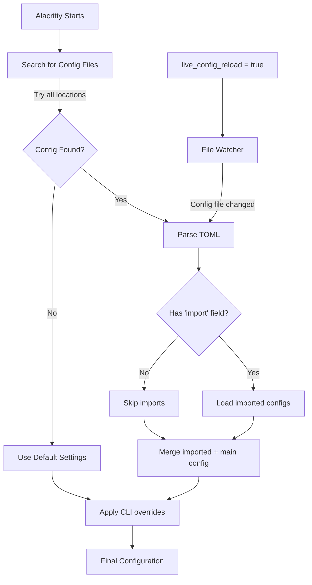
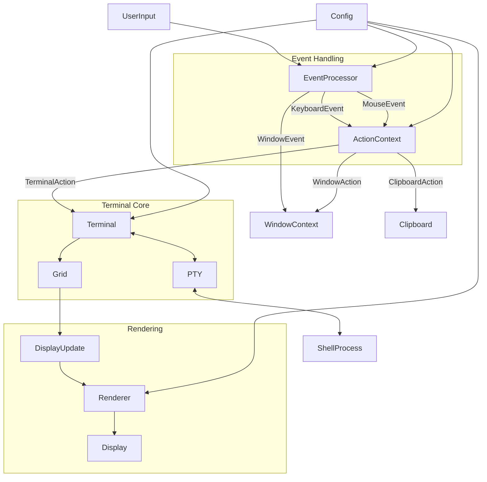

# Getting Started

<details>
<summary>Relevant source files</summary>

The following files were used as context for generating this wiki page:

- [.editorconfig](https://github.com/alacritty/alacritty/blob/a0c4dfe9/.editorconfig)
- [.github/workflows/release.yml](https://github.com/alacritty/alacritty/blob/a0c4dfe9/.github/workflows/release.yml)
- [INSTALL.md](https://github.com/alacritty/alacritty/blob/a0c4dfe9/INSTALL.md)
- [Makefile](https://github.com/alacritty/alacritty/blob/a0c4dfe9/Makefile)
- [README.md](https://github.com/alacritty/alacritty/blob/a0c4dfe9/README.md)
- [extra/man/alacritty-bindings.5.scd](https://github.com/alacritty/alacritty/blob/a0c4dfe9/extra/man/alacritty-bindings.5.scd)
- [extra/man/alacritty-msg.1.scd](https://github.com/alacritty/alacritty/blob/a0c4dfe9/extra/man/alacritty-msg.1.scd)
- [extra/man/alacritty.1.scd](https://github.com/alacritty/alacritty/blob/a0c4dfe9/extra/man/alacritty.1.scd)
- [extra/man/alacritty.5.scd](https://github.com/alacritty/alacritty/blob/a0c4dfe9/extra/man/alacritty.5.scd)

</details>


This page guides you through the initial steps of installing, configuring, and using Alacritty. By the end of this guide, you'll have Alacritty running on your system with a basic understanding of its configuration and usage patterns. For detailed information about specific features, refer to the Features section [Features](#4).

## Installation

Alacritty can be installed in several ways depending on your operating system.

### Using Package Managers

Alacritty is available through package managers on many Linux and BSD distributions:

| Distribution | Command |
|-------------|---------|
| Debian/Ubuntu | `apt install alacritty` |
| Arch Linux | `pacman -S alacritty` |
| Fedora | `dnf install alacritty` |
| CentOS/RHEL | See INSTALL.md |
| openSUSE | See INSTALL.md |
| FreeBSD | `pkg install alacritty` |

### Prebuilt Binaries

For macOS and Windows, prebuilt binaries are available from the [GitHub releases page](https://github.com/alacritty/alacritty/releases).

### Using Cargo

If you have the Rust toolchain installed, you can install Alacritty directly through cargo:

```sh
cargo install alacritty
```

Note that you'll still need to install the required dependencies for your operating system.

### Building from Source

For a complete build from source, follow these general steps:

1. Install dependencies for your OS (see the tables below)
2. Clone the repository
3. Build with cargo
4. Install additional components (terminfo, desktop entry, etc.)

#### Dependencies by OS

**Linux/BSD Dependencies:**

| OS | Installation Command |
|----|----------------------|
| Debian/Ubuntu | `apt install cmake g++ pkg-config libfreetype6-dev libfontconfig1-dev libxcb-xfixes0-dev libxkbcommon-dev python3` |
| Arch Linux | `pacman -S cmake freetype2 fontconfig pkg-config make libxcb libxkbcommon python` |
| Fedora | `dnf install cmake freetype-devel fontconfig-devel libxcb-devel libxkbcommon-devel g++` |

**Windows Dependencies:**
- Rust toolchain with `{architecture}-pc-windows-msvc` target
- Clang 3.9 or greater

For detailed build instructions for your specific platform, refer to the INSTALL.md file.

[README.md:40-49]()
[INSTALL.md:1-390]()

## Configuration File

Alacritty uses TOML configuration files for customization. Unlike many applications, Alacritty doesn't create a default configuration file automatically - you'll need to create one yourself.

### Configuration File Locations

Alacritty searches for a configuration file in the following locations:

**On Unix systems (Linux, macOS, BSD):**
1. `$XDG_CONFIG_HOME/alacritty/alacritty.toml`
2. `$XDG_CONFIG_HOME/alacritty.toml`
3. `$HOME/.config/alacritty/alacritty.toml`
4. `$HOME/.alacritty.toml`

**On Windows:**
* `%APPDATA%\alacritty\alacritty.toml`

### Configuration Loading Process

**Alacritty Configuration Initialization Flow**



### Creating a Basic Configuration File

To get started with configuration, create a file called `alacritty.toml` in one of the locations mentioned above. Here's a simple example:

```toml
[window]
opacity = 0.95
title = "Alacritty"
dimensions = { columns = 100, lines = 30 }

[font]
size = 12.0

[colors.primary]
background = "#1e1e1e"
foreground = "#d4d4d4"
```

### Key Configuration Sections

The Alacritty configuration file is organized into several main sections:

#### General Options

```toml
[general]
# Import additional configuration files
import = ["~/.config/alacritty/theme.toml"]
# Directory the shell is started in
working_directory = "~/projects"
# Live config reload (changes require restart)
live_config_reload = true
```

#### Window Settings

```toml
[window]
# Window dimensions (changes require restart)
dimensions = { columns = 100, lines = 30 }
# Window padding
padding = { x = 5, y = 5 }
# Background opacity
opacity = 0.95
# Window title
title = "Alacritty"
```

#### Font Configuration

```toml
[font]
# Font family and style
normal = { family = "Menlo", style = "Regular" }
bold = { style = "Bold" }
italic = { style = "Italic" }
# Font size in points
size = 12.0
```

#### Colors

```toml
[colors.primary]
background = "#1d1f21"
foreground = "#c5c8c6"

[colors.normal]
black = "#1d1f21"
red = "#cc6666"
green = "#b5bd68"
yellow = "#f0c674"
blue = "#81a2be"
magenta = "#b294bb"
cyan = "#8abeb7"
white = "#c5c8c6"
```

For a complete reference of all available configuration options, see the man page with `man 5 alacritty` or check the source file at [extra/man/alacritty.5.scd]().

[README.md:56-70]()
[extra/man/alacritty.5.scd:8-1002]()

## Command Line Options

Alacritty supports a variety of command line options for customization and control:

### Basic Usage

```
alacritty [FLAGS] [OPTIONS]
```

### Common Options

| Option | Description |
|--------|-------------|
| `--help` | Display help information |
| `--config-file FILE` | Specify an alternative config file |
| `-o, --option KEY=VALUE` | Override config file options |
| `-e, --command COMMAND` | Command and args to execute |
| `--working-directory DIR` | Start shell in specified directory |
| `-T, --title TITLE` | Define window title |
| `--hold` | Keep terminal open after command exits |
| `--class CLASS` | Define window class (on X11/Wayland) |

### Example Commands

```sh
# Start with a custom title and working directory
alacritty --title "Development Terminal" --working-directory ~/projects

# Launch with a specific command
alacritty -e vim ~/.bashrc

# Override config options
alacritty -o "window.opacity=0.8" -o "font.size=14.0"

# Use a different config file
alacritty --config-file ~/my-alacritty-config.toml
```

### Using `alacritty-msg`

Alacritty provides an IPC interface for interacting with running instances through the `alacritty-msg` command:

```sh
# Create a new window
alacritty-msg create-window

# Update configuration at runtime
alacritty-msg config "window.opacity=0.8"
```

[extra/man/alacritty.1.scd:7-137]()
[extra/man/alacritty-msg.1.scd:1-93]()

## Basic Usage and Features

Alacritty functions as a standard terminal emulator but includes several advanced features and optimizations.

### System Architecture

The following diagram illustrates Alacritty's main components and how they interact:



### Default Key Bindings

Alacritty comes with a set of default key bindings:

**Cross-platform bindings:**
* Copy: `Ctrl+Shift+C` (Windows/Linux) or `Command+C` (macOS)
* Paste: `Ctrl+Shift+V` (Windows/Linux) or `Command+V` (macOS)
* Search: `Ctrl+Shift+F` (Windows/Linux) or `Command+F` (macOS)
* Clear history: `Ctrl+L` (Windows/Linux) or `Command+K` (macOS)

**Scrolling:**
* Page up/down: `Shift+PageUp`/`Shift+PageDown`
* Top/bottom: `Shift+Home`/`Shift+End`

**Font size:**
* Increase: `Ctrl+Plus` (Windows/Linux) or `Command+Plus` (macOS)
* Decrease: `Ctrl+Minus` (Windows/Linux) or `Command+Minus` (macOS)
* Reset: `Ctrl+0` (Windows/Linux) or `Command+0` (macOS)

**Vi mode:**
* Toggle Vi mode: `Ctrl+Shift+Space`
* Various navigation keys available in Vi mode

### Customizing Key Bindings

You can customize key bindings in your configuration file:

```toml
[keyboard]
bindings = [
  # Create a new terminal window
  { key = "N", mods = "Control|Shift", action = "CreateNewWindow" },
  
  # Toggle fullscreen
  { key = "Return", mods = "Alt", action = "ToggleFullscreen" },
  
  # Send custom characters
  { key = "L", mods = "Control", chars = "\x0c" }
]
```

For a complete list of available key bindings and actions, refer to the man page with `man 5 alacritty-bindings` or check [extra/man/alacritty-bindings.5.scd]().

[extra/man/alacritty-bindings.5.scd:13-578]()

## Next Steps

Now that you have Alacritty installed and configured with basic settings, here are some suggested next steps:

1. Explore more configuration options in the man pages: `man 5 alacritty`
2. Customize your color scheme and key bindings
3. Learn about Alacritty's Vi mode and selection features (see [Features](#4))
4. Configure shell integration with your preferred shell (bash, zsh, fish, etc.)
5. Set up URL detection and other advanced features

For more specific information about Alacritty's features and capabilities, see the Features section [Features](#4).