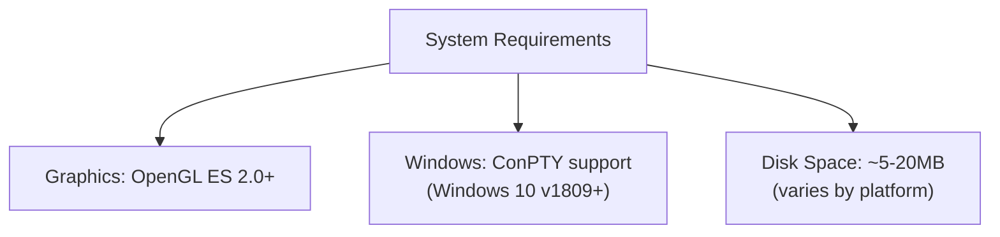
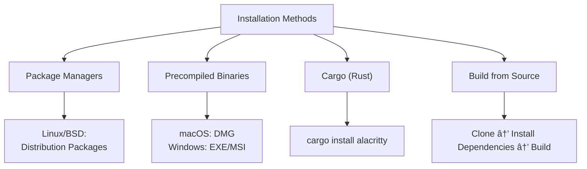
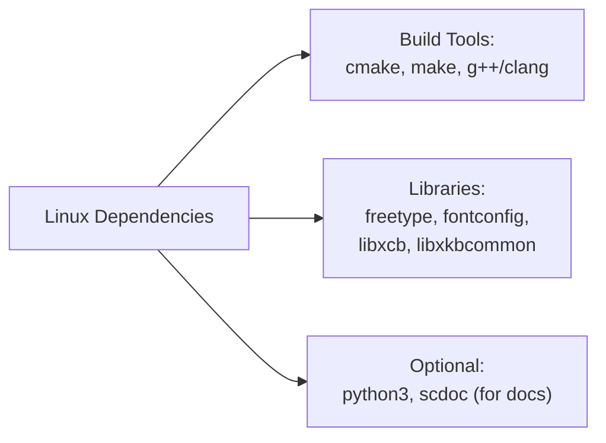
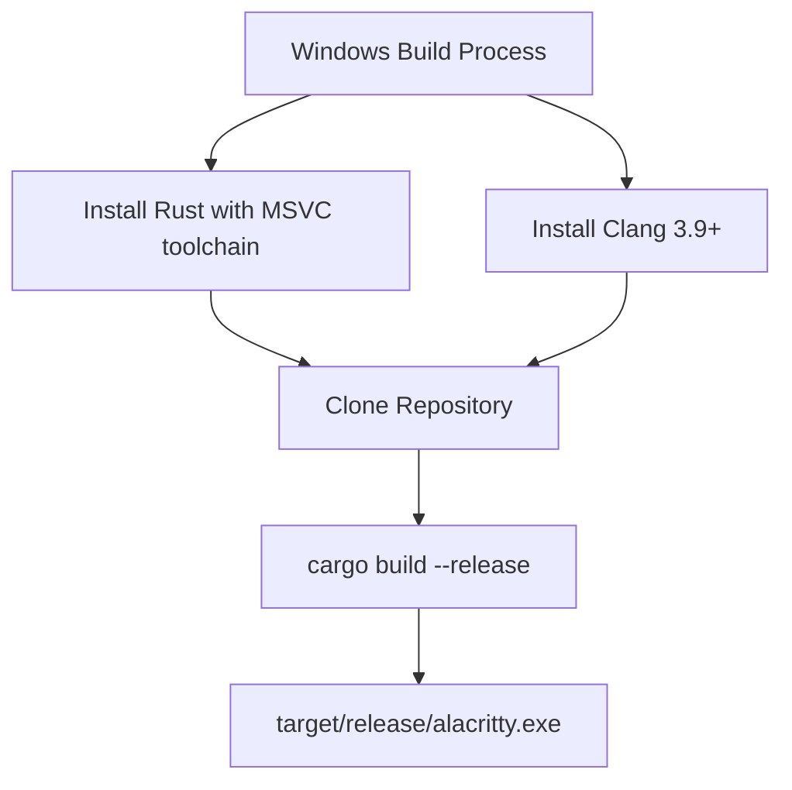
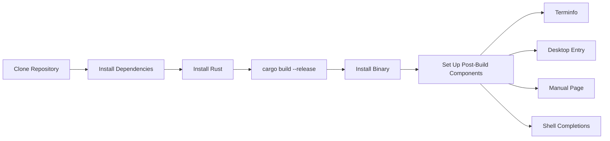
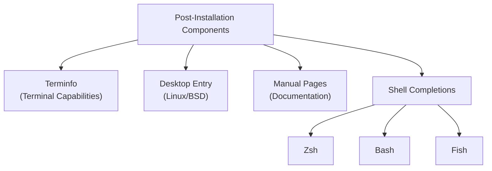

# Installation

<details>
<summary>Relevant source files</summary>

The following files were used as context for generating this wiki page:

- [.editorconfig](https://github.com/alacritty/alacritty/blob/a0c4dfe9/.editorconfig)
- [.github/workflows/release.yml](https://github.com/alacritty/alacritty/blob/a0c4dfe9/.github/workflows/release.yml)
- [INSTALL.md](https://github.com/alacritty/alacritty/blob/a0c4dfe9/INSTALL.md)
- [Makefile](https://github.com/alacritty/alacritty/blob/a0c4dfe9/Makefile)
- [README.md](https://github.com/alacritty/alacritty/blob/a0c4dfe9/README.md)
- [extra/osx/Alacritty.app/Contents/Info.plist](https://github.com/alacritty/alacritty/blob/a0c4dfe9/extra/osx/Alacritty.app/Contents/Info.plist)

</details>


This page provides detailed instructions for installing Alacritty on all supported platforms (Linux, macOS, Windows, and BSD). It covers both pre-built binaries and compilation from source, along with system requirements and post-installation configuration. For information about configuring Alacritty after installation, see [Configuration](#2.2).

## System Requirements

Alacritty has minimal system requirements but does need specific components to function properly:

- At least OpenGL ES 2.0 compatible graphics
- On Windows: ConPTY support (Windows 10 version 1809 or higher)



Sources: [README.md:51-54](https://github.com/alacritty/alacritty/blob/a0c4dfe9/README.md#L51-L54)

## Installation Methods Overview

Alacritty can be installed in several ways depending on your platform and preferences:

1. **Package Managers**: The recommended method for most users
2. **Precompiled Binaries**: Available for macOS and Windows
3. **Cargo (Rust Package Manager)**: Direct installation for Rust users
4. **Building from Source**: For customization or latest development version



Sources: [README.md:40-49](https://github.com/alacritty/alacritty/blob/a0c4dfe9/README.md#L40-L49), [INSTALL.md:1-10](https://github.com/alacritty/alacritty/blob/a0c4dfe9/INSTALL.md#L1-L10)

## Platform-Specific Installation

### Linux

Most Linux distributions provide Alacritty in their package repositories. This is the recommended installation method.

#### Popular Distributions

| Distribution | Installation Command |
|--------------|----------------------|
| Arch Linux   | `pacman -S alacritty` |
| Debian/Ubuntu| `apt install alacritty` |
| Fedora       | `dnf install alacritty` |
| openSUSE     | `zypper install alacritty` |
| Void Linux   | `xbps-install -S alacritty` |
| NixOS        | `nix-env -iA nixos.alacritty` |
| Gentoo       | `emerge x11-terms/alacritty` |

#### Dependencies for Building from Source

If you prefer to build from source, you'll need the following dependencies:



Sources: [INSTALL.md:80-237](https://github.com/alacritty/alacritty/blob/a0c4dfe9/INSTALL.md#L80-L237)

### macOS

#### Prebuilt Binary

The simplest method is to download the DMG from the [GitHub releases page](https://github.com/alacritty/alacritty/releases).

1. Download the latest `Alacritty-x.y.z.dmg`
2. Open the DMG file
3. Drag Alacritty to the Applications folder

#### Using Homebrew

```
brew install --cask alacritty
```

#### Building from Source

For macOS, building requires Rust and optionally `scdoc` for documentation:

```sh
# Clone the repository
git clone https://github.com/alacritty/alacritty.git
cd alacritty

# Build the application
make app

# Copy to Applications folder
cp -r target/release/osx/Alacritty.app /Applications/
```

For universal binary (both Intel and Apple Silicon):

```sh
# Add required targets
rustup target add x86_64-apple-darwin aarch64-apple-darwin

# Build universal app
make app-universal
```

Sources: [INSTALL.md:269-284](https://github.com/alacritty/alacritty/blob/a0c4dfe9/INSTALL.md#L269-L284), [Makefile:15-62](https://github.com/alacritty/alacritty/blob/a0c4dfe9/Makefile#L15-L62)

### Windows

#### Prebuilt Binary

1. Download the latest installer (`Alacritty-x.y.z-installer.msi`) or portable executable (`Alacritty-x.y.z-portable.exe`) from the [GitHub releases page](https://github.com/alacritty/alacritty/releases)
2. Run the installer or use the portable executable directly

#### Using Chocolatey or Scoop

```
# Chocolatey
choco install alacritty

# Scoop
scoop install alacritty
```

#### Building from Source

For Windows, you'll need:
- Rust with the `{architecture}-pc-windows-msvc` toolchain
- Clang 3.9 or greater



Sources: [INSTALL.md:238-246](https://github.com/alacritty/alacritty/blob/a0c4dfe9/INSTALL.md#L238-L246), [INSTALL.md:249-267](https://github.com/alacritty/alacritty/blob/a0c4dfe9/INSTALL.md#L249-L267)

### BSD

#### FreeBSD

```
pkg install alacritty
```

#### OpenBSD

```
pkg_add alacritty
```

#### Building from Source

For FreeBSD, you'll need:
```
pkg install cmake freetype2 fontconfig pkgconf python3
```

For OpenBSD, you'll need:
```
pkg_add rust python
```

Sources: [INSTALL.md:155-178](https://github.com/alacritty/alacritty/blob/a0c4dfe9/INSTALL.md#L155-L178)

## Building from Source (All Platforms)

The general process for building from source is:



### Step 1: Clone the Repository

```sh
git clone https://github.com/alacritty/alacritty.git
cd alacritty
```

### Step 2: Install Rust

```sh
curl --proto '=https' --tlsv1.2 -sSf https://sh.rustup.rs | sh
rustup override set stable
rustup update stable
```

### Step 3: Install Dependencies

See the platform-specific sections above for required dependencies.

### Step 4: Build

For Linux/Windows/BSD:
```sh
cargo build --release
```

For macOS:
```sh
make app
```

The binary will be created at:
- Linux/BSD/Windows: `target/release/alacritty`
- macOS: `target/release/osx/Alacritty.app`

Sources: [INSTALL.md:51-267](https://github.com/alacritty/alacritty/blob/a0c4dfe9/INSTALL.md#L51-L267)

## Post-Installation Setup

After installing Alacritty, there are several optional but recommended steps to enhance functionality.

### Terminfo

The terminfo files define terminal capabilities for applications. To install them:

```sh
# Global installation
sudo tic -xe alacritty,alacritty-direct extra/alacritty.info
```

### Desktop Entry (Linux/BSD)

For integration with desktop environments:

```sh
sudo cp target/release/alacritty /usr/local/bin
sudo cp extra/logo/alacritty-term.svg /usr/share/pixmaps/Alacritty.svg
sudo desktop-file-install extra/linux/Alacritty.desktop
sudo update-desktop-database
```

### Manual Pages

For easy reference documentation:

```sh
sudo mkdir -p /usr/local/share/man/man1
sudo mkdir -p /usr/local/share/man/man5
scdoc < extra/man/alacritty.1.scd | gzip -c | sudo tee /usr/local/share/man/man1/alacritty.1.gz > /dev/null
scdoc < extra/man/alacritty-msg.1.scd | gzip -c | sudo tee /usr/local/share/man/man1/alacritty-msg.1.gz > /dev/null
scdoc < extra/man/alacritty.5.scd | gzip -c | sudo tee /usr/local/share/man/man5/alacritty.5.gz > /dev/null
scdoc < extra/man/alacritty-bindings.5.scd | gzip -c | sudo tee /usr/local/share/man/man5/alacritty-bindings.5.gz > /dev/null
```

### Shell Completions

Alacritty provides shell completions for:

- **Zsh**: Copy `extra/completions/_alacritty` to a directory in your `$fpath`
- **Bash**: Source `extra/completions/alacritty.bash` in your `.bashrc`
- **Fish**: Copy `extra/completions/alacritty.fish` to your completions directory



Sources: [INSTALL.md:286-389](https://github.com/alacritty/alacritty/blob/a0c4dfe9/INSTALL.md#L286-L389)

## Verification

To verify your installation is working correctly:

1. Launch Alacritty from your application menu, desktop shortcut, or command line
2. Check the version to ensure you have the expected release:
   ```
   alacritty --version
   ```