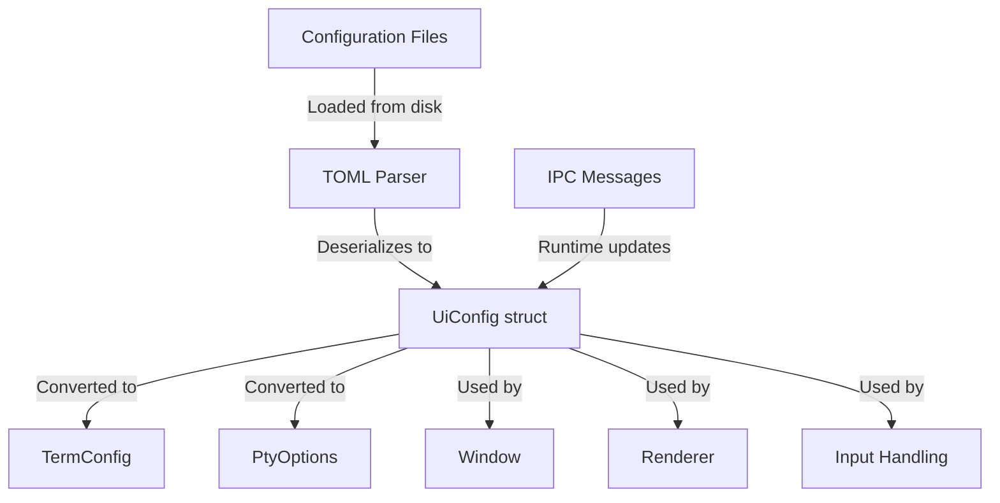
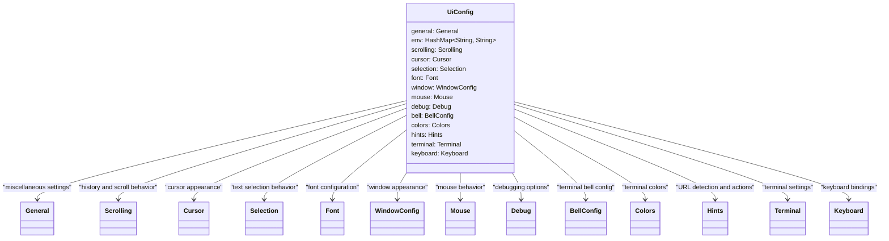
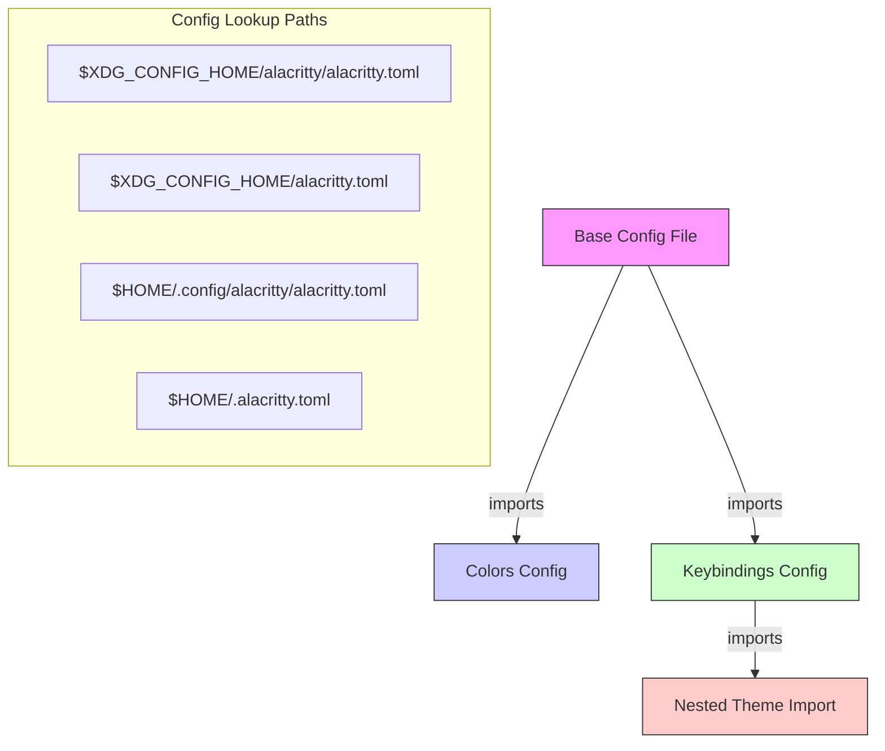
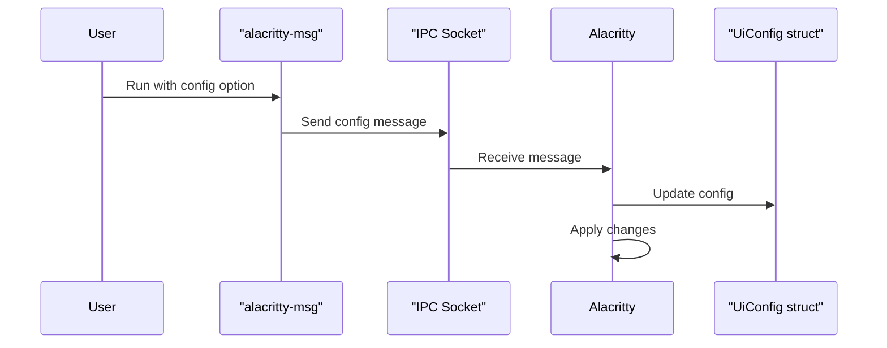

# Configuration

<details>
<summary>Relevant source files</summary>

The following files were used as context for generating this wiki page:

- [alacritty/src/config/ui_config.rs](https://github.com/alacritty/alacritty/blob/a0c4dfe9/alacritty/src/config/ui_config.rs)
- [alacritty/src/display/content.rs](https://github.com/alacritty/alacritty/blob/a0c4dfe9/alacritty/src/display/content.rs)
- [alacritty/src/display/hint.rs](https://github.com/alacritty/alacritty/blob/a0c4dfe9/alacritty/src/display/hint.rs)
- [alacritty/src/migrate/yaml.rs](https://github.com/alacritty/alacritty/blob/a0c4dfe9/alacritty/src/migrate/yaml.rs)
- [alacritty_config_derive/src/config_deserialize/de_struct.rs](https://github.com/alacritty/alacritty/blob/a0c4dfe9/alacritty_config_derive/src/config_deserialize/de_struct.rs)
- [alacritty_config_derive/src/serde_replace.rs](https://github.com/alacritty/alacritty/blob/a0c4dfe9/alacritty_config_derive/src/serde_replace.rs)
- [alacritty_config_derive/tests/config.rs](https://github.com/alacritty/alacritty/blob/a0c4dfe9/alacritty_config_derive/tests/config.rs)
- [alacritty_terminal/src/term/search.rs](https://github.com/alacritty/alacritty/blob/a0c4dfe9/alacritty_terminal/src/term/search.rs)
- [extra/man/alacritty-bindings.5.scd](https://github.com/alacritty/alacritty/blob/a0c4dfe9/extra/man/alacritty-bindings.5.scd)
- [extra/man/alacritty-msg.1.scd](https://github.com/alacritty/alacritty/blob/a0c4dfe9/extra/man/alacritty-msg.1.scd)
- [extra/man/alacritty.1.scd](https://github.com/alacritty/alacritty/blob/a0c4dfe9/extra/man/alacritty.1.scd)
- [extra/man/alacritty.5.scd](https://github.com/alacritty/alacritty/blob/a0c4dfe9/extra/man/alacritty.5.scd)

</details>


This page explains how to configure Alacritty through its TOML configuration file. It covers file locations, structure, common options, importing configurations, and runtime configuration updates.

For information about key and mouse bindings configuration, see [Key and Mouse Bindings](#4.1).

## Overview of the Configuration System

Alacritty uses a TOML-based configuration system that's designed to be flexible and user-friendly. The configuration file controls all aspects of Alacritty's behavior, from appearance to functionality.

![Configuration System Overview]



Sources: [alacritty/src/config/ui_config.rs:42-112](https://github.com/alacritty/alacritty/blob/a0c4dfe9/alacritty/src/config/ui_config.rs#L42-L112), [alacritty/src/config/ui_config.rs:116-134](https://github.com/alacritty/alacritty/blob/a0c4dfe9/alacritty/src/config/ui_config.rs#L116-L134)

## Configuration File Format

Alacritty uses the TOML (Tom's Obvious, Minimal Language) format for its configuration. TOML is a simple, easy-to-read configuration file format with a clear structure. Here's a brief example:

```toml
# This is a comment
[section]
key = "value"
number = 123

[nested.section]
array = ["item1", "item2"]
```

For a complete specification of the TOML format, see [https://toml.io/en/v1.0.0](https://toml.io/en/v1.0.0).

Sources: [extra/man/alacritty.5.scd:5-10](https://github.com/alacritty/alacritty/blob/a0c4dfe9/extra/man/alacritty.5.scd#L5-L10)

## Configuration File Locations

Alacritty doesn't create a default configuration file. Instead, it looks for one in the following locations:

On UNIX systems:
- `$XDG_CONFIG_HOME/alacritty/alacritty.toml`
- `$XDG_CONFIG_HOME/alacritty.toml`
- `$HOME/.config/alacritty/alacritty.toml`
- `$HOME/.alacritty.toml`

On Windows:
- `%APPDATA%\alacritty\alacritty.toml`

If no configuration file is found, Alacritty uses default settings. You can also specify a custom configuration file location using the `--config-file` command-line option:

```
alacritty --config-file /path/to/alacritty.toml
```

Sources: [extra/man/alacritty.5.scd:12-25](https://github.com/alacritty/alacritty/blob/a0c4dfe9/extra/man/alacritty.5.scd#L12-L25), [extra/man/alacritty.1.scd:64-78](https://github.com/alacritty/alacritty/blob/a0c4dfe9/extra/man/alacritty.1.scd#L64-L78)

## Configuration Structure

The Alacritty configuration is divided into sections, each controlling a different aspect of the terminal:

![Configuration Structure]



The major configuration sections are:

| Section | Description |
|---------|-------------|
| `[general]` | Working directory, config imports, live reload |
| `[env]` | Environment variables for the shell |
| `[window]` | Dimensions, position, opacity, decorations |
| `[scrolling]` | History size and scrolling behavior |
| `[font]` | Font family, style, size and offset |
| `[colors]` | Terminal colors, including themes |
| `[bell]` | Visual/audible bell settings |
| `[selection]` | Text selection behavior |
| `[cursor]` | Cursor style, blinking, thickness |
| `[terminal]` | Shell options and OSC52 settings |
| `[mouse]` | Mouse behavior and bindings |
| `[keyboard]` | Key bindings for various actions |
| `[hints]` | Configuration for URL detection |
| `[debug]` | Diagnostics and troubleshooting options |

Sources: [extra/man/alacritty.5.scd:27-1054](https://github.com/alacritty/alacritty/blob/a0c4dfe9/extra/man/alacritty.5.scd#L27-L1054), [alacritty/src/config/ui_config.rs:42-99](https://github.com/alacritty/alacritty/blob/a0c4dfe9/alacritty/src/config/ui_config.rs#L42-L99)

## Common Configuration Examples

Here are some common configuration examples to get you started:

### Changing the Font

```toml
[font]
normal = { family = "Fira Code", style = "Regular" }
bold = { family = "Fira Code", style = "Bold" }
italic = { family = "Fira Code", style = "Italic" }
bold_italic = { family = "Fira Code", style = "Bold Italic" }
size = 11.0
```

### Changing Colors

```toml
[colors.primary]
background = "#1d1f21"
foreground = "#c5c8c6"

[colors.normal]
black = "#1d1f21"
red = "#cc6666"
green = "#b5bd68"
yellow = "#f0c674"
blue = "#81a2be"
magenta = "#b294bb"
cyan = "#8abeb7"
white = "#c5c8c6"
```

### Adding Key Bindings

```toml
[keyboard]
bindings = [
  { key = "N", mods = "Control|Shift", action = "CreateNewWindow" },
  { key = "V", mods = "Control|Shift", action = "Paste" },
  { key = "C", mods = "Control|Shift", action = "Copy" },
]
```

### Customizing the Cursor

```toml
[cursor]
style = { shape = "Block", blinking = "On" }
blink_interval = 750
blink_timeout = 5
```

### Setting Window Opacity

```toml
[window]
opacity = 0.9
```

### Environment Variables

```toml
[env]
TERM = "xterm-256color"
WINIT_X11_SCALE_FACTOR = "1.0"
```

Sources: [extra/man/alacritty.5.scd:69-493](https://github.com/alacritty/alacritty/blob/a0c4dfe9/extra/man/alacritty.5.scd#L69-L493)

## Importing Configuration

Alacritty allows you to split your configuration across multiple files using the `import` field in the `[general]` section:

```toml
[general]
import = [
  "~/.config/alacritty/colors.toml",
  "~/.config/alacritty/keybindings.toml"
]
```

Imports are loaded in order, with later imports overriding earlier ones for any duplicated fields. Missing import files are skipped.

Import paths can be:
- Absolute paths (starting with `/`)
- Relative to the user's home directory (starting with `~/`)
- Relative to the current config file

![Configuration Imports]



Sources: [extra/man/alacritty.5.scd:30-47](https://github.com/alacritty/alacritty/blob/a0c4dfe9/extra/man/alacritty.5.scd#L30-L47)

## Command-Line Configuration Overrides

You can override configuration options from the command line using the `-o` or `--option` flag:

```
alacritty -o 'window.opacity=0.9' -o 'cursor.style.shape="Beam"'
```

This is useful for testing configuration changes or creating shell aliases with specific settings. Command-line overrides take precedence over both the configuration file and runtime configuration updates.

Sources: [extra/man/alacritty.1.scd:84-88](https://github.com/alacritty/alacritty/blob/a0c4dfe9/extra/man/alacritty.1.scd#L84-L88)

## Runtime Configuration

Alacritty supports runtime configuration updates through its IPC interface. The `alacritty-msg` command can send configuration changes to a running Alacritty instance:

```
alacritty-msg config 'cursor.style.shape="Beam"'
```

To clear all runtime changes and revert to settings from the configuration file:

```
alacritty-msg config --reset
```

By default, runtime changes apply to the currently focused window. You can target a specific window with the `--window-id` option, or use `-1` to apply changes to all windows:

```
alacritty-msg config --window-id=-1 'window.opacity=0.8'
```

![Runtime Configuration Updates]



Sources: [extra/man/alacritty-msg.1.scd:56-79](https://github.com/alacritty/alacritty/blob/a0c4dfe9/extra/man/alacritty-msg.1.scd#L56-L79)

## Live Config Reload

Alacritty can automatically reload the configuration file when it changes, allowing you to edit your configuration and see the changes immediately without restarting.

You can enable or disable this feature with the `live_config_reload` option in the `[general]` section:

```toml
[general]
live_config_reload = true
```

When enabled (the default), Alacritty watches for configuration file changes and reloads automatically. Some changes, like window dimensions, require a restart to take effect.

Sources: [extra/man/alacritty.5.scd:56-60](https://github.com/alacritty/alacritty/blob/a0c4dfe9/extra/man/alacritty.5.scd#L56-L60), [alacritty/src/config/ui_config.rs:172-174](https://github.com/alacritty/alacritty/blob/a0c4dfe9/alacritty/src/config/ui_config.rs#L172-L174)

## Validation and Error Handling

Alacritty validates configuration values during parsing and logs warnings or errors if it encounters problems:

- **Invalid values**: If a value has the wrong type or doesn't meet validation requirements, Alacritty logs an error and uses the default value instead.
- **Unrecognized fields**: If a field isn't recognized, Alacritty logs a warning about an unused config key.
- **Deprecated fields**: If a field is deprecated, Alacritty logs a warning suggesting an alternative when available.
- **Removed fields**: If a field has been removed, Alacritty logs a warning indicating it's no longer used.

Alacritty uses a "best-effort" approach to configuration parsing, applying as much of the configuration as possible even if parts are invalid.

Sources: [alacritty_config_derive/src/config_deserialize/de_struct.rs:113-124](https://github.com/alacritty/alacritty/blob/a0c4dfe9/alacritty_config_derive/src/config_deserialize/de_struct.rs#L113-L124), [alacritty_config_derive/tests/config.rs:84-143](https://github.com/alacritty/alacritty/blob/a0c4dfe9/alacritty_config_derive/tests/config.rs#L84-L143)

## Configuration Migration

If you're upgrading from an older version of Alacritty that used YAML configuration files, you can use the `alacritty migrate` command to migrate your configuration to the new TOML format:

```
alacritty migrate --config-file ~/.config/alacritty/alacritty.yml
```

This creates a new TOML file with equivalent settings. The migration process also applies transformations for deprecated or renamed fields, helping you keep your configuration up-to-date.

When importing other configuration files, the migration process recursively migrates those files as well, unless you specify the `--skip-imports` flag.

Sources: [extra/man/alacritty.1.scd:110-133](https://github.com/alacritty/alacritty/blob/a0c4dfe9/extra/man/alacritty.1.scd#L110-L133), [alacritty/src/migrate/yaml.rs:12-87](https://github.com/alacritty/alacritty/blob/a0c4dfe9/alacritty/src/migrate/yaml.rs#L12-L87)

## Reference Documentation

For a complete reference of all configuration options, see the Alacritty man pages:

```
man 5 alacritty
```

Or, for key and mouse bindings:

```
man 5 alacritty-bindings
```

These man pages provide detailed information on every configuration option, including default values and possible settings.