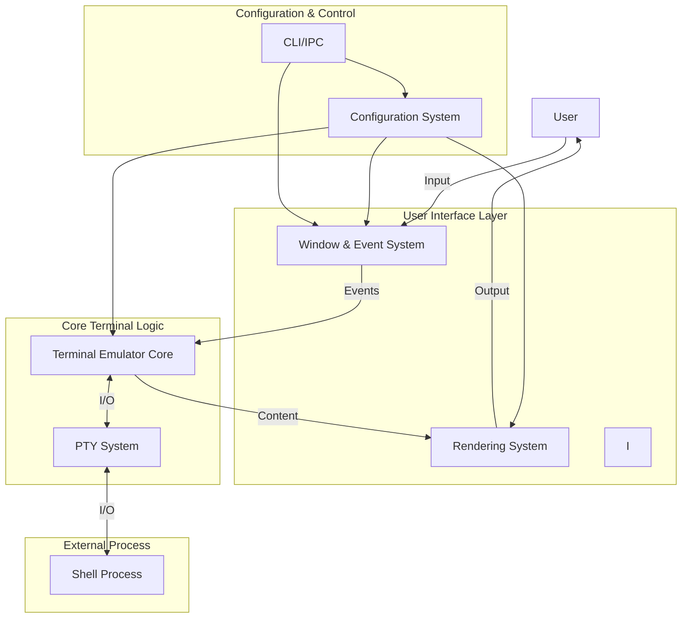
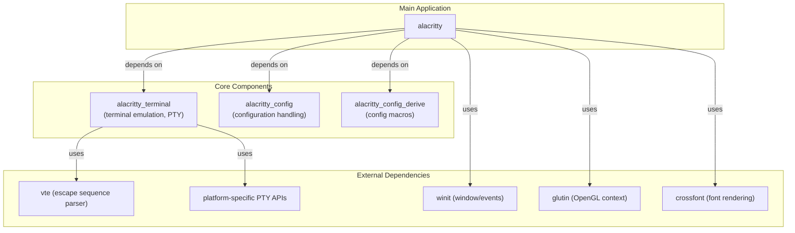
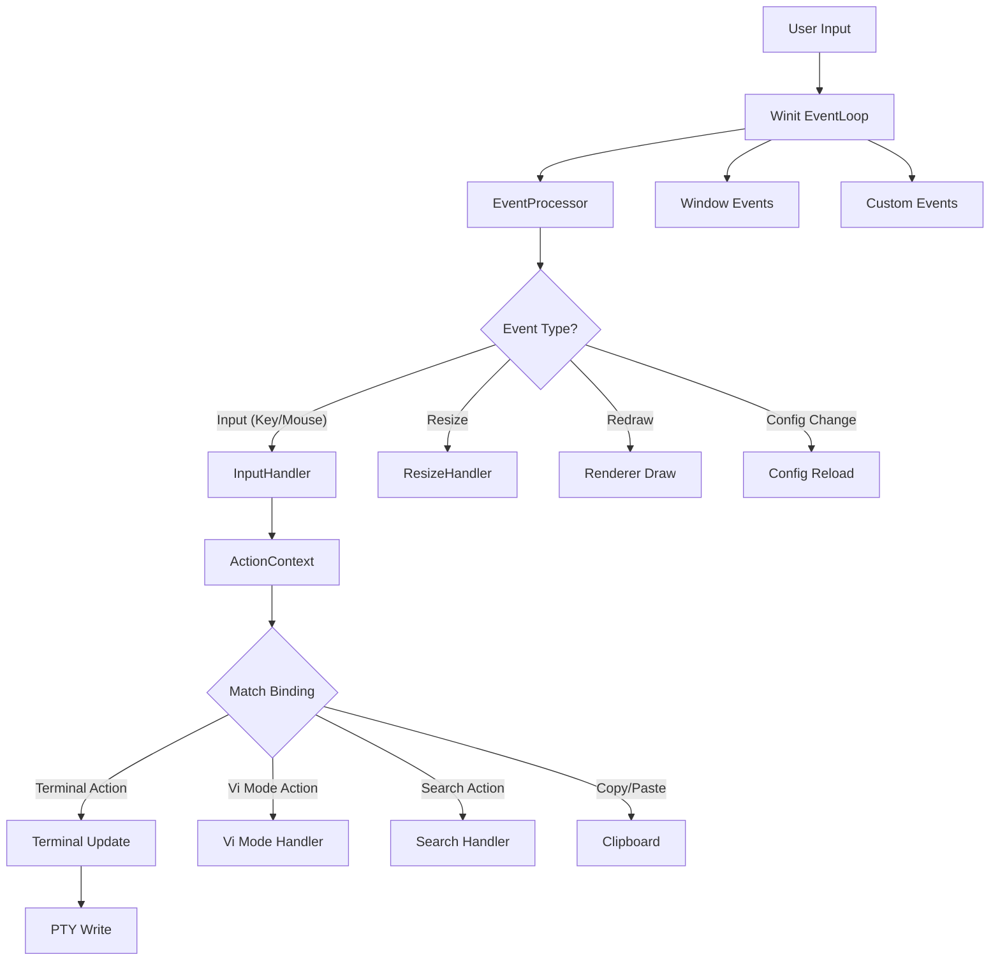
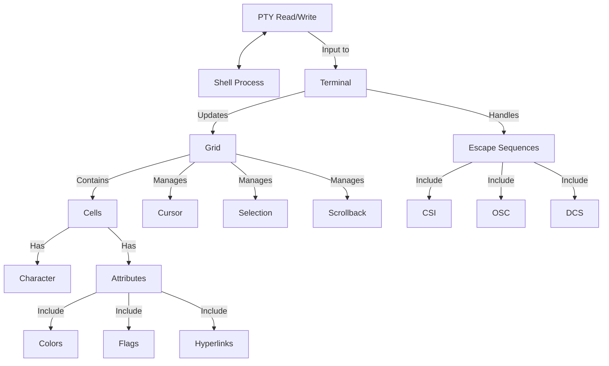
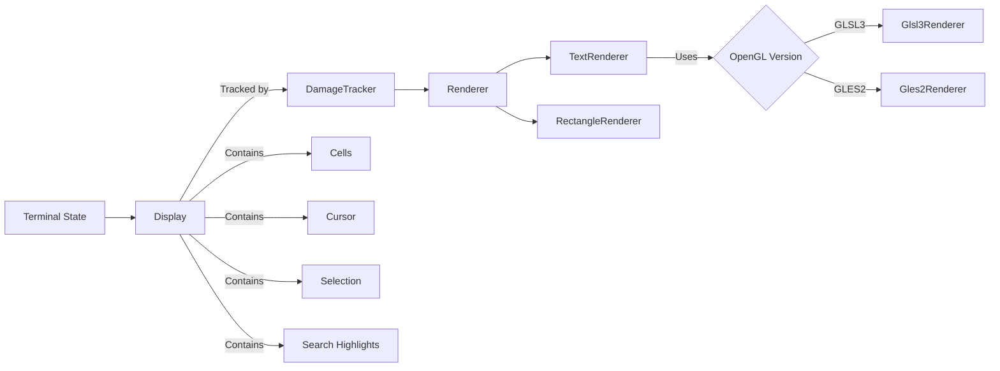
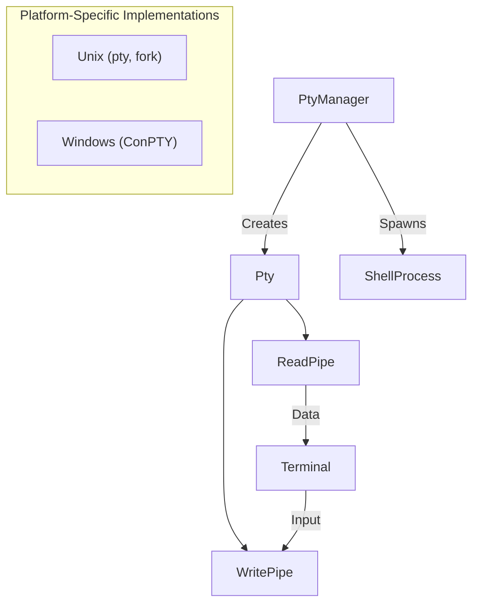
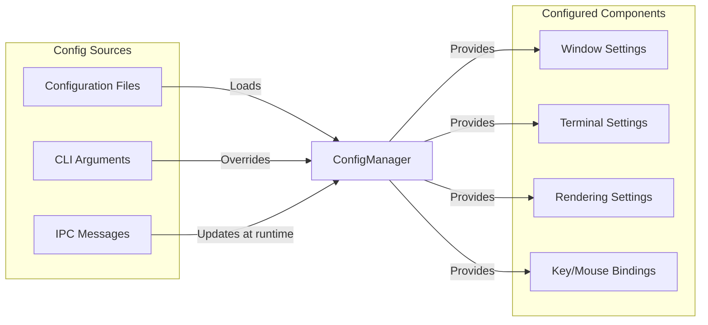
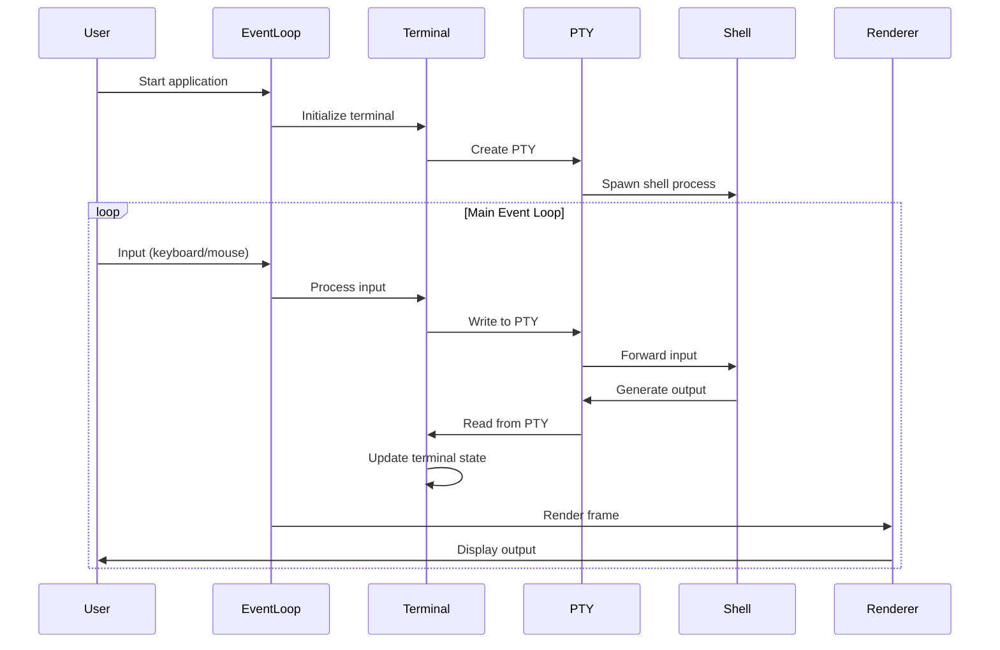
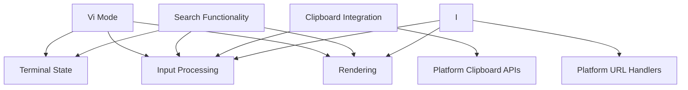
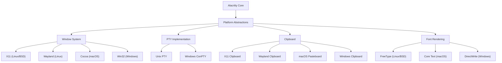

# Architecture

Relevant source files

The following files were used as context for generating this wiki page:

- [CHANGELOG.md](https://github.com/alacritty/alacritty/blob/a0c4dfe9/CHANGELOG.md)
- [Cargo.lock](https://github.com/alacritty/alacritty/blob/a0c4dfe9/Cargo.lock)
- [Cargo.toml](https://github.com/alacritty/alacritty/blob/a0c4dfe9/Cargo.toml)
- [alacritty/Cargo.toml](https://github.com/alacritty/alacritty/blob/a0c4dfe9/alacritty/Cargo.toml)
- [alacritty_terminal/Cargo.toml](https://github.com/alacritty/alacritty/blob/a0c4dfe9/alacritty_terminal/Cargo.toml)

This document provides an overview of Alacritty's system architecture, explaining how the different components work together to create a fast, cross-platform terminal emulator. For information about specific features, see [Features](#4).

## High-Level Architecture Overview

Alacritty follows a modular design with clear separation of concerns, organized around several key subsystems that work together to provide terminal emulation functionality.

### System Components Diagram

Sources:
- alacritty/Cargo.toml
- alacritty_terminal/Cargo.toml

## Project Structure

Alacritty is built using a multi-crate architecture, with clear separation between core terminal functionality and the user interface.

### Crate Organization

Sources:
- Cargo.toml
- alacritty/Cargo.toml
- alacritty_terminal/Cargo.toml
- alacritty_config/Cargo.toml

The key components in the architecture are:

1. **alacritty**: The main application crate containing UI, rendering, and event handling
2. **alacritty_terminal**: Core terminal emulation functionality, PTY handling, and terminal state
3. **alacritty_config**: Configuration parsing and validation
4. **alacritty_config_derive**: Procedural macros for configuration

## Core Subsystems

### Event Processing System

The event system is the heart of Alacritty's interactive capabilities, handling user input and system events.

Sources:
- alacritty/src/event.rs
- alacritty/src/input.rs

The event processing flow:
1. User input (keyboard/mouse) is captured by the `winit` event loop
2. Events are processed by the `EventProcessor`
3. Input events are matched against key/mouse bindings in `ActionContext`
4. Matched actions are dispatched to appropriate handlers
5. Terminal updates are sent to the PTY

### Terminal Core and Grid

The terminal core handles state management and communication with the shell.

Sources:
- alacritty_terminal/src/term/mod.rs
- alacritty_terminal/src/grid/mod.rs
- alacritty_terminal/src/ansi.rs

The terminal core:
1. Maintains a grid of cells representing the terminal display
2. Each cell contains a character and attributes (color, style, etc.)
3. Processes escape sequences from the PTY using the `vte` parser
4. Updates the grid based on parsed commands
5. Manages cursor, selection, and scrollback buffer

### Rendering Pipeline

The rendering system converts terminal state into visible output.

Sources:
- alacritty/src/display/mod.rs
- alacritty/src/renderer/mod.rs

The rendering pipeline:
1. Terminal state is managed by the `Display` component
2. Changes are tracked by the `DamageTracker` to optimize rendering
3. The `Renderer` uses OpenGL through `glutin` to draw content
4. Text is rendered using the `TextRenderer`
5. Backgrounds, cursor, and selections are drawn using the `RectangleRenderer`

### PTY System

The Pseudoterminal (PTY) system connects Alacritty to the shell process.

Sources:
- alacritty_terminal/src/tty/mod.rs
- alacritty_terminal/src/tty/unix.rs
- alacritty_terminal/src/tty/windows/mod.rs

The PTY system:
1. Creates a pseudoterminal appropriate for the platform
2. Spawns a shell process connected to the PTY
3. Provides read/write pipes for communicating with the shell
4. Has platform-specific implementations for Unix and Windows

### Configuration System

The configuration system provides settings for all parts of Alacritty.

Sources:
- alacritty/src/config/mod.rs
- alacritty_config/src/config.rs

The configuration system:
1. Loads and parses TOML configuration files
2. Applies command-line argument overrides
3. Supports live reloading of configuration
4. Provides settings to all subsystems
5. Handles IPC for runtime configuration changes

## Program Execution Flow

This sequence diagram illustrates the overall execution flow in Alacritty:

Sources:
- alacritty/src/main.rs
- alacritty/src/event_loop.rs

The program execution flow:
1. Application starts and initializes terminal, window, and renderer
2. A PTY is created and shell process spawned
3. The main event loop processes user input and system events
4. Input is forwarded to the shell process via the PTY
5. Shell output is read from the PTY and updates the terminal state
6. The renderer draws the terminal content to the screen
7. This cycle continues until the application is closed

## Cross-Cutting Features

Alacritty includes several key features that span multiple subsystems:

Sources:
- alacritty/src/input/mod.rs
- alacritty_terminal/src/vi_mode.rs
- alacritty/src/display/hint.rs

These cross-cutting features are implemented across multiple subsystems:
1. **Vi Mode**: Allows Vim-like navigation and selection within the terminal
2. **Search**: Text search functionality with highlighting
3. **Clipboard Integration**: Copy/paste with system clipboard
4. **URL Hints**: Detection and interaction with URLs in terminal content

## Platform-Specific Implementations

Alacritty provides consistent functionality across platforms through abstraction:

Sources:
- alacritty/src/window.rs
- alacritty_terminal/src/tty/mod.rs
- alacritty/src/clipboard.rs

Platform-specific implementations ensure Alacritty works consistently across:
1. **Window Systems**: X11, Wayland, Cocoa (macOS), and Win32 (Windows)
2. **PTY**: Unix (pty/fork) and Windows (ConPTY)
3. **Clipboard**: Platform-specific clipboard APIs
4. **Font Rendering**: FreeType, Core Text, and DirectWrite

## Related Pages

For more detailed information about the architecture components, refer to:
- [Project Structure](#3.1)
- [Terminal Core](#3.2)
- [Event System](#3.3)
- [Rendering Pipeline](#3.4)
- [PTY Interaction](#3.5)

Sources:
- Cargo.toml
- alacritty/Cargo.toml