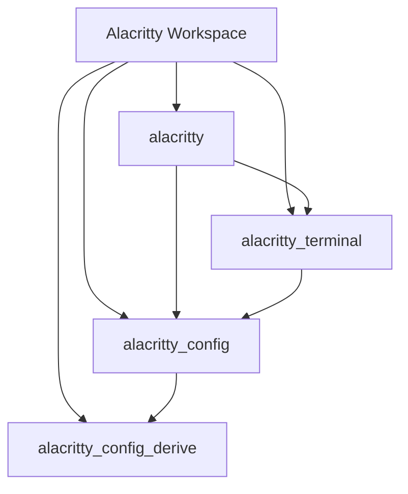
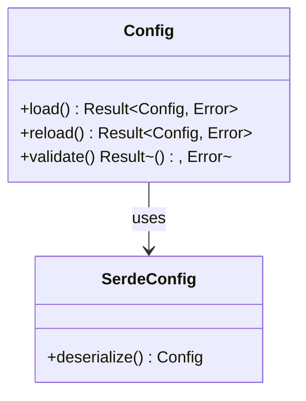
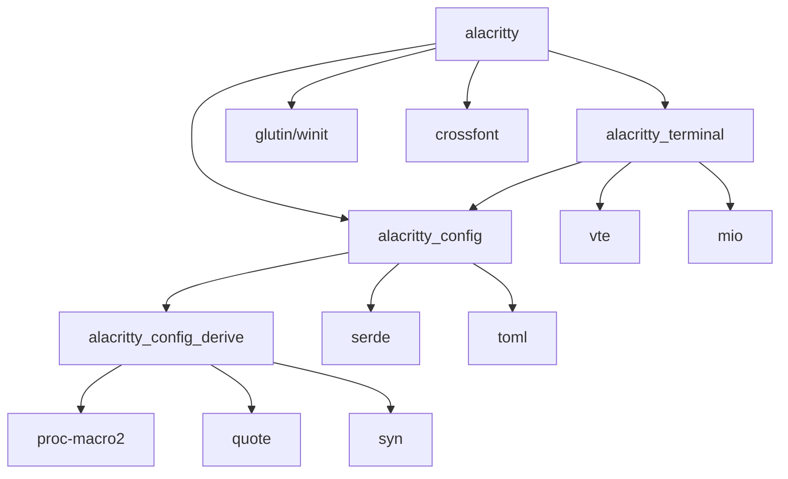
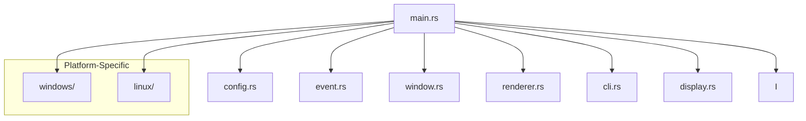
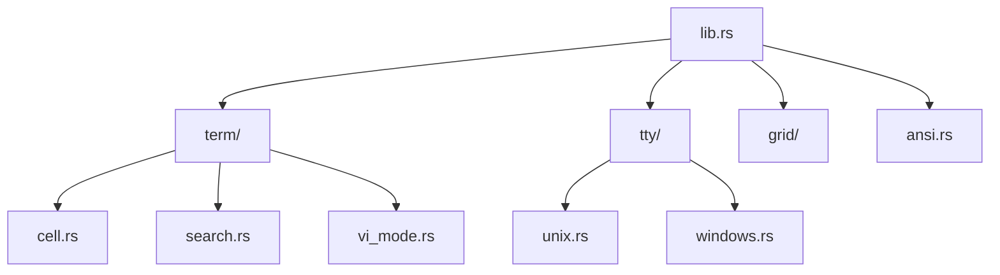

# Project Structure

<details>
<summary>Relevant source files</summary>

The following files were used as context for generating this wiki page:

- [Cargo.toml](https://github.com/alacritty/alacritty/blob/a0c4dfe9/Cargo.toml)
- [alacritty/windows/wix/alacritty.wxs](https://github.com/alacritty/alacritty/blob/a0c4dfe9/alacritty/windows/wix/alacritty.wxs)
- [alacritty_config/Cargo.toml](https://github.com/alacritty/alacritty/blob/a0c4dfe9/alacritty_config/Cargo.toml)
- [alacritty_config_derive/Cargo.toml](https://github.com/alacritty/alacritty/blob/a0c4dfe9/alacritty_config_derive/Cargo.toml)
- [alacritty_terminal/CHANGELOG.md](https://github.com/alacritty/alacritty/blob/a0c4dfe9/alacritty_terminal/CHANGELOG.md)

</details>


This document provides a detailed overview of the Alacritty project's codebase organization, explaining the repository structure, the purpose of each crate, and how they interact with each other. For specific details about the internal workings of the Terminal Core, see [Terminal Core](#3.2). For information about the Event System and Rendering Pipeline, refer to [Event System](#3.3) and [Rendering Pipeline](#3.4) respectively.

## Repository Organization

Alacritty is structured as a Rust workspace composed of multiple crates, each with a specific responsibility. This modular approach enhances maintainability and allows components to be developed and tested independently.



**Diagram: Alacritty Workspace Structure**

Sources: [Cargo.toml:1-14](https://github.com/alacritty/alacritty/blob/a0c4dfe9/Cargo.toml#L1-L14)

### Workspace Overview

The Alacritty workspace is defined in the root Cargo.toml, which specifies the member crates and global configuration options. The workspace uses the resolver 2 and sets specific optimization flags for release builds.

| Crate | Description | Primary Responsibility |
|-------|-------------|------------------------|
| alacritty | Main executable | Entry point, window management, application lifecycle |
| alacritty_terminal | Terminal emulation | Grid management, PTY handling, terminal state |
| alacritty_config | Configuration handling | Configuration parsing and validation |
| alacritty_config_derive | Code generation | Proc macros for configuration deserialization |

Sources: [Cargo.toml:1-14](https://github.com/alacritty/alacritty/blob/a0c4dfe9/Cargo.toml#L1-L14), [alacritty_config/Cargo.toml:1-20](https://github.com/alacritty/alacritty/blob/a0c4dfe9/alacritty_config/Cargo.toml#L1-L20), [alacritty_config_derive/Cargo.toml:1-28](https://github.com/alacritty/alacritty/blob/a0c4dfe9/alacritty_config_derive/Cargo.toml#L1-L28)

## Main Crates

### alacritty

The `alacritty` crate serves as the main executable component and entry point for the terminal emulator. It integrates all other components and manages the application lifecycle.

Key responsibilities:
- Application initialization and entry point
- Window management and event loop
- Integration of terminal, configuration, and rendering components
- Platform-specific implementations
- User interface elements
- Command-line interface and IPC handling

### alacritty_terminal

The `alacritty_terminal` crate contains the core terminal emulation functionality, including the terminal state management, PTY handling, and escape sequence processing.

Key responsibilities:
- Terminal emulation and state management (grid, cursor, etc.)
- PTY interface for shell communication
- Escape sequence parsing and handling
- Text selection and search
- Clipboard integration (including OSC 52 support)
- Vi mode implementation

Notable recent changes in the terminal crate include:
- Replacement of `Options::hold` with `Options::drain_on_exit`
- Addition of escape sequences for tab navigation
- Improvements to shell interaction on macOS
- PTY file descriptor handling optimizations

Sources: [alacritty_terminal/CHANGELOG.md:1-52](https://github.com/alacritty/alacritty/blob/a0c4dfe9/alacritty_terminal/CHANGELOG.md#L1-L52)

### alacritty_config

The `alacritty_config` crate provides abstractions for handling Alacritty's configuration. It leverages serde for deserialization and implements error-resistant configuration parsing.

Key responsibilities:
- Configuration file loading and parsing
- Configuration validation and error handling
- Exposing configuration values to other components
- Configuration reload handling



**Diagram: Configuration System Overview**

Sources: [alacritty_config/Cargo.toml:1-20](https://github.com/alacritty/alacritty/blob/a0c4dfe9/alacritty_config/Cargo.toml#L1-L20)

### alacritty_config_derive

The `alacritty_config_derive` crate provides procedural macros used by `alacritty_config` to implement error-resistant deserialization for configuration structures.

Key responsibilities:
- Generate code for deserializing configuration structures
- Handle deserialization errors gracefully
- Support partial configuration loading

The crate uses the proc-macro2, quote, and syn crates to generate Rust code. It's particularly designed to allow Alacritty to continue functioning even when parts of the configuration file contain errors.

Sources: [alacritty_config_derive/Cargo.toml:1-28](https://github.com/alacritty/alacritty/blob/a0c4dfe9/alacritty_config_derive/Cargo.toml#L1-L28)

## Crate Dependencies and Relationships

The following diagram illustrates the dependency relationships between Alacritty's crates and external dependencies:



**Diagram: Crate Dependencies**

Sources: [Cargo.toml:1-14](https://github.com/alacritty/alacritty/blob/a0c4dfe9/Cargo.toml#L1-L14), [alacritty_config/Cargo.toml:1-20](https://github.com/alacritty/alacritty/blob/a0c4dfe9/alacritty_config/Cargo.toml#L1-L20), [alacritty_config_derive/Cargo.toml:1-28](https://github.com/alacritty/alacritty/blob/a0c4dfe9/alacritty_config_derive/Cargo.toml#L1-L28)

## Code Organization Within Crates

### Main Binary Crate (alacritty)

The `alacritty` crate follows a modular organization with components for different functionality areas:



**Diagram: Main Crate Organization**

### Terminal Crate (alacritty_terminal)

The `alacritty_terminal` crate organizes its code into logical modules focused on terminal functionality:



**Diagram: Terminal Crate Organization**

## Build and Package Structure

Alacritty includes build configuration for different platforms, including Windows-specific installers using WiX. The installer:

- Includes the Alacritty executable
- Creates shortcuts and program menu entries
- Modifies the system PATH
- Adds context menu entries for launching Alacritty

Sources: [alacritty/windows/wix/alacritty.wxs:1-52](https://github.com/alacritty/alacritty/blob/a0c4dfe9/alacritty/windows/wix/alacritty.wxs#L1-L52)

## Cross-Cutting Concerns

Several design patterns and approaches are used throughout the Alacritty codebase:

1. **Platform Abstraction**: Platform-specific code is isolated in separate modules and uses trait-based abstractions for cross-platform compatibility.

2. **Error Handling**: Robust error handling with graceful degradation, especially in configuration processing.

3. **Event-Driven Architecture**: The application uses an event loop to process input, window events, and terminal updates.

4. **Rendering Optimization**: Damage tracking and optimized rendering to minimize GPU usage.

The repository structure supports these patterns through its modular design and clear separation of concerns.

## Release Profile Configuration

Alacritty uses specific release profile settings to optimize performance while maintaining debugging capabilities:

```toml
[profile.release]
lto = "thin"
debug = 1
incremental = false
```

This configuration enables thin link-time optimization, includes minimal debug information, and disables incremental compilation for release builds.