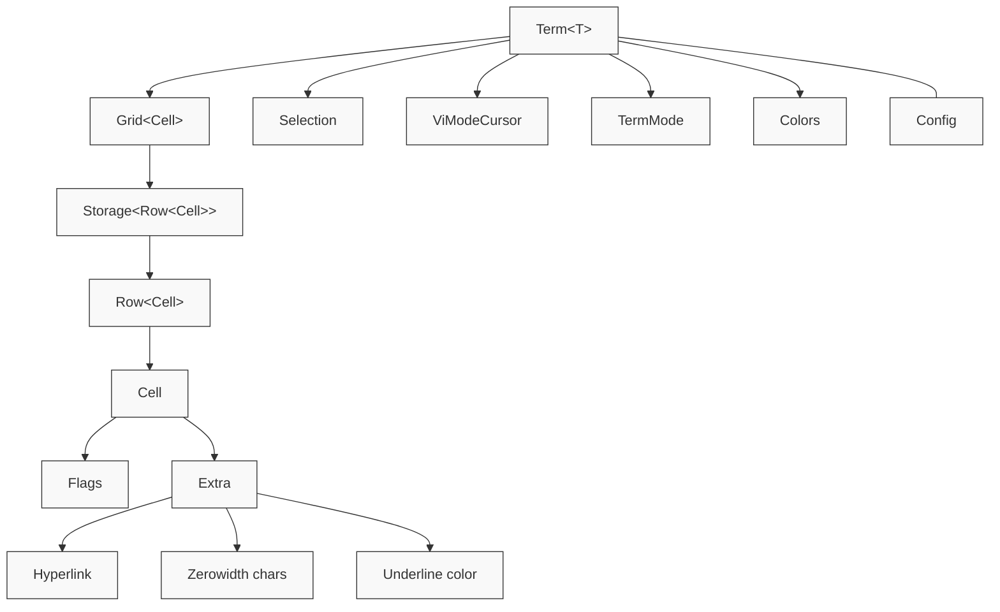
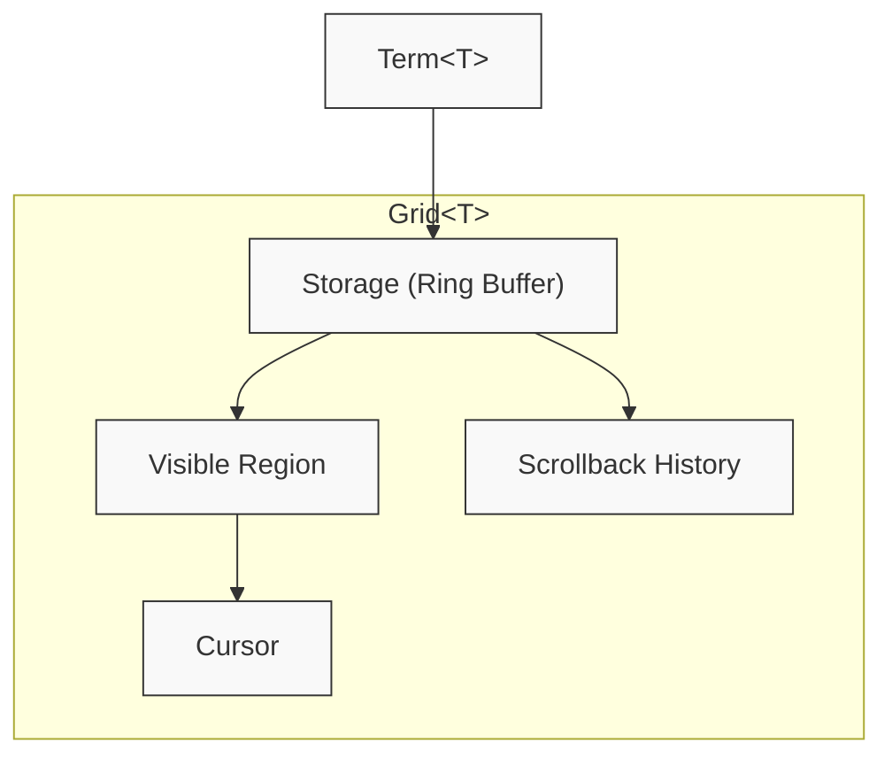
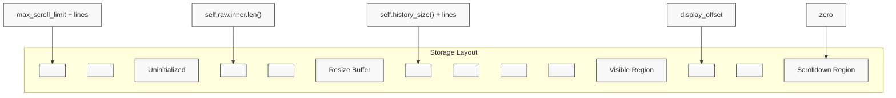
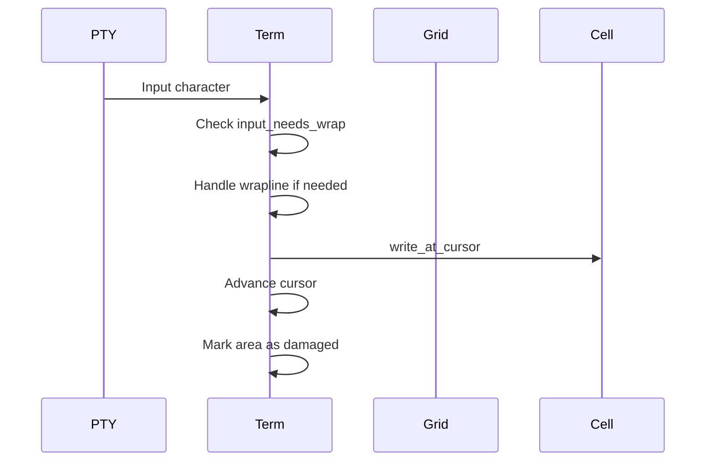
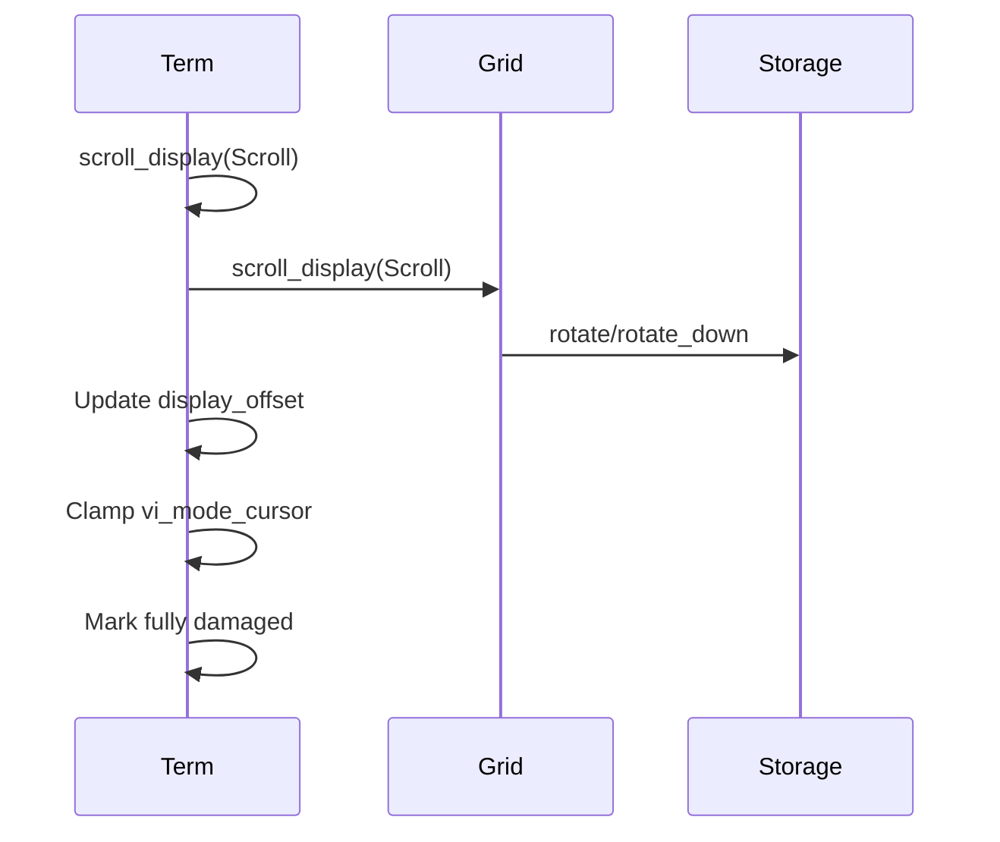
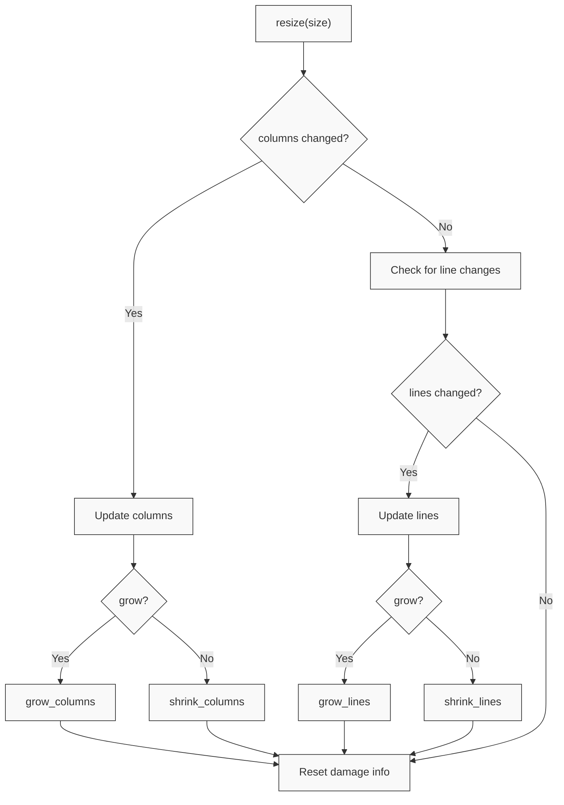
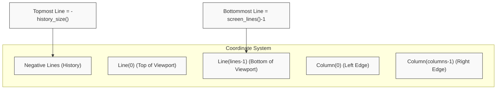

# Terminal Core

<details>
<summary>Relevant source files</summary>

The following files were used as context for generating this wiki page:

- [alacritty_terminal/src/grid/mod.rs](https://github.com/alacritty/alacritty/blob/a0c4dfe9/alacritty_terminal/src/grid/mod.rs)
- [alacritty_terminal/src/grid/resize.rs](https://github.com/alacritty/alacritty/blob/a0c4dfe9/alacritty_terminal/src/grid/resize.rs)
- [alacritty_terminal/src/grid/row.rs](https://github.com/alacritty/alacritty/blob/a0c4dfe9/alacritty_terminal/src/grid/row.rs)
- [alacritty_terminal/src/grid/storage.rs](https://github.com/alacritty/alacritty/blob/a0c4dfe9/alacritty_terminal/src/grid/storage.rs)
- [alacritty_terminal/src/grid/tests.rs](https://github.com/alacritty/alacritty/blob/a0c4dfe9/alacritty_terminal/src/grid/tests.rs)
- [alacritty_terminal/src/index.rs](https://github.com/alacritty/alacritty/blob/a0c4dfe9/alacritty_terminal/src/index.rs)
- [alacritty_terminal/src/selection.rs](https://github.com/alacritty/alacritty/blob/a0c4dfe9/alacritty_terminal/src/selection.rs)
- [alacritty_terminal/src/term/cell.rs](https://github.com/alacritty/alacritty/blob/a0c4dfe9/alacritty_terminal/src/term/cell.rs)
- [alacritty_terminal/src/term/mod.rs](https://github.com/alacritty/alacritty/blob/a0c4dfe9/alacritty_terminal/src/term/mod.rs)
- [alacritty_terminal/src/vi_mode.rs](https://github.com/alacritty/alacritty/blob/a0c4dfe9/alacritty_terminal/src/vi_mode.rs)
- [alacritty_terminal/tests/ref.rs](https://github.com/alacritty/alacritty/blob/a0c4dfe9/alacritty_terminal/tests/ref.rs)

</details>


The Terminal Core is the central component of Alacritty that manages the terminal state, including the grid of cells that store characters and attributes, cursor positioning, text selection, scrollback history, and terminal modes. It provides a high-level API for manipulating the terminal content and responding to user input and escape sequences.

This document covers the internal structures and mechanisms of the terminal core implementation. For information about handling terminal events, see [Event System](#3.3). For rendering of terminal content, see [Rendering Pipeline](#3.4). For communication with the shell process, see [PTY Interaction](#3.5).

## Core Components

The Terminal Core consists of several key components that work together to maintain the terminal state:



Sources: [alacritty_terminal/src/term/mod.rs:267-330](https://github.com/alacritty/alacritty/blob/a0c4dfe9/alacritty_terminal/src/term/mod.rs#L267-L330). [alacritty_terminal/src/term/cell.rs:134-221](https://github.com/alacritty/alacritty/blob/a0c4dfe9/alacritty_terminal/src/term/cell.rs#L134-L221).

### Term Structure

The `Term<T>` struct is the main structure that represents the terminal state. It contains references to all other components and provides methods for manipulating the terminal.

```mermaid
classDiagram
    class "Term<T>" {
        +Grid<Cell> grid
        +Grid<Cell> inactive_grid
        +ViModeCursor vi_mode_cursor
        +Option<Selection> selection
        +TermMode mode
        +Colors colors
        +Config config
        +bool is_focused
        +Cursor<Cell> cursor
        +Cursor<Cell> saved_cursor
        +Range<Line> scroll_region
        +TermDamageState damage
    }
    
    class "Grid<T>" {
        +Cursor<T> cursor
        +Cursor<T> saved_cursor
        +Storage<T> raw
        +usize columns
        +usize lines
        +usize display_offset
        +usize max_scroll_limit
    }
    
    class "Cell" {
        +char c
        +Color fg
        +Color bg
        +Flags flags
        +Option<Arc<CellExtra>> extra
    }
    
    class "TermMode" {
        <<bitflags>>
        +SHOW_CURSOR
        +APP_CURSOR
        +LINE_WRAP
        +ALT_SCREEN
        +VI
        +MOUSE_REPORT_CLICK
        +BRACKETED_PASTE
        +etc...
    }
    
    "Term<T>" *-- "Grid<Cell>"
    "Term<T>" *-- "TermMode"
    "Grid<T>" *-- "Cell"
```

Sources: [alacritty_terminal/src/term/mod.rs:267-330](https://github.com/alacritty/alacritty/blob/a0c4dfe9/alacritty_terminal/src/term/mod.rs#L267-L330). [alacritty_terminal/src/grid/mod.rs:108-138](https://github.com/alacritty/alacritty/blob/a0c4dfe9/alacritty_terminal/src/grid/mod.rs#L108-L138).

## Grid System

The Grid is a specialized 2D data structure optimized for terminal operations. It efficiently manages both the visible viewport and scrollback history using a ring buffer implementation.



Sources: [alacritty_terminal/src/grid/mod.rs:82-107](https://github.com/alacritty/alacritty/blob/a0c4dfe9/alacritty_terminal/src/grid/mod.rs#L82-L107). [alacritty_terminal/src/grid/storage.rs:1-42](https://github.com/alacritty/alacritty/blob/a0c4dfe9/alacritty_terminal/src/grid/storage.rs#L1-L42).

### Grid Memory Layout

The grid uses a specialized ring buffer structure to efficiently store and manage both the visible area of the terminal and the scrollback history:



Sources: [alacritty_terminal/src/grid/mod.rs:82-107](https://github.com/alacritty/alacritty/blob/a0c4dfe9/alacritty_terminal/src/grid/mod.rs#L82-L107). [alacritty_terminal/src/grid/storage.rs:10-135](https://github.com/alacritty/alacritty/blob/a0c4dfe9/alacritty_terminal/src/grid/storage.rs#L10-L135).

### Storage and Memory Management

The Storage class provides an optimized ring buffer implementation for efficiently managing the grid content:

1. **Zero-based Indexing**: Uses a `zero` field to track the starting point of the ring buffer
2. **Efficient Rotation**: Fast buffer rotation using modular arithmetic rather than moving data
3. **Lazy Initialization**: Only initializes memory when needed
4. **Optimized Swapping**: Custom implementation for performance

Sources: [alacritty_terminal/src/grid/storage.rs:32-42](https://github.com/alacritty/alacritty/blob/a0c4dfe9/alacritty_terminal/src/grid/storage.rs#L32-L42). [alacritty_terminal/src/grid/storage.rs:143-176](https://github.com/alacritty/alacritty/blob/a0c4dfe9/alacritty_terminal/src/grid/storage.rs#L143-L176).

## Cells and Attributes

Each cell in the grid represents a single character position with associated attributes.

```mermaid
classDiagram
    class "Cell" {
        +char c
        +Color fg
        +Color bg
        +Flags flags
        +Option<Arc<CellExtra>> extra
        +zerowidth() Option<&[char]>
        +push_zerowidth(char)
        +clear_wide()
        +set_underline_color(Option<Color>)
        +set_hyperlink(Option<Hyperlink>)
    }
    
    class "CellExtra" {
        +Vec<char> zerowidth
        +Option<Color> underline_color
        +Option<Hyperlink> hyperlink
    }
    
    class "Hyperlink" {
        +Arc<HyperlinkInner> inner
        +id() -> &str
        +uri() -> &str
    }
    
    class "Flags" {
        <<bitflags>>
        +INVERSE
        +BOLD
        +ITALIC
        +UNDERLINE
        +WRAPLINE
        +WIDE_CHAR
        +WIDE_CHAR_SPACER
        +DIM
        +HIDDEN
        +STRIKEOUT
        +LEADING_WIDE_CHAR_SPACER
        +DOUBLE_UNDERLINE
        +etc...
    }
    
    Cell *-- CellExtra
    CellExtra *-- Hyperlink
    Cell *-- Flags
```

Sources: [alacritty_terminal/src/term/cell.rs:134-153](https://github.com/alacritty/alacritty/blob/a0c4dfe9/alacritty_terminal/src/term/cell.rs#L134-L153). [alacritty_terminal/src/term/cell.rs:12-37](https://github.com/alacritty/alacritty/blob/a0c4dfe9/alacritty_terminal/src/term/cell.rs#L12-L37).

### Cell Optimizations

The Cell structure is optimized to reduce memory usage:

1. **Small Base Size**: The basic Cell struct is designed to be as small as possible (24 bytes)
2. **Lazy Allocation**: The `extra` field is only allocated when needed
3. **Arc Sharing**: Common CellExtra values can be shared via Arc to reduce memory usage
4. **Flags Bitfield**: Attributes are stored in a compact bitfield
5. **Row Optimization**: Rows track occupied cells to avoid processing empty cells

Sources: [alacritty_terminal/src/term/cell.rs:295-306](https://github.com/alacritty/alacritty/blob/a0c4dfe9/alacritty_terminal/src/term/cell.rs#L295-L306). [alacritty_terminal/src/grid/row.rs:5-25](https://github.com/alacritty/alacritty/blob/a0c4dfe9/alacritty_terminal/src/grid/row.rs#L5-L25).

## Terminal State Management

The terminal state is managed through a combination of structures and flags:

### Terminal Modes

Terminal modes control various aspects of terminal behavior:

```mermaid
classDiagram
    class "TermMode" {
        <<bitflags>>
        +NONE: 0
        +SHOW_CURSOR: 1
        +APP_CURSOR: 1 << 1
        +APP_KEYPAD: 1 << 2
        +MOUSE_REPORT_CLICK: 1 << 3
        +BRACKETED_PASTE: 1 << 4
        +SGR_MOUSE: 1 << 5
        +MOUSE_MOTION: 1 << 6
        +LINE_WRAP: 1 << 7
        +LINE_FEED_NEW_LINE: 1 << 8
        +ORIGIN: 1 << 9
        +INSERT: 1 << 10
        +...and many more...
    }
```

Sources: [alacritty_terminal/src/term/mod.rs:53-87](https://github.com/alacritty/alacritty/blob/a0c4dfe9/alacritty_terminal/src/term/mod.rs#L53-L87).

### Cursor Management

Cursors in the terminal track position and state:

```mermaid
classDiagram
    class "Cursor<T>" {
        +Point point
        +T template
        +Charsets charsets
        +bool input_needs_wrap
    }
    
    class "Point" {
        +Line line
        +Column column
        +new(line, column)
        +add(dimensions, boundary, rhs)
        +sub(dimensions, boundary, rhs)
        +grid_clamp(dimensions, boundary)
    }
    
    class "Line" {
        +i32 0
        +grid_clamp(dimensions, boundary)
    }
    
    class "Column" {
        +usize 0
    }
    
    Cursor *-- Point
    Point *-- Line
    Point *-- Column
```

Sources: [alacritty_terminal/src/grid/mod.rs:34-53](https://github.com/alacritty/alacritty/blob/a0c4dfe9/alacritty_terminal/src/grid/mod.rs#L34-L53). [alacritty_terminal/src/index.rs:46-116](https://github.com/alacritty/alacritty/blob/a0c4dfe9/alacritty_terminal/src/index.rs#L46-L116).

## Selection and Vi Mode

Alacritty supports text selection and a Vi navigation mode for keyboard-based selection and navigation.

### Selection Types

Selection can operate in different modes:

```mermaid
classDiagram
    class "Selection" {
        +SelectionType ty
        +Range<Anchor> region
        +new(ty, location, side)
        +update(point, side)
        +rotate(dimensions, range, delta)
        +is_empty()
        +intersects_range(range)
        +include_all()
        +to_range(term)
    }
    
    class "SelectionType" {
        <<enumeration>>
        +Simple
        +Block
        +Semantic
        +Lines
    }
    
    class "SelectionRange" {
        +Point start
        +Point end
        +bool is_block
        +contains(point)
        +contains_cell(indexed, point, shape)
    }
    
    Selection *-- SelectionType
```

Sources: [alacritty_terminal/src/selection.rs:118-227](https://github.com/alacritty/alacritty/blob/a0c4dfe9/alacritty_terminal/src/selection.rs#L118-L227). [alacritty_terminal/src/selection.rs:33-89](https://github.com/alacritty/alacritty/blob/a0c4dfe9/alacritty_terminal/src/selection.rs#L33-L89).

### Vi Mode Cursor

The Vi mode cursor provides keyboard-based navigation:

```mermaid
classDiagram
    class "ViModeCursor" {
        +Point point
        +new(point)
        +motion(term, motion)
        +scroll(term, lines)
    }
    
    class "ViMotion" {
        <<enumeration>>
        +Up
        +Down
        +Left
        +Right
        +First
        +Last
        +FirstOccupied
        +High
        +Middle
        +Low
        +SemanticLeft
        +SemanticRight
        +SemanticLeftEnd
        +SemanticRightEnd
        +WordLeft
        +WordRight
        +WordLeftEnd
        +WordRightEnd
        +Bracket
    }
    
    ViModeCursor -- ViMotion
```

Sources: [alacritty_terminal/src/vi_mode.rs:57-177](https://github.com/alacritty/alacritty/blob/a0c4dfe9/alacritty_terminal/src/vi_mode.rs#L57-L177). [alacritty_terminal/src/vi_mode.rs:13-55](https://github.com/alacritty/alacritty/blob/a0c4dfe9/alacritty_terminal/src/vi_mode.rs#L13-L55).

## Term API

The `Term<T>` structure provides a high-level API for terminal operations:

### Key Operations

1. **Input Processing**: Handles character input from the PTY
2. **Cursor Movement**: Controls cursor position and wrapping
3. **Scrolling**: Manages viewport scrolling and scrollback history
4. **Line Manipulation**: Insert/delete lines and characters
5. **Cell Attributes**: Set colors, flags, and other attributes
6. **Selection**: Manage text selection
7. **Damage Tracking**: Track which areas of the terminal need to be redrawn

Sources: [alacritty_terminal/src/term/mod.rs:387-1057](https://github.com/alacritty/alacritty/blob/a0c4dfe9/alacritty_terminal/src/term/mod.rs#L387-L1057).

### Terminal Damage Tracking

The terminal tracks which cells have been modified and need to be redrawn:

```mermaid
classDiagram
    class "TermDamageState" {
        +bool full
        +Vec<LineDamageBounds> lines
        +Point last_cursor
    }
    
    class "LineDamageBounds" {
        +usize line
        +usize left
        +usize right
        +is_damaged()
        +expand(left, right)
        +reset(num_cols)
    }
    
    class "TermDamage" {
        <<enumeration>>
        +Full
        +Partial(TermDamageIterator)
    }
    
    class "TermDamageIterator" {
        +slice::Iter<LineDamageBounds> line_damage
        +usize display_offset
    }
    
    TermDamageState *-- LineDamageBounds
    TermDamage *-- TermDamageIterator
```

Sources: [alacritty_terminal/src/term/mod.rs:136-214](https://github.com/alacritty/alacritty/blob/a0c4dfe9/alacritty_terminal/src/term/mod.rs#L136-L214). [alacritty_terminal/src/term/mod.rs:215-227](https://github.com/alacritty/alacritty/blob/a0c4dfe9/alacritty_terminal/src/term/mod.rs#L215-L227).

## Content Flow and Terminal Operations

This section illustrates how content flows through the terminal core when handling various operations.

### Character Input and Processing

When characters are received from the PTY, they are processed by the terminal core:



Sources: [alacritty_terminal/src/term/mod.rs:1061-1086](https://github.com/alacritty/alacritty/blob/a0c4dfe9/alacritty_terminal/src/term/mod.rs#L1061-L1086). [alacritty_terminal/src/term/mod.rs:957-980](https://github.com/alacritty/alacritty/blob/a0c4dfe9/alacritty_terminal/src/term/mod.rs#L957-L980).

### Scrolling Operations

Terminal scrolling is a complex operation that involves manipulating the grid's content:



Sources: [alacritty_terminal/src/term/mod.rs:387-408](https://github.com/alacritty/alacritty/blob/a0c4dfe9/alacritty_terminal/src/term/mod.rs#L387-L408). [alacritty_terminal/src/grid/mod.rs:163-173](https://github.com/alacritty/alacritty/blob/a0c4dfe9/alacritty_terminal/src/grid/mod.rs#L163-L173). [alacritty_terminal/src/grid/storage.rs:179-195](https://github.com/alacritty/alacritty/blob/a0c4dfe9/alacritty_terminal/src/grid/storage.rs#L179-L195).

### Resizing Operations

When the terminal is resized, the core handles reflow of content and adjusts the grid dimensions:



Sources: [alacritty_terminal/src/term/mod.rs:653-706](https://github.com/alacritty/alacritty/blob/a0c4dfe9/alacritty_terminal/src/term/mod.rs#L653-L706). [alacritty_terminal/src/grid/resize.rs:14-36](https://github.com/alacritty/alacritty/blob/a0c4dfe9/alacritty_terminal/src/grid/resize.rs#L14-L36).

## Configuration

The terminal core behavior can be configured through the `Config` structure:

```mermaid
classDiagram
    class "Config" {
        +usize scrolling_history
        +CursorStyle default_cursor_style
        +Option<CursorStyle> vi_mode_cursor_style
        +String semantic_escape_chars
        +bool kitty_keyboard
        +Osc52 osc52
    }
    
    class "Osc52" {
        <<enumeration>>
        +Disabled
        +OnlyCopy
        +OnlyPaste
        +CopyPaste
    }
    
    Config *-- Osc52
```

Sources: [alacritty_terminal/src/term/mod.rs:332-366](https://github.com/alacritty/alacritty/blob/a0c4dfe9/alacritty_terminal/src/term/mod.rs#L332-L366). [alacritty_terminal/src/term/mod.rs:370-385](https://github.com/alacritty/alacritty/blob/a0c4dfe9/alacritty_terminal/src/term/mod.rs#L370-L385).

## Grid and Cursor Coordinate System

The terminal uses a coordinate system based on lines and columns:



Sources: [alacritty_terminal/src/index.rs:134-165](https://github.com/alacritty/alacritty/blob/a0c4dfe9/alacritty_terminal/src/index.rs#L134-L165). [alacritty_terminal/src/grid/mod.rs:486-518](https://github.com/alacritty/alacritty/blob/a0c4dfe9/alacritty_terminal/src/grid/mod.rs#L486-L518).

## Key Features and Operations

This table summarizes key operations provided by the Terminal Core:

| Operation | Description | Key Methods |
|-----------|-------------|------------|
| Character Input | Process characters from PTY | `input()` |
| Cursor Movement | Move cursor to a new position | `set_cursor_point()` |
| Scrolling | Scroll content up/down | `scroll_up_relative()`, `scroll_down_relative()` |
| Selection | Select text in the terminal | `selection_to_string()` |
| Line Manipulation | Insert/delete lines | `insert_blank_line()`, `delete_line()` |
| Vi Mode | Control vi mode cursor | `vi_motion()`, `vi_goto_point()` |
| Damage Tracking | Track changes for rendering | `damage()`, `reset_damage()` |
| Screen Switching | Toggle between main/alt screen | `swap_alt()` |

Sources: [alacritty_terminal/src/term/mod.rs:387-1057](https://github.com/alacritty/alacritty/blob/a0c4dfe9/alacritty_terminal/src/term/mod.rs#L387-L1057).

## Conclusion

The Terminal Core is a central part of Alacritty, providing the foundation for all terminal operations. Its design emphasizes:

1. **Performance**: Optimized data structures and algorithms for terminal operations
2. **Memory Efficiency**: Compact cell representation and shared attributes
3. **Flexibility**: Configurable behavior and operational modes
4. **Functionality**: Support for advanced features like vi-mode navigation and text selection