# Event System

Relevant source files

The following files were used as context for generating this wiki page:

- [alacritty/src/config/bindings.rs](https://github.com/alacritty/alacritty/blob/a0c4dfe9/alacritty/src/config/bindings.rs)
- [alacritty/src/config/mod.rs](https://github.com/alacritty/alacritty/blob/a0c4dfe9/alacritty/src/config/mod.rs)
- [alacritty/src/config/window.rs](https://github.com/alacritty/alacritty/blob/a0c4dfe9/alacritty/src/config/window.rs)
- [alacritty/src/display/mod.rs](https://github.com/alacritty/alacritty/blob/a0c4dfe9/alacritty/src/display/mod.rs)
- [alacritty/src/display/window.rs](https://github.com/alacritty/alacritty/blob/a0c4dfe9/alacritty/src/display/window.rs)
- [alacritty/src/event.rs](https://github.com/alacritty/alacritty/blob/a0c4dfe9/alacritty/src/event.rs)
- [alacritty/src/logging.rs](https://github.com/alacritty/alacritty/blob/a0c4dfe9/alacritty/src/logging.rs)
- [alacritty/src/main.rs](https://github.com/alacritty/alacritty/blob/a0c4dfe9/alacritty/src/main.rs)
- [alacritty/src/window_context.rs](https://github.com/alacritty/alacritty/blob/a0c4dfe9/alacritty/src/window_context.rs)

The Alacritty Event System handles input processing, window management, and terminal state updates. It bridges user interactions (keyboard, mouse, window operations) with terminal operations by processing events and dispatching actions to the appropriate components. This page explains how events flow through the Alacritty codebase, from user input to terminal state changes.

For information about key and mouse bindings configuration, see [Key and Mouse Bindings](#4.1).

## Overview of the Event System

Alacritty's event system is centered around an event loop that processes various types of events: window events from the windowing system, terminal events from the PTY, and internally generated events like timer callbacks. The system dispatches these events to the appropriate terminal window and performs the requested actions.

### Event System High-Level Flow

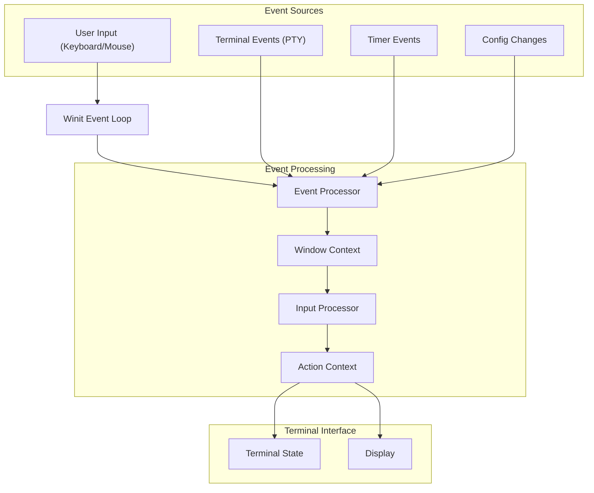

Sources: [alacritty/src/event.rs:75-91](https://github.com/alacritty/alacritty/blob/a0c4dfe9/alacritty/src/event.rs#L75-L91), [alacritty/src/window_context.rs:47-68](https://github.com/alacritty/alacritty/blob/a0c4dfe9/alacritty/src/window_context.rs#L47-L68), [alacritty/src/main.rs:135-137](https://github.com/alacritty/alacritty/blob/a0c4dfe9/alacritty/src/main.rs#L135-L137)

## Event System Components

The event system consists of several key components that work together to process and handle events.

### Core Components

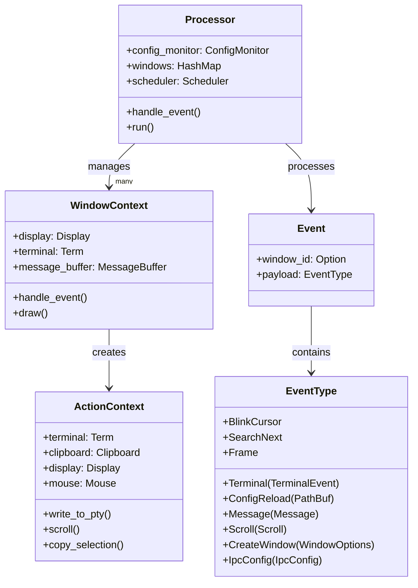

Sources: [alacritty/src/event.rs:75-91](https://github.com/alacritty/alacritty/blob/a0c4dfe9/alacritty/src/event.rs#L75-L91), [alacritty/src/event.rs:484-498](https://github.com/alacritty/alacritty/blob/a0c4dfe9/alacritty/src/event.rs#L484-L498), [alacritty/src/event.rs:507-526](https://github.com/alacritty/alacritty/blob/a0c4dfe9/alacritty/src/event.rs#L507-L526), [alacritty/src/window_context.rs:47-68](https://github.com/alacritty/alacritty/blob/a0c4dfe9/alacritty/src/window_context.rs#L47-L68), [alacritty/src/event.rs:624-648](https://github.com/alacritty/alacritty/blob/a0c4dfe9/alacritty/src/event.rs#L624-L648)

## Event Processing Flow

The event system's processing flow starts with the event loop in the main function and flows through several layers of handlers.

### Event Loop and Processor

The event processing begins in the `main.rs` file where an `EventLoop` is created and passed to a `Processor`. The processor is initialized with the application configuration and options, and then runs the event loop.

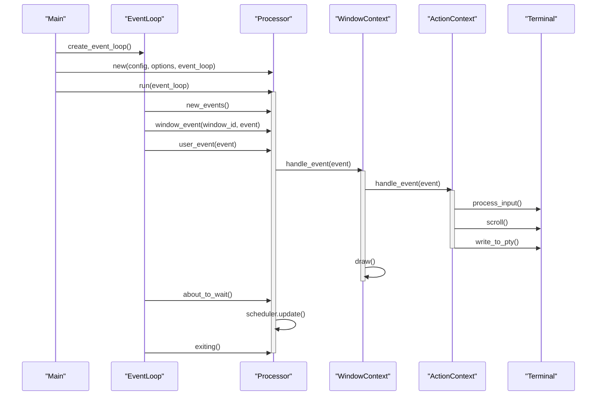

Sources: [alacritty/src/main.rs:135-140](https://github.com/alacritty/alacritty/blob/a0c4dfe9/alacritty/src/main.rs#L135-L140), [alacritty/src/event.rs:93-197](https://github.com/alacritty/alacritty/blob/a0c4dfe9/alacritty/src/event.rs#L93-L197), [alacritty/src/event.rs:220-255](https://github.com/alacritty/alacritty/blob/a0c4dfe9/alacritty/src/event.rs#L220-L255), [alacritty/src/window_context.rs:391-482](https://github.com/alacritty/alacritty/blob/a0c4dfe9/alacritty/src/window_context.rs#L391-L482)

### Processor and Event Handling

The `Processor` serves as the main entry point for events. It manages a collection of window contexts and dispatches events to the appropriate window.

1. **Event Types** - The processor handles several types of events:
   - Window events (input, resize, close)
   - User events (custom events defined by Alacritty)
   - Terminal events (from PTY)
   - Timer events (cursor blinking, etc.)

2. **Event Dispatch** - Events are dispatched based on their target window:
   - Events with a specific window ID are sent to that window's context
   - Events without a window ID are broadcast to all windows

Sources: [alacritty/src/event.rs:220-456](https://github.com/alacritty/alacritty/blob/a0c4dfe9/alacritty/src/event.rs#L220-L456)

## Window Context and Event Handling

The `WindowContext` represents a single terminal window and contains the terminal state, display, and event handling logic.

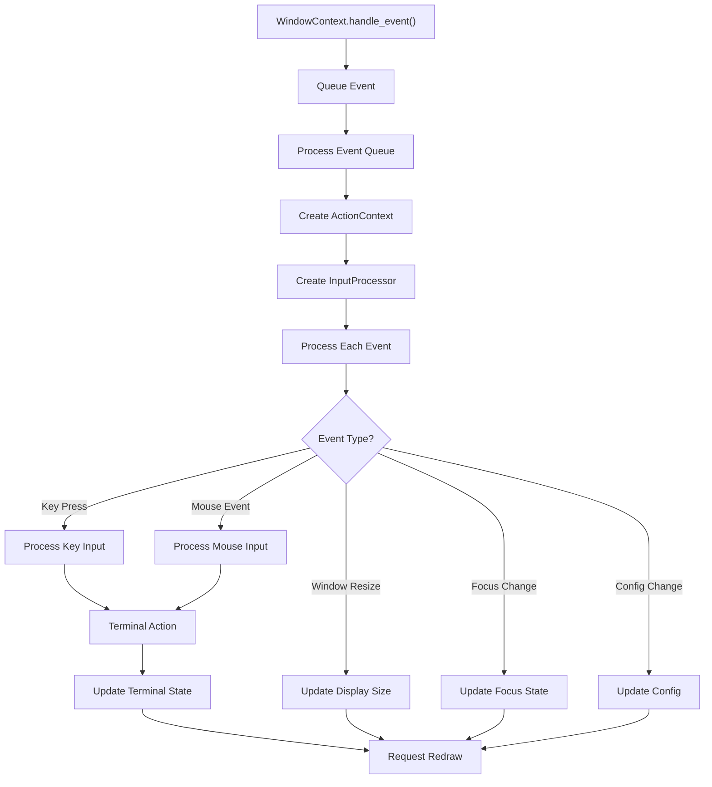

Sources: [alacritty/src/window_context.rs:391-482](https://github.com/alacritty/alacritty/blob/a0c4dfe9/alacritty/src/window_context.rs#L391-L482)

When an event is received by a window context, it is first queued up and then processed in batches. The window context creates an `ActionContext` which provides the interface for performing actions on the terminal, display, and other components.

## Action Context

The `ActionContext` is the interface through which events trigger changes to the terminal state, display, and other components.

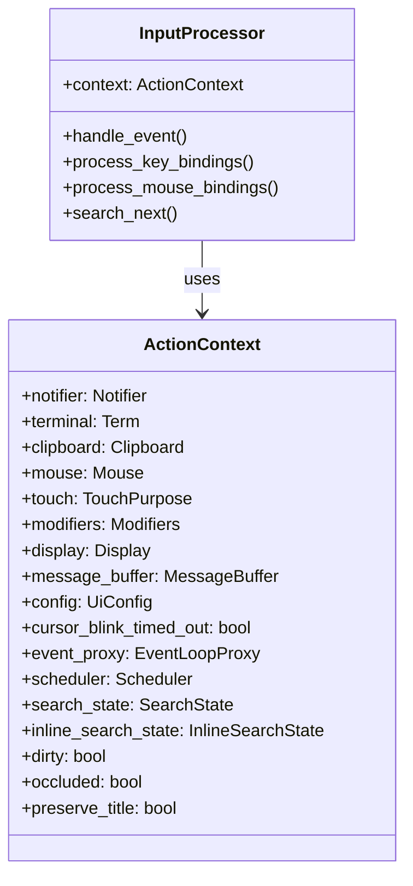

Sources: [alacritty/src/event.rs:624-648](https://github.com/alacritty/alacritty/blob/a0c4dfe9/alacritty/src/event.rs#L624-L648)

The `ActionContext` implements the `input::ActionContext` trait which defines methods for all the actions that can be triggered by input events, such as:

- Writing to the PTY
- Scrolling the terminal view
- Copying and pasting text
- Managing selections
- Updating the window
- Changing font size
- Handling search

Sources: [alacritty/src/event.rs:650-864](https://github.com/alacritty/alacritty/blob/a0c4dfe9/alacritty/src/event.rs#L650-L864)

## Event Types

Alacritty defines several types of events that flow through the event system:

### Alacritty Event Types

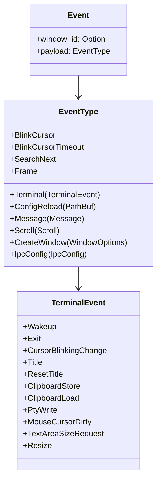

Sources: [alacritty/src/event.rs:484-526](https://github.com/alacritty/alacritty/blob/a0c4dfe9/alacritty/src/event.rs#L484-L526)

Each event type corresponds to a specific action or state change in the terminal:

1. **Terminal Events** - Events related to the terminal state and PTY
2. **Config Reload** - Triggered when the configuration file changes
3. **Message** - Messages to display in the message bar
4. **Scroll** - Terminal scrolling events
5. **Create Window** - Request to create a new terminal window
6. **IPC Config** - Configuration changes via IPC
7. **BlinkCursor/BlinkCursorTimeout** - Cursor blinking events
8. **SearchNext** - Search functionality events
9. **Frame** - Display frame-related events

## Input Handling and Action Binding

A key part of the event system is mapping user input to actions. This is handled through key and mouse bindings that associate inputs with specific actions.

### Key and Mouse Binding Structure

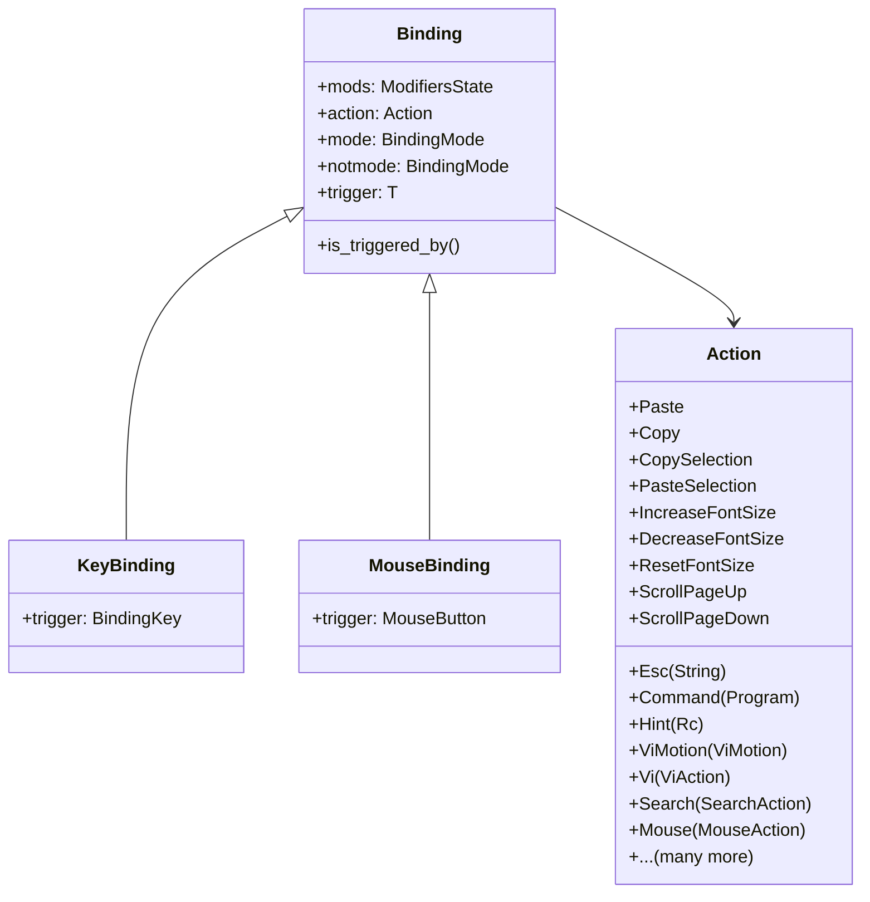

Sources: [alacritty/src/config/bindings.rs:25-86](https://github.com/alacritty/alacritty/blob/a0c4dfe9/alacritty/src/config/bindings.rs#L25-L86), [alacritty/src/config/bindings.rs:88-252](https://github.com/alacritty/alacritty/blob/a0c4dfe9/alacritty/src/config/bindings.rs#L88-L252)

When an input event is received, the `InputProcessor` checks if the input matches any defined bindings and executes the corresponding action.

## Search and Vi Mode Event Handling

Alacritty includes features for searching text and a Vi-like mode for navigation and selection, both of which have their own event handling:

### Search State

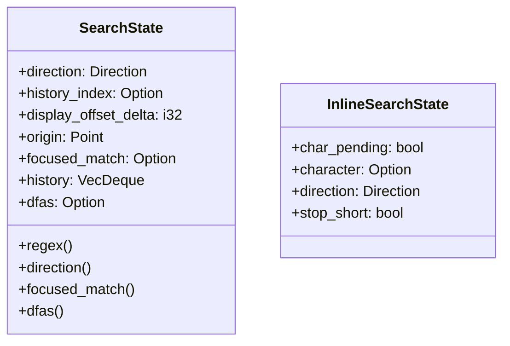

Sources: [alacritty/src/event.rs:528-622](https://github.com/alacritty/alacritty/blob/a0c4dfe9/alacritty/src/event.rs#L528-L622)

These states are managed as part of the event system and affect how certain events are processed. For example, when in search mode, keyboard input is directed to the search interface rather than the terminal.

## Scheduler and Timed Events

The event system includes a scheduler for timed events like cursor blinking:

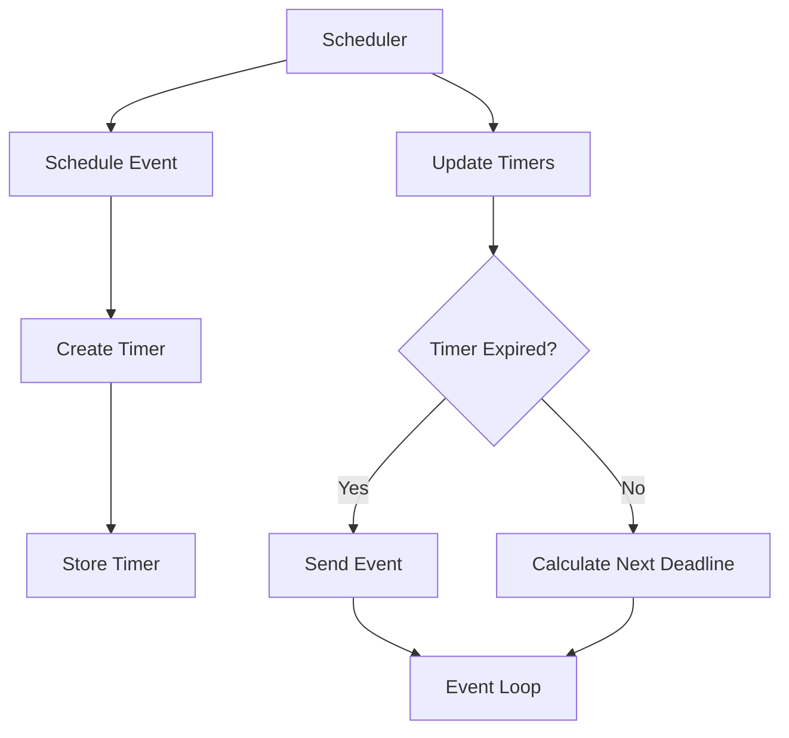

Sources: [alacritty/src/event.rs:450-454](https://github.com/alacritty/alacritty/blob/a0c4dfe9/alacritty/src/event.rs#L450-L454)

The scheduler allows events to be triggered after a delay or at regular intervals, which is used for features like cursor blinking and search delay.

## Event Processing Examples

To illustrate how the event system works in practice, here are some examples of common event flows:

### Keyboard Input Processing

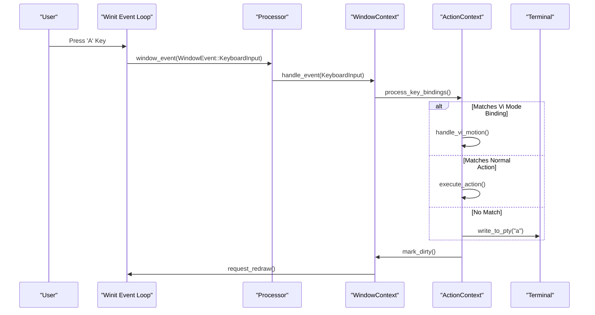

Sources: [alacritty/src/event.rs:240-274](https://github.com/alacritty/alacritty/blob/a0c4dfe9/alacritty/src/event.rs#L240-L274), [alacritty/src/window_context.rs:391-463](https://github.com/alacritty/alacritty/blob/a0c4dfe9/alacritty/src/window_context.rs#L391-L463)

### Configuration Reload

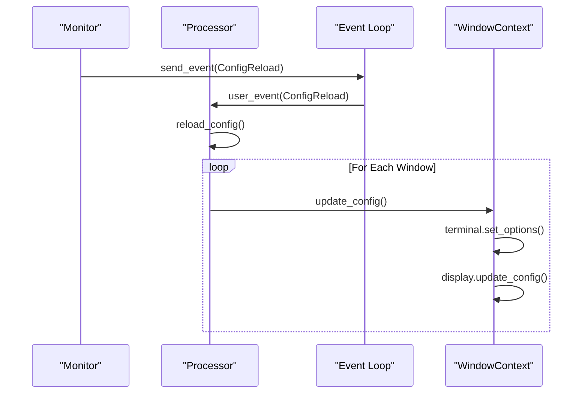

Sources: [alacritty/src/event.rs:311-338](https://github.com/alacritty/alacritty/blob/a0c4dfe9/alacritty/src/event.rs#L311-L338), [alacritty/src/window_context.rs:256-328](https://github.com/alacritty/alacritty/blob/a0c4dfe9/alacritty/src/window_context.rs#L256-L328)

## Summary

The Alacritty Event System is a comprehensive framework for handling user input, PTY output, window events, and internal state changes. It consists of:

1. An event processor (`Processor`) that dispatches events to windows
2. Window contexts (`WindowContext`) that process events for individual terminal windows
3. Action contexts (`ActionContext`) that provide interfaces for performing actions
4. Various event types representing different kinds of state changes
5. A binding system that maps user input to actions
6. A scheduler for timed events

Together, these components enable responsive terminal emulation with a rich set of features and a highly customizable user experience.