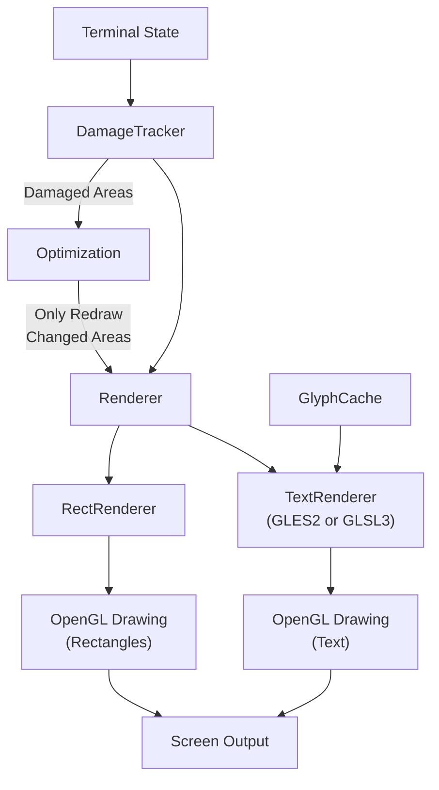
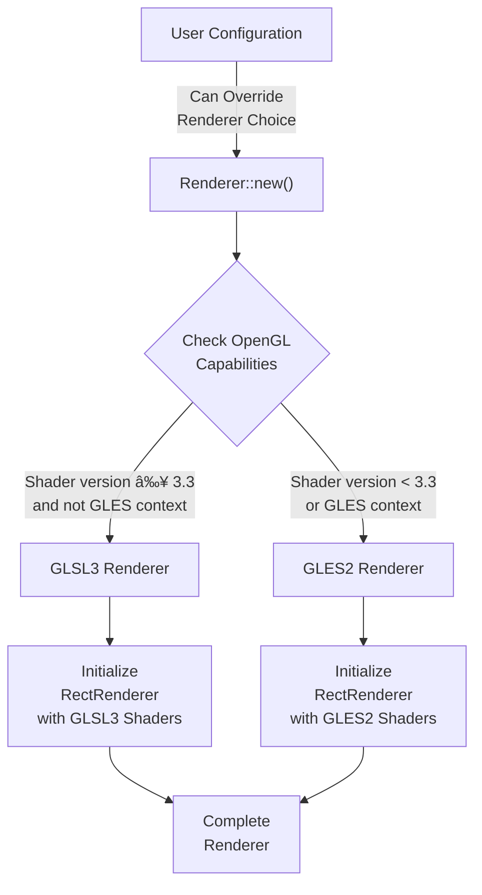
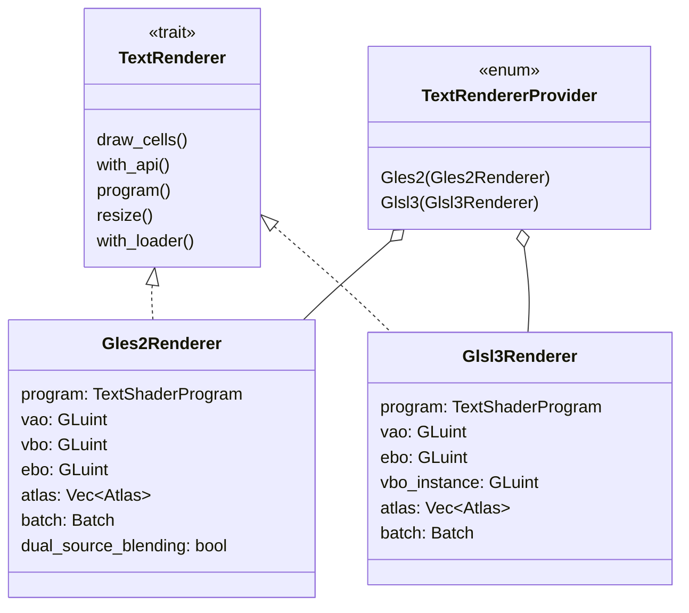
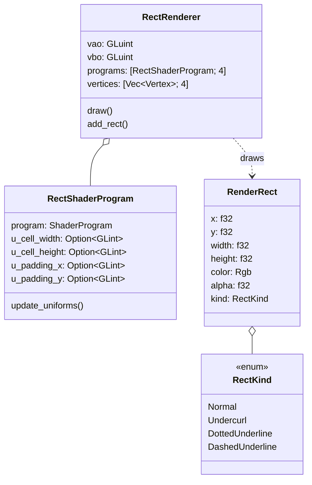
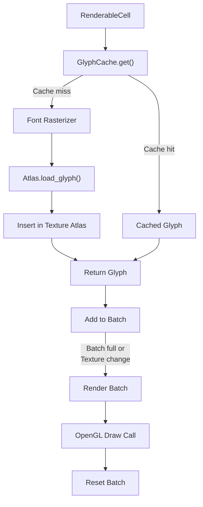
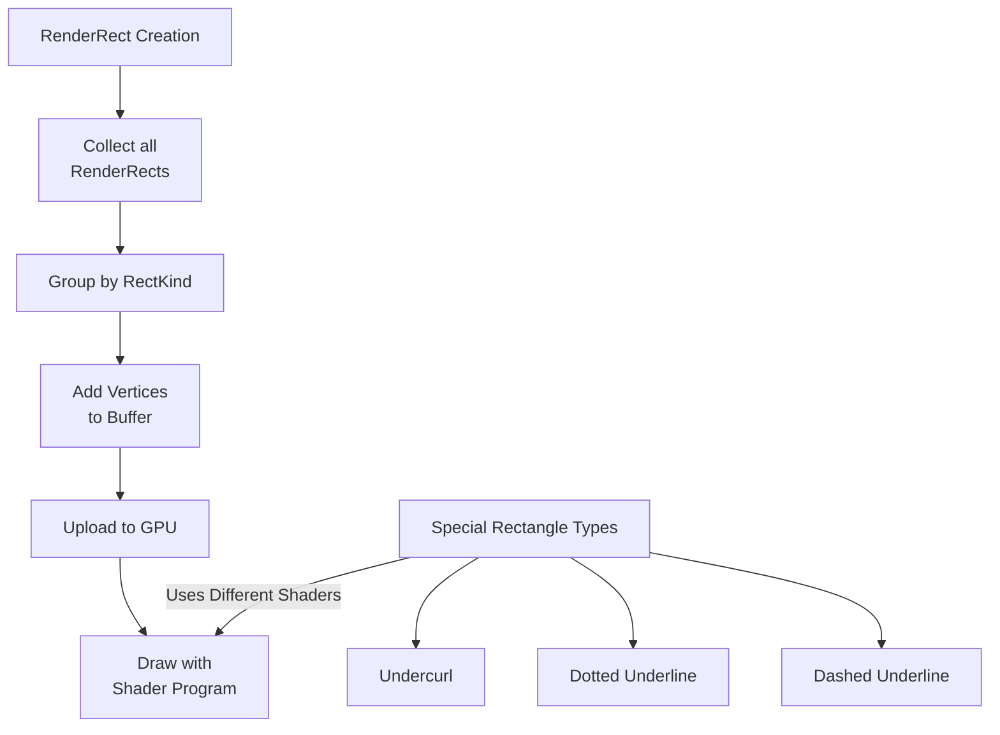
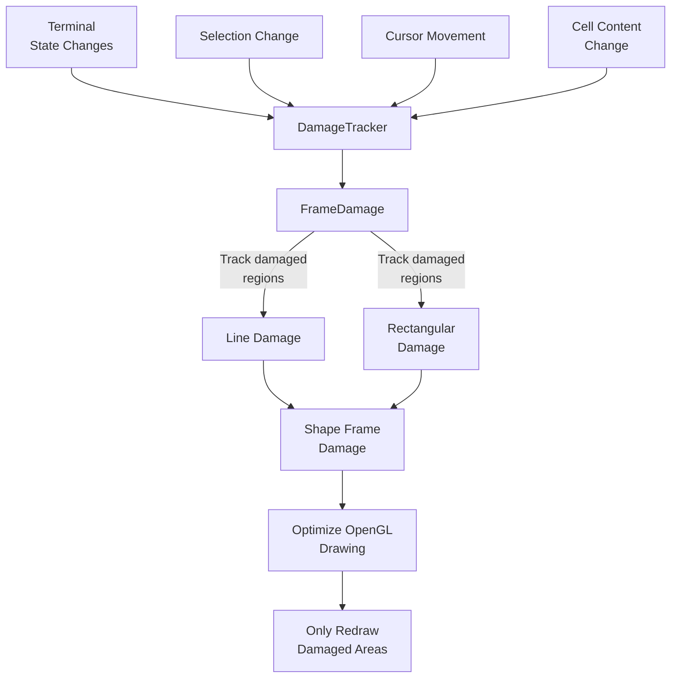
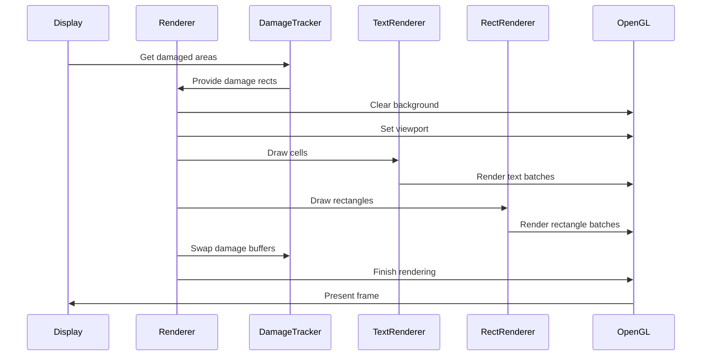

# Rendering Pipeline

Relevant source files

The following files were used as context for generating this wiki page:

- [alacritty/src/display/color.rs](https://github.com/alacritty/alacritty/blob/a0c4dfe9/alacritty/src/display/color.rs)
- [alacritty/src/display/damage.rs](https://github.com/alacritty/alacritty/blob/a0c4dfe9/alacritty/src/display/damage.rs)
- [alacritty/src/display/meter.rs](https://github.com/alacritty/alacritty/blob/a0c4dfe9/alacritty/src/display/meter.rs)
- [alacritty/src/renderer/mod.rs](https://github.com/alacritty/alacritty/blob/a0c4dfe9/alacritty/src/renderer/mod.rs)
- [alacritty/src/renderer/rects.rs](https://github.com/alacritty/alacritty/blob/a0c4dfe9/alacritty/src/renderer/rects.rs)
- [alacritty/src/renderer/text/gles2.rs](https://github.com/alacritty/alacritty/blob/a0c4dfe9/alacritty/src/renderer/text/gles2.rs)
- [alacritty/src/renderer/text/glsl3.rs](https://github.com/alacritty/alacritty/blob/a0c4dfe9/alacritty/src/renderer/text/glsl3.rs)
- [alacritty/src/renderer/text/mod.rs](https://github.com/alacritty/alacritty/blob/a0c4dfe9/alacritty/src/renderer/text/mod.rs)
- [alacritty/src/string.rs](https://github.com/alacritty/alacritty/blob/a0c4dfe9/alacritty/src/string.rs)

The Alacritty rendering pipeline is responsible for efficiently drawing the terminal content to the screen using OpenGL. This wiki page explains how Alacritty transforms terminal cell data into graphical output, with a focus on the core rendering components, text and rectangle rendering, and performance optimization through damage tracking.

## Overview

Alacritty's rendering system is designed for performance, using OpenGL to accelerate drawing operations. The rendering pipeline consists of several key components:

Sources: [alacritty/src/renderer/mod.rs:97-358](https://github.com/alacritty/alacritty/blob/a0c4dfe9/alacritty/src/renderer/mod.rs#L97-L358), [alacritty/src/display/damage.rs:16-136](https://github.com/alacritty/alacritty/blob/a0c4dfe9/alacritty/src/display/damage.rs#L16-L136)

## Renderer Selection and Initialization

The rendering system automatically selects between GLES2 (OpenGL ES 2.0) and GLSL3 (OpenGL 3.3+) renderers based on the GPU's capabilities. This selection happens during initialization:

Sources: [alacritty/src/renderer/mod.rs:127-183](https://github.com/alacritty/alacritty/blob/a0c4dfe9/alacritty/src/renderer/mod.rs#L127-L183)

The renderer is created with:

1. The OpenGL shader version is determined by querying the GPU
2. Robustness is checked (for recovery from GPU errors)
3. Based on the shader version and context, either GLSL3 or GLES2 is selected
4. Appropriate text and rectangle renderers are initialized

## Core Rendering Components

Alacritty's renderer consists of two main subsystems:

### 1. Text Renderer

The text renderer handles drawing characters to the screen. It manages:

- Glyph rasterization and caching
- Character positioning
- Font styling (bold, italic)
- Subpixel rendering for text clarity

Two implementations exist:
- `Glsl3Renderer`: Used on systems with OpenGL 3.3+ support
- `Gles2Renderer`: Used on systems with only OpenGL ES 2.0 support

Sources: [alacritty/src/renderer/text/mod.rs:49-95](https://github.com/alacritty/alacritty/blob/a0c4dfe9/alacritty/src/renderer/text/mod.rs#L49-L95), [alacritty/src/renderer/text/gles2.rs:26-158](https://github.com/alacritty/alacritty/blob/a0c4dfe9/alacritty/src/renderer/text/gles2.rs#L26-L158), [alacritty/src/renderer/text/glsl3.rs:29-147](https://github.com/alacritty/alacritty/blob/a0c4dfe9/alacritty/src/renderer/text/glsl3.rs#L29-L147)

### 2. Rectangle Renderer

The rectangle renderer draws all non-text elements, including:

- Cell backgrounds
- Cursor
- Selection highlights
- Underlines (regular, double, dotted, dashed, undercurl)
- Search highlights

Sources: [alacritty/src/renderer/rects.rs:249-408](https://github.com/alacritty/alacritty/blob/a0c4dfe9/alacritty/src/renderer/rects.rs#L249-L408), [alacritty/src/renderer/rects.rs:21-35](https://github.com/alacritty/alacritty/blob/a0c4dfe9/alacritty/src/renderer/rects.rs#L21-L35)

## The Text Rendering Pipeline

The text rendering pipeline transforms character information into visible glyphs on screen:

Sources: [alacritty/src/renderer/text/mod.rs:134-173](https://github.com/alacritty/alacritty/blob/a0c4dfe9/alacritty/src/renderer/text/mod.rs#L134-L173), [alacritty/src/renderer/text/glsl3.rs:217-262](https://github.com/alacritty/alacritty/blob/a0c4dfe9/alacritty/src/renderer/text/glsl3.rs#L217-L262), [alacritty/src/renderer/text/gles2.rs:340-422](https://github.com/alacritty/alacritty/blob/a0c4dfe9/alacritty/src/renderer/text/gles2.rs#L340-L422)

The text rendering process:

1. For each cell to be rendered, the font and character information is used to retrieve the glyph
2. If the glyph is not in cache, it is rasterized and loaded into a texture atlas
3. Glyph information (position, color, texture coordinates) is added to a batch
4. When the batch is full or a texture change is needed, the batch is rendered with OpenGL
5. Special rendering passes are used for subpixel rendering

## Rectangle Rendering Pipeline

Rectangles are used for backgrounds, underlines, cursor, and other graphical elements:

Sources: [alacritty/src/renderer/rects.rs:321-371](https://github.com/alacritty/alacritty/blob/a0c4dfe9/alacritty/src/renderer/rects.rs#L321-L371)

The rectangle rendering process:

1. Rectangles of various types (backgrounds, underlines, etc.) are created and collected
2. Rectangles are grouped by their type (normal, undercurl, dotted, dashed)
3. Vertices for each rectangle are generated and added to a buffer
4. Vertex data is uploaded to the GPU
5. Different shader programs are used based on the rectangle type
6. All rectangles of each type are drawn in a single batch to minimize shader switches

## Damage Tracking and Optimization

To avoid redrawing the entire screen on every frame, Alacritty tracks which areas have changed using a damage tracking system:

Sources: [alacritty/src/display/damage.rs:16-136](https://github.com/alacritty/alacritty/blob/a0c4dfe9/alacritty/src/display/damage.rs#L16-L136), [alacritty/src/display/damage.rs:216-251](https://github.com/alacritty/alacritty/blob/a0c4dfe9/alacritty/src/display/damage.rs#L216-L251)

The damage tracking process:

1. Terminal state changes (content, cursor, selection) are tracked
2. Damaged regions are recorded as line damage or rectangular damage
3. Adjacent damaged regions are merged to minimize draw calls
4. On render, only the damaged regions are redrawn
5. This significantly improves performance, especially for small changes

## Main Rendering Flow

When a frame needs to be rendered, the process flows through these stages:

Sources: [alacritty/src/renderer/mod.rs:185-239](https://github.com/alacritty/alacritty/blob/a0c4dfe9/alacritty/src/renderer/mod.rs#L185-L239), [alacritty/src/renderer/mod.rs:250-273](https://github.com/alacritty/alacritty/blob/a0c4dfe9/alacritty/src/renderer/mod.rs#L250-L273)

## Performance Considerations

Alacritty includes performance monitoring using the `Meter` class to track rendering times:

1. The renderer can track how long frames take to render
2. Moving averages of render times are calculated
3. This can be displayed for debugging or benchmarking purposes

Sources: [alacritty/src/display/meter.rs:27-92](https://github.com/alacritty/alacritty/blob/a0c4dfe9/alacritty/src/display/meter.rs#L27-L92)

Additionally, the renderer includes several optimizations:

1. Damage tracking to minimize the amount of rendering work
2. Batching render operations to reduce OpenGL state changes
3. Glyph caching to avoid re-rasterizing text
4. Selection of the most appropriate renderer based on hardware capabilities
5. Rectangle merging to reduce draw calls

## OpenGL Error Handling

The renderer includes error handling and robustness features:

1. Graphics reset status is checked if supported by the GPU
2. Debug logging can be enabled for OpenGL operations
3. Error checking is performed when querying OpenGL strings and states

This helps ensure stability even when GPU issues occur.

Sources: [alacritty/src/renderer/mod.rs:287-329](https://github.com/alacritty/alacritty/blob/a0c4dfe9/alacritty/src/renderer/mod.rs#L287-L329), [alacritty/src/renderer/mod.rs:397-408](https://github.com/alacritty/alacritty/blob/a0c4dfe9/alacritty/src/renderer/mod.rs#L397-L408)

## Conclusion