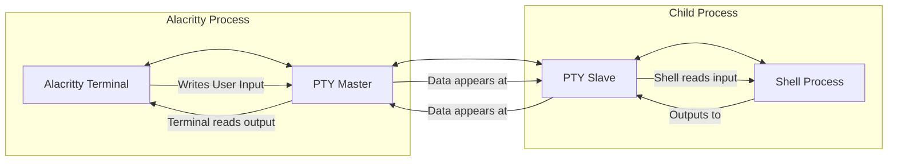
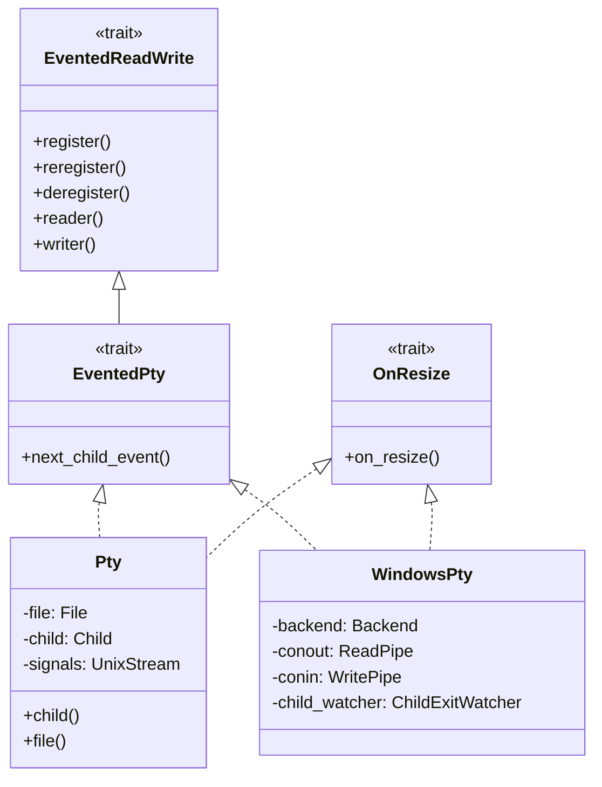
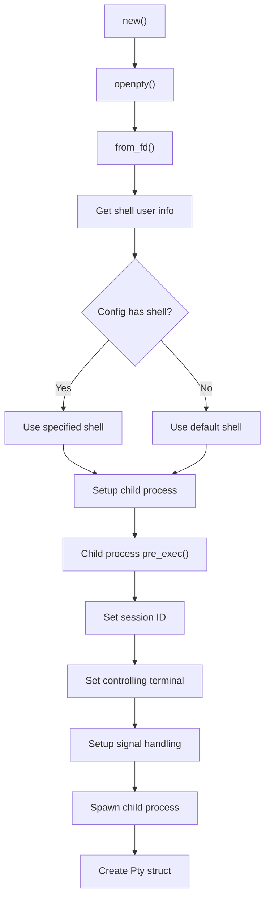
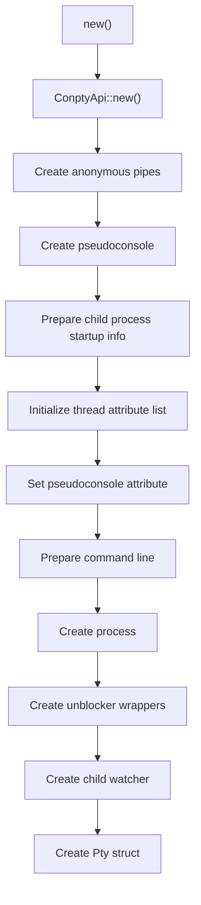
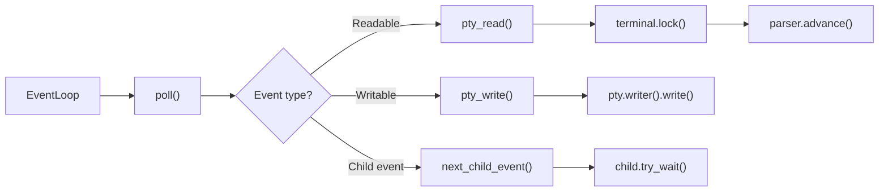
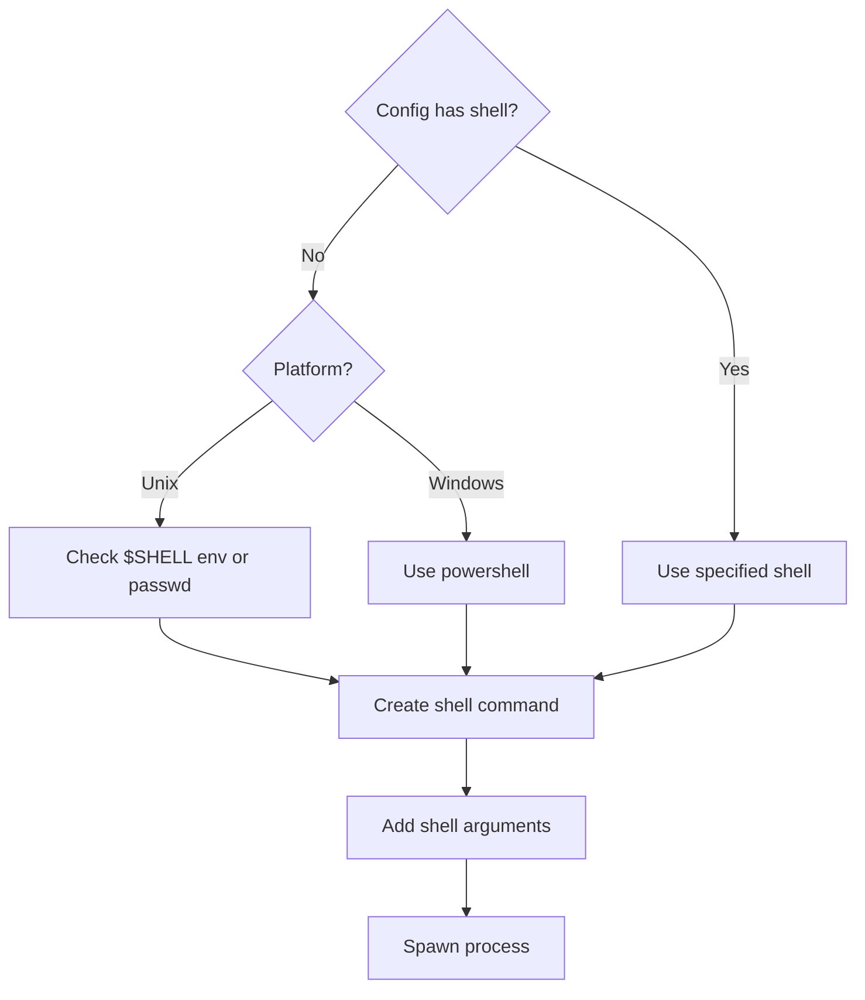
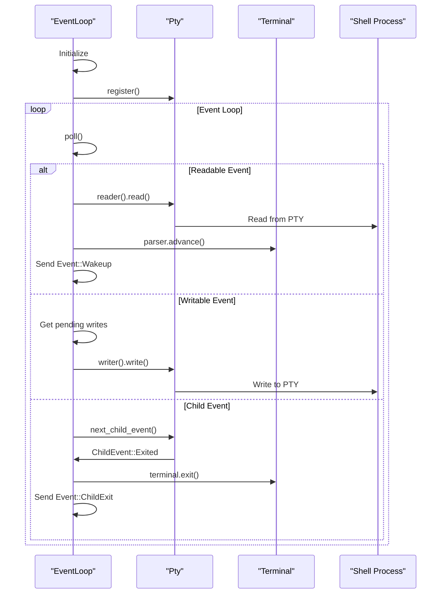

# PTY Interaction

<details>
<summary>Relevant source files</summary>

The following files were used as context for generating this wiki page:

- [alacritty_terminal/src/event_loop.rs](https://github.com/alacritty/alacritty/blob/a0c4dfe9/alacritty_terminal/src/event_loop.rs)
- [alacritty_terminal/src/tty/mod.rs](https://github.com/alacritty/alacritty/blob/a0c4dfe9/alacritty_terminal/src/tty/mod.rs)
- [alacritty_terminal/src/tty/unix.rs](https://github.com/alacritty/alacritty/blob/a0c4dfe9/alacritty_terminal/src/tty/unix.rs)
- [alacritty_terminal/src/tty/windows/child.rs](https://github.com/alacritty/alacritty/blob/a0c4dfe9/alacritty_terminal/src/tty/windows/child.rs)
- [alacritty_terminal/src/tty/windows/conpty.rs](https://github.com/alacritty/alacritty/blob/a0c4dfe9/alacritty_terminal/src/tty/windows/conpty.rs)
- [alacritty_terminal/src/tty/windows/mod.rs](https://github.com/alacritty/alacritty/blob/a0c4dfe9/alacritty_terminal/src/tty/windows/mod.rs)

</details>


This page documents how Alacritty interacts with pseudoterminals (PTYs), which form the communication bridge between the terminal emulator interface and the shell processes running within it. For information about the terminal core itself, see [Terminal Core](#3.2), and for details on how events are processed, see [Event System](#3.3).

## Overview of PTY in Terminal Emulation

A pseudoterminal (PTY) is a pair of virtual character devices that provides a bidirectional communication channel between the terminal emulator (master end) and processes running in the terminal (slave end). Alacritty's PTY subsystem is responsible for:

1. Creating platform-specific PTY instances
2. Spawning and connecting to shell processes
3. Handling bidirectional I/O between the terminal and shell
4. Managing terminal resize events
5. Detecting and handling child process termination



Sources: [alacritty_terminal/src/tty/mod.rs:1-146](https://github.com/alacritty/alacritty/blob/a0c4dfe9/alacritty_terminal/src/tty/mod.rs#L1-L146), [alacritty_terminal/src/event_loop.rs:1-486](https://github.com/alacritty/alacritty/blob/a0c4dfe9/alacritty_terminal/src/event_loop.rs#L1-L486)

## Cross-Platform Abstraction

Alacritty implements a cross-platform abstraction layer for PTY interaction, with platform-specific implementations for Unix and Windows systems.



Sources: [alacritty_terminal/src/tty/mod.rs:52-89](https://github.com/alacritty/alacritty/blob/a0c4dfe9/alacritty_terminal/src/tty/mod.rs#L52-L89), [alacritty_terminal/src/tty/unix.rs:103-118](https://github.com/alacritty/alacritty/blob/a0c4dfe9/alacritty_terminal/src/tty/unix.rs#L103-L118), [alacritty_terminal/src/tty/windows/mod.rs:27-53](https://github.com/alacritty/alacritty/blob/a0c4dfe9/alacritty_terminal/src/tty/windows/mod.rs#L27-L53)

### Core Traits

The PTY subsystem defines several key traits that abstract platform-specific behavior:

| Trait | Purpose | Key Methods |
|-------|---------|-------------|
| `EventedReadWrite` | Provides an abstraction over stream read/write operations | `register()`, `reregister()`, `deregister()`, `reader()`, `writer()` |
| `EventedPty` | Extends `EventedReadWrite` with child process event notifications | `next_child_event()` |
| `OnResize` | Handles PTY size changes | `on_resize()` |

The platform-specific implementations of these traits handle the details of PTY management on each supported platform.

Sources: [alacritty_terminal/src/tty/mod.rs:57-89](https://github.com/alacritty/alacritty/blob/a0c4dfe9/alacritty_terminal/src/tty/mod.rs#L57-L89)

## PTY Creation and Setup

### Unix PTY Creation

On Unix systems, Alacritty creates a PTY using the `openpty` function, which returns a master and slave file descriptor pair.



Sources: [alacritty_terminal/src/tty/unix.rs:196-304](https://github.com/alacritty/alacritty/blob/a0c4dfe9/alacritty_terminal/src/tty/unix.rs#L196-L304)

The Unix implementation includes setting up the terminal attributes, creating a new process group, and handling signals.

### Windows PTY Creation

On Windows, Alacritty uses the ConPTY API to create a pseudoconsole instance:



Sources: [alacritty_terminal/src/tty/windows/conpty.rs:110-244](https://github.com/alacritty/alacritty/blob/a0c4dfe9/alacritty_terminal/src/tty/windows/conpty.rs#L110-L244)

## PTY I/O Operations

The PTY I/O operations are managed by the event loop, which performs reading and writing operations between the terminal and the shell process:



Sources: [alacritty_terminal/src/event_loop.rs:104-203](https://github.com/alacritty/alacritty/blob/a0c4dfe9/alacritty_terminal/src/event_loop.rs#L104-L203), [alacritty_terminal/src/event_loop.rs:228-316](https://github.com/alacritty/alacritty/blob/a0c4dfe9/alacritty_terminal/src/event_loop.rs#L228-L316)

### Reading from PTY

The `pty_read` function reads data from the PTY and processes it through the terminal parser:

1. Reads data from the PTY in non-blocking mode
2. Attempts to lock the terminal for updates
3. Passes the read bytes to the terminal parser
4. Schedules a terminal redraw when new content is processed

Sources: [alacritty_terminal/src/event_loop.rs:104-171](https://github.com/alacritty/alacritty/blob/a0c4dfe9/alacritty_terminal/src/event_loop.rs#L104-L171)

### Writing to PTY

The `pty_write` function writes user input to the PTY:

1. Takes data from a write queue
2. Writes as much data as possible to the PTY
3. Handles partial writes by buffering remaining data
4. Handles blocking and errors

Sources: [alacritty_terminal/src/event_loop.rs:174-203](https://github.com/alacritty/alacritty/blob/a0c4dfe9/alacritty_terminal/src/event_loop.rs#L174-L203)

## Terminal Resizing

Both Unix and Windows implementations support terminal resizing:

### Unix Resizing
On Unix systems, terminal resizing is implemented using the `TIOCSWINSZ` ioctl to update the kernel's representation of the terminal size.

```
OnResize::on_resize() 
→ ioctl(file_descriptor, TIOCSWINSZ, winsize)
```

Sources: [alacritty_terminal/src/tty/unix.rs:403-417](https://github.com/alacritty/alacritty/blob/a0c4dfe9/alacritty_terminal/src/tty/unix.rs#L403-L417), [alacritty_terminal/src/tty/unix.rs:425-434](https://github.com/alacritty/alacritty/blob/a0c4dfe9/alacritty_terminal/src/tty/unix.rs#L425-L434)

### Windows Resizing
On Windows, terminal resizing is implemented using the ConPTY API's `ResizePseudoConsole` function.

```
OnResize::on_resize() 
→ ResizePseudoConsole(handle, window_size)
```

Sources: [alacritty_terminal/src/tty/windows/conpty.rs:303-308](https://github.com/alacritty/alacritty/blob/a0c4dfe9/alacritty_terminal/src/tty/windows/conpty.rs#L303-L308), [alacritty_terminal/src/tty/windows/conpty.rs:310-316](https://github.com/alacritty/alacritty/blob/a0c4dfe9/alacritty_terminal/src/tty/windows/conpty.rs#L310-L316)

## Child Process Management

### Spawning Shell Process

The PTY subsystem is responsible for spawning the shell process and connecting it to the PTY:

1. Determines which shell to use based on configuration
2. Sets up environment variables
3. Connects the shell's standard I/O to the slave end of the PTY
4. Spawns the shell process

Sources: [alacritty_terminal/src/tty/unix.rs:215-302](https://github.com/alacritty/alacritty/blob/a0c4dfe9/alacritty_terminal/src/tty/unix.rs#L215-L302), [alacritty_terminal/src/tty/windows/conpty.rs:204-235](https://github.com/alacritty/alacritty/blob/a0c4dfe9/alacritty_terminal/src/tty/windows/conpty.rs#L204-L235)

### Platform-Specific Shell Selection



Sources: [alacritty_terminal/src/tty/unix.rs:127-159](https://github.com/alacritty/alacritty/blob/a0c4dfe9/alacritty_terminal/src/tty/unix.rs#L127-L159), [alacritty_terminal/src/tty/windows/mod.rs:128-136](https://github.com/alacritty/alacritty/blob/a0c4dfe9/alacritty_terminal/src/tty/windows/mod.rs#L128-L136)

### Child Process Exit Detection

Alacritty detects child process exit differently on Unix and Windows:

#### Unix Exit Detection
On Unix, exit detection uses signal handling with `SIGCHLD` to detect when the child process exits.

Sources: [alacritty_terminal/src/tty/unix.rs:276-282](https://github.com/alacritty/alacritty/blob/a0c4dfe9/alacritty_terminal/src/tty/unix.rs#L276-L282), [alacritty_terminal/src/tty/unix.rs:381-400](https://github.com/alacritty/alacritty/blob/a0c4dfe9/alacritty_terminal/src/tty/unix.rs#L381-L400)

#### Windows Exit Detection
On Windows, exit detection uses the `RegisterWaitForSingleObject` API to get notified when the child process handle becomes signaled.

Sources: [alacritty_terminal/src/tty/windows/child.rs:31-48](https://github.com/alacritty/alacritty/blob/a0c4dfe9/alacritty_terminal/src/tty/windows/child.rs#L31-L48), [alacritty_terminal/src/tty/windows/child.rs:58-92](https://github.com/alacritty/alacritty/blob/a0c4dfe9/alacritty_terminal/src/tty/windows/child.rs#L58-L92)

## Event Loop Integration

The PTY subsystem integrates with Alacritty's event loop to handle I/O and events:



Sources: [alacritty_terminal/src/event_loop.rs:205-323](https://github.com/alacritty/alacritty/blob/a0c4dfe9/alacritty_terminal/src/event_loop.rs#L205-L323)

## Platform-Specific Implementations

### Unix Implementation

On Unix systems, Alacritty uses the standard PTY mechanism with:
- Master and slave file descriptors
- Signal-based child process monitoring
- IOCTL-based terminal resizing

This implementation involves:
1. Creating a PTY pair using `openpty()`
2. Setting terminal attributes
3. Creating a new session with `setsid()`
4. Setting the PTY as the controlling terminal
5. Spawning the shell process
6. Handling I/O through the master file descriptor

Sources: [alacritty_terminal/src/tty/unix.rs:196-304](https://github.com/alacritty/alacritty/blob/a0c4dfe9/alacritty_terminal/src/tty/unix.rs#L196-L304), [alacritty_terminal/src/tty/unix.rs:320-377](https://github.com/alacritty/alacritty/blob/a0c4dfe9/alacritty_terminal/src/tty/unix.rs#L320-L377)

### Windows Implementation

On Windows, Alacritty uses the ConPTY API with:
- Pseudoconsole handle
- Anonymous pipes for I/O
- Event-based child process monitoring

This implementation involves:
1. Creating anonymous pipes for input and output
2. Creating a pseudoconsole using `CreatePseudoConsole()`
3. Setting up process attributes to use the pseudoconsole
4. Creating the shell process
5. Using non-blocking wrappers for pipe I/O
6. Registering for child process exit notifications

Sources: [alacritty_terminal/src/tty/windows/conpty.rs:110-244](https://github.com/alacritty/alacritty/blob/a0c4dfe9/alacritty_terminal/src/tty/windows/conpty.rs#L110-L244), [alacritty_terminal/src/tty/windows/mod.rs:60-126](https://github.com/alacritty/alacritty/blob/a0c4dfe9/alacritty_terminal/src/tty/windows/mod.rs#L60-L126)

## Summary

The PTY subsystem in Alacritty provides a cross-platform abstraction for interacting with pseudoterminals, handling the complexities of different operating systems behind a consistent interface. It manages PTY creation, shell process spawning, I/O operations, terminal resizing, and child process exit detection, allowing the terminal emulator to communicate effectively with the shell process regardless of the underlying platform.