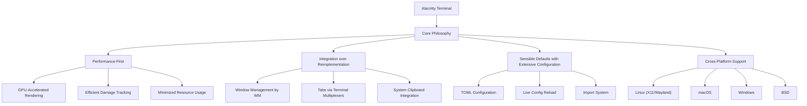
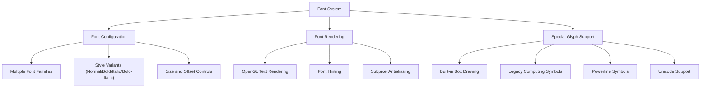
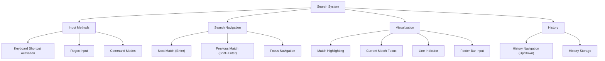
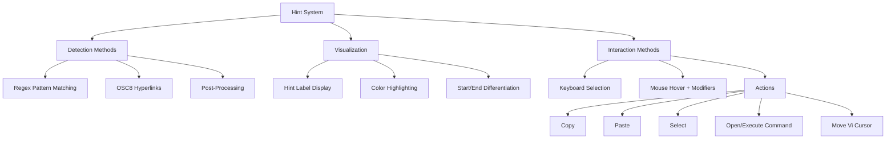
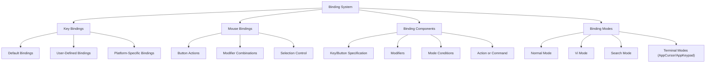
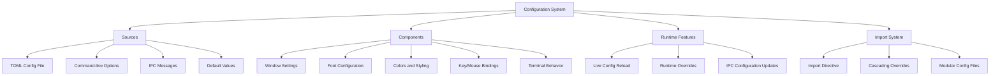

# Features

Relevant source files

The following files were used as context for generating this wiki page:

- [.editorconfig](https://github.com/alacritty/alacritty/blob/a0c4dfe9/.editorconfig)
- [.github/workflows/release.yml](https://github.com/alacritty/alacritty/blob/a0c4dfe9/.github/workflows/release.yml)
- [INSTALL.md](https://github.com/alacritty/alacritty/blob/a0c4dfe9/INSTALL.md)
- [Makefile](https://github.com/alacritty/alacritty/blob/a0c4dfe9/Makefile)
- [README.md](https://github.com/alacritty/alacritty/blob/a0c4dfe9/README.md)
- [extra/man/alacritty-bindings.5.scd](https://github.com/alacritty/alacritty/blob/a0c4dfe9/extra/man/alacritty-bindings.5.scd)
- [extra/man/alacritty-msg.1.scd](https://github.com/alacritty/alacritty/blob/a0c4dfe9/extra/man/alacritty-msg.1.scd)
- [extra/man/alacritty.1.scd](https://github.com/alacritty/alacritty/blob/a0c4dfe9/extra/man/alacritty.1.scd)
- [extra/man/alacritty.5.scd](https://github.com/alacritty/alacritty/blob/a0c4dfe9/extra/man/alacritty.5.scd)

This page provides an overview of Alacritty's main features and how they enhance the terminal experience. Alacritty is designed with performance and simplicity as core principles, focusing on providing essential terminal functionality without unnecessary bloat. Rather than reimplementing features better handled by other tools (like tabs, which are better managed by terminal multiplexers like tmux), Alacritty integrates with existing applications to create a flexible terminal experience.

For installation instructions, see [Getting Started](#2), and for configuration details, see [Configuration](#2.2).

## Feature Philosophy

Sources: [README.md:12-19](https://github.com/alacritty/alacritty/blob/a0c4dfe9/README.md#L12-L19)

## Terminal Core Features

### Performance-Oriented Rendering

Alacritty uses GPU-acceleration through OpenGL to deliver exceptional rendering performance:

- OpenGL-based rendering pipeline for terminal content
- Efficient damage tracking to minimize redraw operations
- Optimized text rendering with proper font hinting
- Multiple renderer support (GLSL3 and GLES2)
- Support for transparency and window blur effects (platform-dependent)

Sources: [README.md:5-9](https://github.com/alacritty/alacritty/blob/a0c4dfe9/README.md#L5-L9), [extra/man/alacritty.5.scd:131-143](https://github.com/alacritty/alacritty/blob/a0c4dfe9/extra/man/alacritty.5.scd#L131-L143)

### Scrollback Buffer

- Configurable scrollback history (up to 100,000 lines)
- Adjustable scroll multiplier for mouse wheel and trackpad
- Various scroll actions: line, page, half-page, to top/bottom

Sources: [extra/man/alacritty.5.scd:219-233](https://github.com/alacritty/alacritty/blob/a0c4dfe9/extra/man/alacritty.5.scd#L219-L233)

### Unicode and Font Support

- Full Unicode text support
- Custom built-in font for box drawing characters (U+2500 - U+259F)
- Support for legacy computing symbols (U+1FB00 - U+1FB3B)
- Built-in powerline symbols (U+E0B0 - U+E0B3)
- Customizable font rendering with family, style, size options
- Support for individual configurations of normal, bold, italic, and bold-italic fonts

Sources: [extra/man/alacritty.5.scd:234-292](https://github.com/alacritty/alacritty/blob/a0c4dfe9/extra/man/alacritty.5.scd#L234-L292)

### Color and Styling

- 16 base colors (normal and bright variants)
- Dim color variants
- Indexed colors (16-256)
- Customizable colors for UI elements (cursor, selection, search matches, etc.)
- Support for terminal attributes (bold, italic, underline, etc.)
- Optional transparent background

Sources: [extra/man/alacritty.5.scd:293-493](https://github.com/alacritty/alacritty/blob/a0c4dfe9/extra/man/alacritty.5.scd#L293-L493)

## Text Selection and Navigation

Alacritty provides powerful text selection and navigation features:

### Selection Modes

- Character-based selection (click and drag)
- Semantic selection (word-based, respecting delimiter characters)
- Line selection
- Block selection (in Vi mode)
- Configurable semantic escape characters for word boundaries

Sources: [extra/man/alacritty.5.scd:526-542](https://github.com/alacritty/alacritty/blob/a0c4dfe9/extra/man/alacritty.5.scd#L526-L542)

### Vi Mode

Vi mode provides Vim-like navigation and selection capabilities:

```mermaid
graph TD
    A["Vi Mode"] --> B["Navigation"]
    A --> C["Selection Types"]
    A --> D["Search"]
    A --> E["Actions"]
    
    B --> B1["Character Movement (h/j/k/l)"]
    B --> B2["Word Movement (b/w/e)"]
    B --> B3["Line Navigation (0/$)"]
    B --> B4["Screen Navigation (H/M/L)"]
    B --> B5["Bracket Matching (%)"]
    
    C --> C1["Normal Selection (v)"]
    C --> C2["Line Selection (V)"]
    C --> C3["Block Selection (Ctrl+v)"]
    C --> C4["Semantic Selection (Alt+v)"]
    
    D --> D1["Forward Search (/)"]
    D --> D2["Backward Search (?)"]
    D --> D3["Next/Previous Match (n/N)"]
    D --> D4["Inline Search (f/F/t/T)"]
    
    E --> E1["Copy (y)"]
    E --> E2["Open URL (Enter)"]
    E --> E3["Center Screen (z)"]
```

Vi mode can be toggled with `Ctrl+Shift+Space` and offers a mouse-free way to navigate and manipulate text in the terminal.

Sources: [extra/man/alacritty-bindings.5.scd:70-299](https://github.com/alacritty/alacritty/blob/a0c4dfe9/extra/man/alacritty-bindings.5.scd#L70-L299), [extra/man/alacritty.5.scd:566-929](https://github.com/alacritty/alacritty/blob/a0c4dfe9/extra/man/alacritty.5.scd#L566-L929)

### Clipboard Integration

- Copy selected text to clipboard
- Paste from system clipboard
- Support for OSC 52 escape sequence for remote clipboard operations
- Option to automatically copy selection to clipboard
- Platform-specific clipboard handling (X11/Wayland selection buffer on Linux)

Sources: [extra/man/alacritty.5.scd:526-542](https://github.com/alacritty/alacritty/blob/a0c4dfe9/extra/man/alacritty.5.scd#L526-L542), [extra/man/alacritty.5.scd:617-626](https://github.com/alacritty/alacritty/blob/a0c4dfe9/extra/man/alacritty.5.scd#L617-L626)

## Search Functionality

Alacritty includes comprehensive search capabilities:

### Search Interface

The search system allows users to find text in the terminal buffer:

- Enter search mode with `Ctrl+Shift+F` (Windows/Linux) or `Cmd+F` (macOS)
- Regular expression support
- Forward and backward search
- Navigate between matches
- Search history navigation

Sources: [extra/man/alacritty-bindings.5.scd:302-347](https://github.com/alacritty/alacritty/blob/a0c4dfe9/extra/man/alacritty-bindings.5.scd#L302-L347), [extra/man/alacritty.5.scd:345-405](https://github.com/alacritty/alacritty/blob/a0c4dfe9/extra/man/alacritty.5.scd#L345-L405)

## Hints and URL Integration

The hints system allows detecting and interacting with URLs and other patterns in the terminal:

### Hint Configuration

- Customizable regex patterns for detecting content
- Support for OSC 8 hyperlinks (generated by terminal applications)
- Configurable alphabet for hint labels
- Persistent hints option
- Post-processing to clean up matched content (e.g., trailing punctuation)

### Hint Activation and Actions

- Activate with keyboard shortcut (default: `Ctrl+Shift+O`)
- Mouse hover with configurable modifier keys
- Configurable actions:
  - Copy to clipboard
  - Paste into terminal
  - Select the text
  - Move Vi mode cursor to the hint
  - Execute a custom command with the hint text

Sources: [extra/man/alacritty.5.scd:662-745](https://github.com/alacritty/alacritty/blob/a0c4dfe9/extra/man/alacritty.5.scd#L662-L745)

## Key and Mouse Bindings

Alacritty provides extensive customization of keyboard and mouse interactions:

### Binding System

### Key Binding Features

- Configurable key combinations
- Support for different binding modes:
  - Normal mode
  - Vi mode
  - Search mode
  - AppCursor and AppKeypad modes
- Multiple actions per key binding
- Platform-specific defaults
- Overriding and disabling default bindings

### Available Actions

Alacritty includes a wide range of built-in actions that can be bound:

| Category | Actions |
|----------|---------|
| Clipboard | Copy, Paste, CopySelection, PasteSelection |
| Font | IncreaseFontSize, DecreaseFontSize, ResetFontSize |
| Scrolling | ScrollPageUp/Down, ScrollLineUp/Down, ScrollHalfPageUp/Down, ScrollToTop/Bottom |
| Window | ToggleFullscreen, ToggleMaximized, Hide, Minimize, Quit |
| Vi Mode | ToggleViMode, plus numerous Vi navigation and selection commands |
| Search | SearchForward, SearchBackward, plus search navigation commands |
| Utility | ClearHistory, ClearSelection, ClearLogNotice, SpawnNewInstance, CreateNewWindow |

### Mouse Bindings

- Configurable mouse button actions with modifier keys
- Selection expansion
- Context-sensitive actions (e.g., different behavior in Vi mode)

Sources: [extra/man/alacritty-bindings.5.scd:12-564](https://github.com/alacritty/alacritty/blob/a0c4dfe9/extra/man/alacritty-bindings.5.scd#L12-L564), [extra/man/alacritty.5.scd:627-662](https://github.com/alacritty/alacritty/blob/a0c4dfe9/extra/man/alacritty.5.scd#L627-L662), [extra/man/alacritty.5.scd:746-996](https://github.com/alacritty/alacritty/blob/a0c4dfe9/extra/man/alacritty.5.scd#L746-L996)

## Configuration System

Alacritty uses a TOML configuration file format for comprehensive customization:

### Configuration File

- TOML format (`alacritty.toml`)
- Automatic file location discovery in standard paths
- Import system for modular configuration
- Live configuration reload
- Command-line options to override config values
- IPC-based configuration changes at runtime

### Customization Areas

The configuration file allows customization of:

- Terminal appearance (colors, opacity, padding)
- Font settings (family, style, size, offset)
- Window properties (dimensions, position, decorations)
- Scrolling behavior
- Key and mouse bindings
- Cursor properties (style, blinking behavior)
- Hints configuration
- Selection behavior
- Bell settings
- Environment variables

Sources: [extra/man/alacritty.5.scd:8-1055](https://github.com/alacritty/alacritty/blob/a0c4dfe9/extra/man/alacritty.5.scd#L8-L1055), [README.md:56-76](https://github.com/alacritty/alacritty/blob/a0c4dfe9/README.md#L56-L76)

## Cross-Platform Support

Alacritty supports multiple platforms with consistent features and platform-specific optimizations:

### Platform Support

- Linux (X11 and Wayland)
- macOS
- Windows
- BSD variants

### Platform Integration

- Windows: ConPTY support, clipboard integration
- macOS: Native tabs, option as alt key, simple fullscreen mode
- Linux/BSD: X11/Wayland integration, clipboard selection buffer support
- Platform-specific default key bindings

### IPC Communication

The `alacritty msg` command enables communication with running Alacritty instances:

- Create new windows with specific configurations
- Update configuration at runtime
- Control multiple windows from scripts or command line

Sources: [README.md:17-18](https://github.com/alacritty/alacritty/blob/a0c4dfe9/README.md#L17-L18), [extra/man/alacritty-msg.1.scd:1-93](https://github.com/alacritty/alacritty/blob/a0c4dfe9/extra/man/alacritty-msg.1.scd#L1-L93), [extra/man/alacritty.5.scd:62-67](https://github.com/alacritty/alacritty/blob/a0c4dfe9/extra/man/alacritty.5.scd#L62-L67), [INSTALL.md:1-390](https://github.com/alacritty/alacritty/blob/a0c4dfe9/INSTALL.md#L1-L390)

## Additional Features

### Terminal Compatibility

- Support for 256 colors
- Support for wide range of terminal escape sequences
- Compatibility with common terminal applications and tools
- Built-in terminfo definitions (`alacritty` and `alacritty-direct`)

### Debug Features

Advanced debugging features for troubleshooting:

- Rendering timer
- Log levels and persistent logging
- Event printing
- Damage highlighting
- Renderer selection options