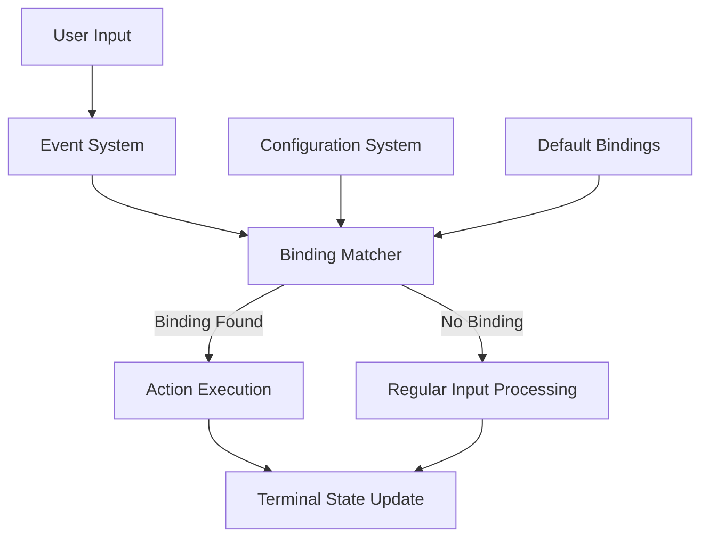
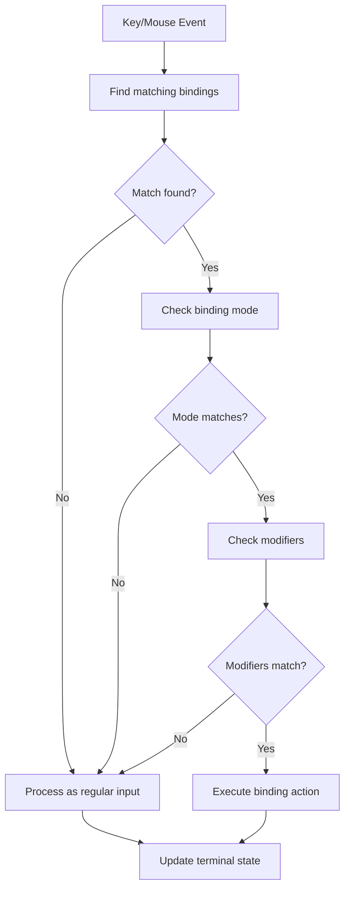

# Key and Mouse Bindings

<details>
<summary>Relevant source files</summary>

The following files were used as context for generating this wiki page:

- [alacritty/src/config/bindings.rs](https://github.com/alacritty/alacritty/blob/a0c4dfe9/alacritty/src/config/bindings.rs)
- [alacritty/src/config/mod.rs](https://github.com/alacritty/alacritty/blob/a0c4dfe9/alacritty/src/config/mod.rs)
- [alacritty/src/logging.rs](https://github.com/alacritty/alacritty/blob/a0c4dfe9/alacritty/src/logging.rs)
- [alacritty/src/main.rs](https://github.com/alacritty/alacritty/blob/a0c4dfe9/alacritty/src/main.rs)
- [extra/man/alacritty-bindings.5.scd](https://github.com/alacritty/alacritty/blob/a0c4dfe9/extra/man/alacritty-bindings.5.scd)
- [extra/man/alacritty-msg.1.scd](https://github.com/alacritty/alacritty/blob/a0c4dfe9/extra/man/alacritty-msg.1.scd)
- [extra/man/alacritty.1.scd](https://github.com/alacritty/alacritty/blob/a0c4dfe9/extra/man/alacritty.1.scd)
- [extra/man/alacritty.5.scd](https://github.com/alacritty/alacritty/blob/a0c4dfe9/extra/man/alacritty.5.scd)

</details>


This page documents Alacritty's key and mouse binding system, which allows users to map keyboard and mouse inputs to specific terminal actions. For information about the Vi mode and its specific key mappings, see [Vi Mode](#4.2).

## Overview

Alacritty uses a binding system to map user inputs (keyboard and mouse) to specific actions in the terminal. This system is designed to be flexible and customizable, allowing users to define their own key combinations and mouse clicks for various terminal operations.



Sources: [alacritty/src/config/bindings.rs:26-86](https://github.com/alacritty/alacritty/blob/a0c4dfe9/alacritty/src/config/bindings.rs#L26-L86), [alacritty/src/event.rs](https://github.com/alacritty/alacritty/blob/a0c4dfe9/alacritty/src/event.rs)

## Binding Architecture

The binding system is built around the `Binding<T>` generic struct, which is specialized for keyboard inputs (`KeyBinding`) and mouse inputs (`MouseBinding`).

```mermaid
classDiagram
    class Binding {
        +ModifiersState mods
        +Action action
        +BindingMode mode
        +BindingMode notmode
        +T trigger
        +is_triggered_by()
        +triggers_match()
    }
    
    class KeyBinding {
    }
    
    class MouseBinding {
    }
    
    class BindingKey {
        +Scancode(PhysicalKey)
        +Keycode{key, location}
    }
    
    class MouseButton {
        +Left
        +Right
        +Middle
        +Back
        +Forward
    }
    
    class Action {
        +Esc(String)
        +Command(Program)
        +Paste
        +Copy
        +CopySelection
        +PasteSelection
        +ScrollPageUp
        +ToggleViMode
        +ToggleFullscreen
        +ClearHistory
        +... (many more)
    }
    
    Binding <|-- KeyBinding : "specializes"
    Binding <|-- MouseBinding : "specializes"
    KeyBinding --> BindingKey : "uses as trigger"
    MouseBinding --> MouseButton : "uses as trigger"
    Binding --> Action : "executes"
```

Each binding consists of:
- `trigger`: The key or mouse button that activates the binding
- `mods`: Modifier keys required (Ctrl, Alt, Shift, etc.)
- `mode`: Terminal mode in which the binding is active
- `notmode`: Terminal modes in which the binding is inactive
- `action`: The action to execute when triggered

Sources: [alacritty/src/config/bindings.rs:26-86](https://github.com/alacritty/alacritty/blob/a0c4dfe9/alacritty/src/config/bindings.rs#L26-L86)

## Default Bindings

Alacritty provides a set of default bindings for common operations. These are defined in the source code and are used unless overridden by user configuration.

### Default Key Bindings

Key bindings are defined in the `default_key_bindings()` function:

| Key | Modifiers | Mode | Action |
|-----|-----------|------|--------|
| `Copy` | | | Copy |
| `Copy` | | Vi | ClearSelection |
| `Paste` | | ~Vi | Paste |
| `Paste` | | Vi\|Search | Paste |
| `l` | Control | | ClearLogNotice |
| `Space` | Shift+Control | ~Search | ToggleViMode |
| `PageUp` | Shift | ~Alt | ScrollPageUp |
| `PageDown` | Shift | ~Alt | ScrollPageDown |
| `Home` | Shift | ~Alt | ScrollToTop |
| `End` | Shift | ~Alt | ScrollToBottom |

### Default Mouse Bindings

Mouse bindings are defined in the `default_mouse_bindings()` function:

| Button | Modifiers | Mode | Action |
|--------|-----------|------|--------|
| Right | | | ExpandSelection |
| Right | Control | | ExpandSelection |
| Middle | | ~Vi | PasteSelection |

### Platform-Specific Bindings

Alacritty provides platform-specific bindings for different operating systems:

- **Linux/BSD**: Ctrl+Shift+C for copy, Ctrl+Shift+V for paste
- **Windows**: Includes Windows-specific shortcuts like Alt+Enter for fullscreen
- **macOS**: Uses Command key (⌘) for most shortcuts (⌘C for copy, ⌘V for paste)

Sources: [alacritty/src/config/bindings.rs:416-616](https://github.com/alacritty/alacritty/blob/a0c4dfe9/alacritty/src/config/bindings.rs#L416-L616), [extra/man/alacritty-bindings.5.scd](https://github.com/alacritty/alacritty/blob/a0c4dfe9/extra/man/alacritty-bindings.5.scd)

## Configuring Bindings

Bindings can be customized in the Alacritty configuration file (alacritty.toml). This allows users to override the default bindings or add new ones.

### Keyboard Bindings Configuration

```toml
[keyboard]
bindings = [
  { key = "N", mods = "Control|Shift", action = "CreateNewWindow" },
  { key = "L", mods = "Control|Shift", chars = "l" },
]
```

### Mouse Bindings Configuration

```toml
[mouse]
bindings = [
  { mouse = "Right", mods = "Control", action = "Paste" },
]
```

The binding configuration syntax supports:

- `key`: The key that triggers the binding (letters, numbers, function keys, etc.)
- `mouse`: The mouse button that triggers the binding (Left, Right, Middle, etc.)
- `mods`: Modifier keys required (Control, Shift, Alt, Super, Command, Option)
- `mode`: Terminal mode in which the binding is active
- `notmode`: Terminal modes in which the binding is inactive
- `action`: The action to execute
- `chars`: Text to send to the terminal (alternative to `action`)

To unset a default binding, you can use the action `ReceiveChar` to remove it or `None` to inhibit any action.

Sources: [extra/man/alacritty.5.scd:747-979](https://github.com/alacritty/alacritty/blob/a0c4dfe9/extra/man/alacritty.5.scd#L747-L979)

## Binding Modes

Bindings can be active or inactive depending on the current terminal mode. The following modes are available:

- `Vi`: Vi-like navigation mode
- `Search`: Search mode (when searching for text)
- `AppCursor`: Application cursor mode (when applications request special cursor handling)
- `AppKeypad`: Application keypad mode
- `Alt`: Alt screen mode (for full-screen applications like editors)

Modes can be specified in two ways:
- Required modes: Use `mode` to specify modes that must be active
- Excluded modes: Use `notmode` to specify modes that must not be active

In configuration files, modes are specified using the `mode` field:
- `mode = "Vi"` - The binding is active only in Vi mode
- `mode = "~Vi"` - The binding is active only when NOT in Vi mode
- `mode = "Vi|Search"` - The binding is active in either Vi mode OR Search mode

Sources: [alacritty/src/config/bindings.rs:52-86](https://github.com/alacritty/alacritty/blob/a0c4dfe9/alacritty/src/config/bindings.rs#L52-L86), [extra/man/alacritty.5.scd:779-787](https://github.com/alacritty/alacritty/blob/a0c4dfe9/extra/man/alacritty.5.scd#L779-L787)

## Available Actions

The `Action` enum defines all possible actions that can be triggered by bindings. Here are the main categories:

### General Actions
- `Copy`, `Paste`: Clipboard operations
- `CopySelection`, `PasteSelection`: Selection buffer operations (Linux/BSD)
- Scrolling: `ScrollPageUp`, `ScrollPageDown`, `ScrollLineUp`, `ScrollLineDown`, `ScrollToTop`, `ScrollToBottom`
- Font management: `IncreaseFontSize`, `DecreaseFontSize`, `ResetFontSize`
- Window operations: `CreateNewWindow`, `ToggleFullscreen`, `ToggleMaximized`, `Minimize`, `Hide`, `Quit`
- Other: `ClearHistory`, `ClearSelection`, `ClearLogNotice`

### Vi Mode Actions
- `ToggleViMode`: Enter or exit Vi mode
- Selection: `ToggleNormalSelection`, `ToggleLineSelection`, `ToggleBlockSelection`, `ToggleSemanticSelection`
- Search navigation: `SearchNext`, `SearchPrevious`, `SearchStart`, `SearchEnd`
- Inline search: `InlineSearchForward`, `InlineSearchBackward`, `InlineSearchNext`, `InlineSearchPrevious`
- Others: `Open` (open URL under cursor), `CenterAroundViCursor`

### Search Actions
- Starting search: `SearchForward`, `SearchBackward`
- Navigation: `SearchFocusNext`, `SearchFocusPrevious`
- Control: `SearchConfirm`, `SearchCancel`, `SearchClear`, `SearchDeleteWord`
- History: `SearchHistoryPrevious`, `SearchHistoryNext`

### Mouse Actions
- `ExpandSelection`: Expand the selection to the current mouse cursor position

Sources: [alacritty/src/config/bindings.rs:88-330](https://github.com/alacritty/alacritty/blob/a0c4dfe9/alacritty/src/config/bindings.rs#L88-L330), [extra/man/alacritty.5.scd:799-981](https://github.com/alacritty/alacritty/blob/a0c4dfe9/extra/man/alacritty.5.scd#L799-L981)

## Binding Processing Flow

When a key or mouse event occurs, Alacritty processes it through a series of steps to determine if there's a matching binding and what action to execute:



The matching process is implemented in the `is_triggered_by` method, which checks:
1. If the trigger (key or mouse button) matches
2. If the modifiers match
3. If the current mode matches the required mode
4. If the current mode doesn't match any excluded modes

If all conditions are met, the associated action is executed.

Sources: [alacritty/src/config/bindings.rs:52-86](https://github.com/alacritty/alacritty/blob/a0c4dfe9/alacritty/src/config/bindings.rs#L52-L86)

## Platform-Specific Considerations

Alacritty adapts its binding system to match the conventions of different platforms:

### macOS
- Uses Command (⌘) key for most shortcuts
- Includes macOS-specific actions like `CreateNewTab`, `SelectNextTab`, `ToggleSimpleFullscreen`
- Maps `Option` key to `Alt` through `window.option_as_alt` configuration

### Windows
- Uses standard Windows shortcut conventions
- Includes Alt+Enter for toggling fullscreen

### Linux/BSD
- Follows standard Linux/BSD conventions
- Includes specific actions for X11/Wayland clipboard handling (`CopySelection`, `PasteSelection`)

Sources: [alacritty/src/config/bindings.rs:534-616](https://github.com/alacritty/alacritty/blob/a0c4dfe9/alacritty/src/config/bindings.rs#L534-L616), [extra/man/alacritty-bindings.5.scd:349-564](https://github.com/alacritty/alacritty/blob/a0c4dfe9/extra/man/alacritty-bindings.5.scd#L349-L564)

## Configuration Example

Here's a complete example of custom key and mouse bindings in alacritty.toml:

```toml
[keyboard]
bindings = [
  # Create new window with Ctrl+Shift+N
  { key = "N", mods = "Control|Shift", action = "CreateNewWindow" },
  
  # Send "clear" command with Ctrl+Shift+L
  { key = "L", mods = "Control|Shift", chars = "\x0c" },
  
  # Toggle full screen with F11
  { key = "F11", action = "ToggleFullscreen" },
  
  # Increase font size with Ctrl+Plus
  { key = "Plus", mods = "Control", action = "IncreaseFontSize" },
  
  # Decrease font size with Ctrl+Minus
  { key = "Minus", mods = "Control", action = "DecreaseFontSize" }
]

[mouse]
bindings = [
  # Paste with right-click
  { mouse = "Right", action = "Paste" },
  
  # Copy selected text with Shift+Left click
  { mouse = "Left", mods = "Shift", action = "Copy" }
]
```

You can import separate binding files using the `import` field in the `[general]` section:

```toml
[general]
import = ["~/.config/alacritty/keybindings.toml"]
```

Sources: [extra/man/alacritty.5.scd:30-67](https://github.com/alacritty/alacritty/blob/a0c4dfe9/extra/man/alacritty.5.scd#L30-L67), [extra/man/alacritty.5.scd:747-996](https://github.com/alacritty/alacritty/blob/a0c4dfe9/extra/man/alacritty.5.scd#L747-L996)

## Overriding Default Bindings

To disable a default binding, you can:
1. Replace it with the same trigger but a different action
2. Use the `ReceiveChar` action to process the key normally
3. Use the `None` action to completely disable the key

Example:

```toml
[keyboard]
bindings = [
  # Disable Ctrl+Shift+C for copy
  { key = "C", mods = "Control|Shift", action = "None" },
  
  # Make F11 do nothing
  { key = "F11", action = "None" },
  
  # Make Ctrl+Q pass through to the application
  { key = "Q", mods = "Control", action = "ReceiveChar" }
]
```

Sources: [extra/man/alacritty.5.scd:752-755](https://github.com/alacritty/alacritty/blob/a0c4dfe9/extra/man/alacritty.5.scd#L752-L755)

## Multiple Bindings for Same Input

Alacritty supports triggering multiple actions from a single key combination. The bindings are executed in the order they are defined:

```toml
[keyboard]
bindings = [
  # First clear log notice
  { key = "L", mods = "Control", action = "ClearLogNotice" },
  # Then send Ctrl+L to the application
  { key = "L", mods = "Control", action = "ReceiveChar" }
]
```