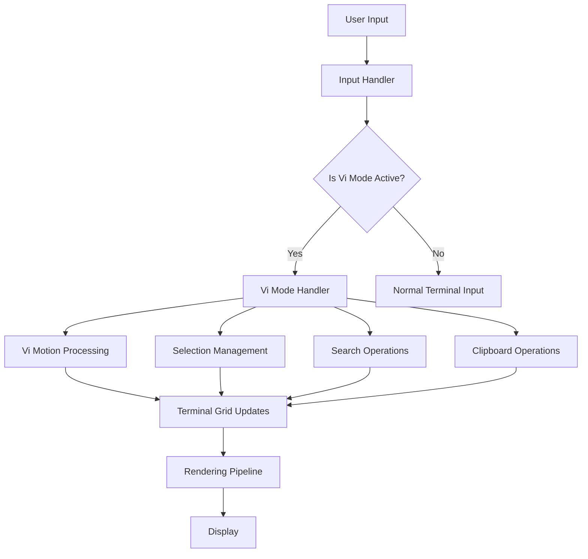
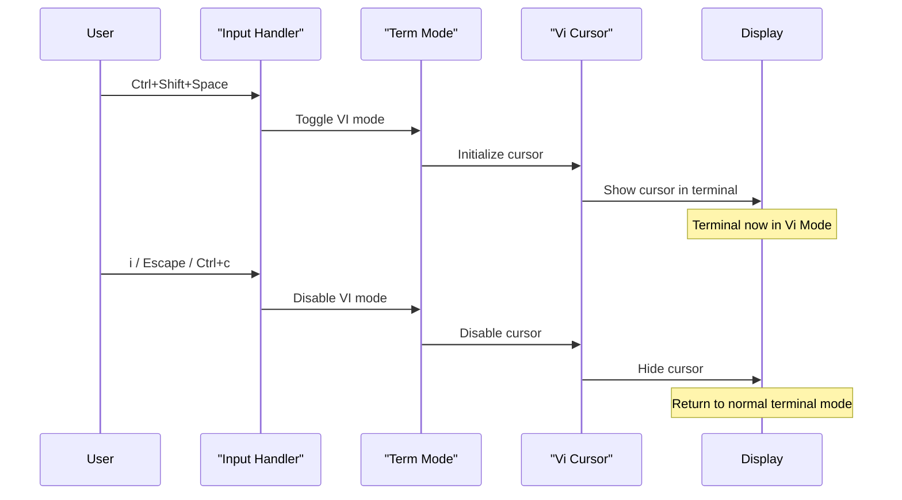
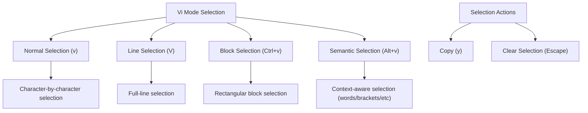
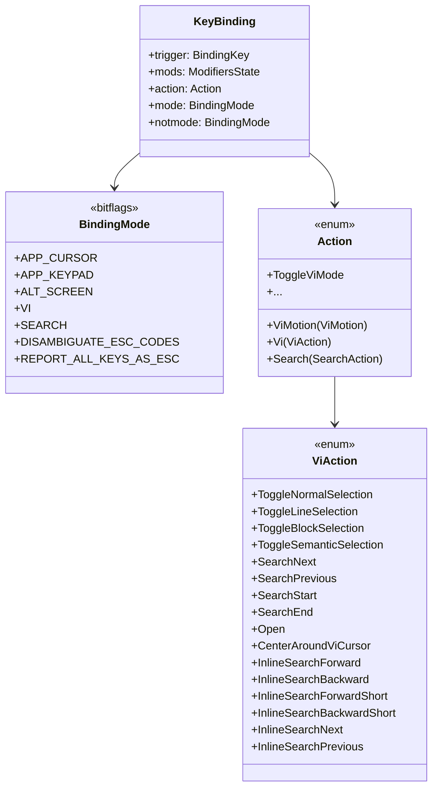

# Vi Mode

<details>
<summary>Relevant source files</summary>

The following files were used as context for generating this wiki page:

- [alacritty/src/config/bindings.rs](https://github.com/alacritty/alacritty/blob/a0c4dfe9/alacritty/src/config/bindings.rs)
- [alacritty/src/config/mod.rs](https://github.com/alacritty/alacritty/blob/a0c4dfe9/alacritty/src/config/mod.rs)
- [alacritty/src/logging.rs](https://github.com/alacritty/alacritty/blob/a0c4dfe9/alacritty/src/logging.rs)
- [alacritty/src/main.rs](https://github.com/alacritty/alacritty/blob/a0c4dfe9/alacritty/src/main.rs)

</details>


This page documents Alacritty's Vi Mode feature, which allows users to navigate and manipulate terminal content using Vi-like key bindings. For information about general key bindings, see [Key and Mouse Bindings](#4.1). For information about search functionality, see [Search and Selection](#4.3).

## Overview

Vi Mode transforms Alacritty's terminal interface to behave similarly to the Vi/Vim text editor, providing keyboard-driven navigation, selection, and content manipulation. When activated, a cursor appears in the terminal content, allowing users to move through the buffer, select text, search for patterns, and interact with content without using the mouse.



*Vi Mode Architecture*

Sources: [alacritty/src/config/bindings.rs:297-330](https://github.com/alacritty/alacritty/blob/a0c4dfe9/alacritty/src/config/bindings.rs#L297-L330), [alacritty/src/config/bindings.rs:752-779](https://github.com/alacritty/alacritty/blob/a0c4dfe9/alacritty/src/config/bindings.rs#L752-L779)

## Enabling and Disabling Vi Mode

Vi Mode is toggled using key bindings. By default, you can:

- Enter Vi Mode: `Ctrl+Shift+Space`
- Exit Vi Mode: Press `i`, `Escape`, or `Ctrl+c`, or press `Ctrl+Shift+Space` again

When Vi Mode is activated, Alacritty sets the `BindingMode::VI` flag, which changes how input events are handled and enables Vi-specific key bindings.



*Vi Mode Activation Sequence*

Sources: [alacritty/src/config/bindings.rs:459-464](https://github.com/alacritty/alacritty/blob/a0c4dfe9/alacritty/src/config/bindings.rs#L459-L464)

## Navigation in Vi Mode

Vi Mode offers multiple navigation methods, mirroring the navigation capabilities in Vi/Vim.

### Basic Movement

| Key | Action | Description |
|-----|--------|-------------|
| `h` or `←` | `ViMotion::Left` | Move cursor left |
| `j` or `↓` | `ViMotion::Down` | Move cursor down |
| `k` or `↑` | `ViMotion::Up` | Move cursor up |
| `l` or `→` | `ViMotion::Right` | Move cursor right |

### Word-based Movement

| Key | Action | Description |
|-----|--------|-------------|
| `w` | `ViMotion::SemanticRight` | Move to next word start |
| `b` | `ViMotion::SemanticLeft` | Move to previous word start |
| `e` | `ViMotion::SemanticRightEnd` | Move to next word end |
| `W` | `ViMotion::WordRight` | Move to next WORD start (whitespace delimited) |
| `B` | `ViMotion::WordLeft` | Move to previous WORD start |
| `E` | `ViMotion::WordRightEnd` | Move to next WORD end |

### Line-based Movement

| Key | Action | Description |
|-----|--------|-------------|
| `0` | `ViMotion::First` | Move to beginning of line |
| `$` | `ViMotion::Last` | Move to end of line |
| `^` | `ViMotion::FirstOccupied` | Move to first non-blank character in line |

### Screen-based Movement

| Key | Action | Description |
|-----|--------|-------------|
| `H` | `ViMotion::High` | Move to top of visible area |
| `M` | `ViMotion::Middle` | Move to middle of visible area |
| `L` | `ViMotion::Low` | Move to bottom of visible area |
| `z` | `ViAction::CenterAroundViCursor` | Center screen around cursor |

### Scrolling

| Key | Action | Description |
|-----|--------|-------------|
| `Ctrl+y` | `Action::ScrollLineUp` | Scroll up one line |
| `Ctrl+e` | `Action::ScrollLineDown` | Scroll down one line |
| `Ctrl+u` | `Action::ScrollHalfPageUp` | Scroll up half a page |
| `Ctrl+d` | `Action::ScrollHalfPageDown` | Scroll down half a page |
| `Ctrl+b` | `Action::ScrollPageUp` | Scroll up one page |
| `Ctrl+f` | `Action::ScrollPageDown` | Scroll down one page |
| `g` | `Action::ScrollToTop` | Go to top of scrollback buffer |
| `G` | `Action::ScrollToBottom` | Go to bottom of scrollback buffer |

Sources: [alacritty/src/config/bindings.rs:465-513](https://github.com/alacritty/alacritty/blob/a0c4dfe9/alacritty/src/config/bindings.rs#L465-L513)

## Selection in Vi Mode

Vi Mode supports multiple selection types, each suited for different text selection needs.



*Vi Mode Selection Types*

Sources: [alacritty/src/config/bindings.rs:297-306](https://github.com/alacritty/alacritty/blob/a0c4dfe9/alacritty/src/config/bindings.rs#L297-L306), [alacritty/src/config/bindings.rs:473-480](https://github.com/alacritty/alacritty/blob/a0c4dfe9/alacritty/src/config/bindings.rs#L473-L480)

### Selection Types

| Key | Action | Description |
|-----|--------|-------------|
| `v` | `ViAction::ToggleNormalSelection` | Character-wise selection |
| `V` | `ViAction::ToggleLineSelection` | Line-wise selection |
| `Ctrl+v` | `ViAction::ToggleBlockSelection` | Rectangular block selection |
| `Alt+v` | `ViAction::ToggleSemanticSelection` | Smart selection based on text context |

### Using Selections

1. Enter Vi Mode with `Ctrl+Shift+Space`
2. Move the cursor to the starting position
3. Press the key for your desired selection type (e.g., `v` for normal selection)
4. Navigate to extend the selection
5. Copy the selection with `y` (equivalent to Vim's yank operation)

Sources: [alacritty/src/config/bindings.rs:473-480](https://github.com/alacritty/alacritty/blob/a0c4dfe9/alacritty/src/config/bindings.rs#L473-L480)

## Search Functionality

Vi Mode provides powerful search capabilities, including both full-buffer search and inline (within-line) search.

### Full-buffer Search

| Key | Action | Description |
|-----|--------|-------------|
| `/` | `Action::SearchForward` | Search forward in buffer |
| `?` | `Action::SearchBackward` | Search backward in buffer |
| `n` | `ViAction::SearchNext` | Find next match |
| `N` | `ViAction::SearchPrevious` | Find previous match |

### Inline Search

| Key | Action | Description |
|-----|--------|-------------|
| `f` + char | `ViAction::InlineSearchForward` | Find next occurrence of character in current line |
| `F` + char | `ViAction::InlineSearchBackward` | Find previous occurrence of character in current line |
| `t` + char | `ViAction::InlineSearchForwardShort` | Find next occurrence of character, stopping just before it |
| `T` + char | `ViAction::InlineSearchBackwardShort` | Find previous occurrence of character, stopping just after it |
| `;` | `ViAction::InlineSearchNext` | Repeat last inline search in same direction |
| `,` | `ViAction::InlineSearchPrevious` | Repeat last inline search in opposite direction |

Sources: [alacritty/src/config/bindings.rs:307-330](https://github.com/alacritty/alacritty/blob/a0c4dfe9/alacritty/src/config/bindings.rs#L307-L330), [alacritty/src/config/bindings.rs:475-490](https://github.com/alacritty/alacritty/blob/a0c4dfe9/alacritty/src/config/bindings.rs#L475-L490)

## Special Features

### URL Handling

When in Vi Mode, you can navigate to URLs displayed in the terminal and open them:

1. Use Vi navigation commands to move the cursor to a URL
2. Press `Enter` to open the URL in your default browser (using the `ViAction::Open` action)

### Bracket Matching

Use `%` to jump between matching brackets (parentheses, square brackets, and curly braces) using the `ViMotion::Bracket` action.

Sources: [alacritty/src/config/bindings.rs:316](https://github.com/alacritty/alacritty/blob/a0c4dfe9/alacritty/src/config/bindings.rs#L316), [alacritty/src/config/bindings.rs:483-513](https://github.com/alacritty/alacritty/blob/a0c4dfe9/alacritty/src/config/bindings.rs#L483-L513)

## Implementation Details

Vi Mode is implemented as a binding mode within Alacritty's input handling system. When active, the `BindingMode::VI` flag is set, which causes input events to be processed differently.



*Vi Mode Code Structure*

Sources: [alacritty/src/config/bindings.rs:26-44](https://github.com/alacritty/alacritty/blob/a0c4dfe9/alacritty/src/config/bindings.rs#L26-L44), [alacritty/src/config/bindings.rs:89-252](https://github.com/alacritty/alacritty/blob/a0c4dfe9/alacritty/src/config/bindings.rs#L89-L252), [alacritty/src/config/bindings.rs:297-330](https://github.com/alacritty/alacritty/blob/a0c4dfe9/alacritty/src/config/bindings.rs#L297-L330), [alacritty/src/config/bindings.rs:747-779](https://github.com/alacritty/alacritty/blob/a0c4dfe9/alacritty/src/config/bindings.rs#L747-L779)

## Customizing Vi Mode

Vi Mode key bindings can be customized in your Alacritty configuration file. Here's an example of how to customize Vi Mode bindings:

```toml
# Example: Change the binding to enter Vi Mode
[[keyboard.bindings]]
key = "Space"
mods = "Control|Shift"
action = "ToggleViMode"

# Example: Add a custom Vi Mode binding
[[keyboard.bindings]]
key = "D"
mode = "Vi"
action = "ScrollHalfPageDown"

# Example: Custom Vi Mode selection binding
[[keyboard.bindings]]
key = "Y"
mode = "Vi"
action = "Copy"
```

For more information on customizing key bindings, refer to the [Key and Mouse Bindings](#4.1) page.