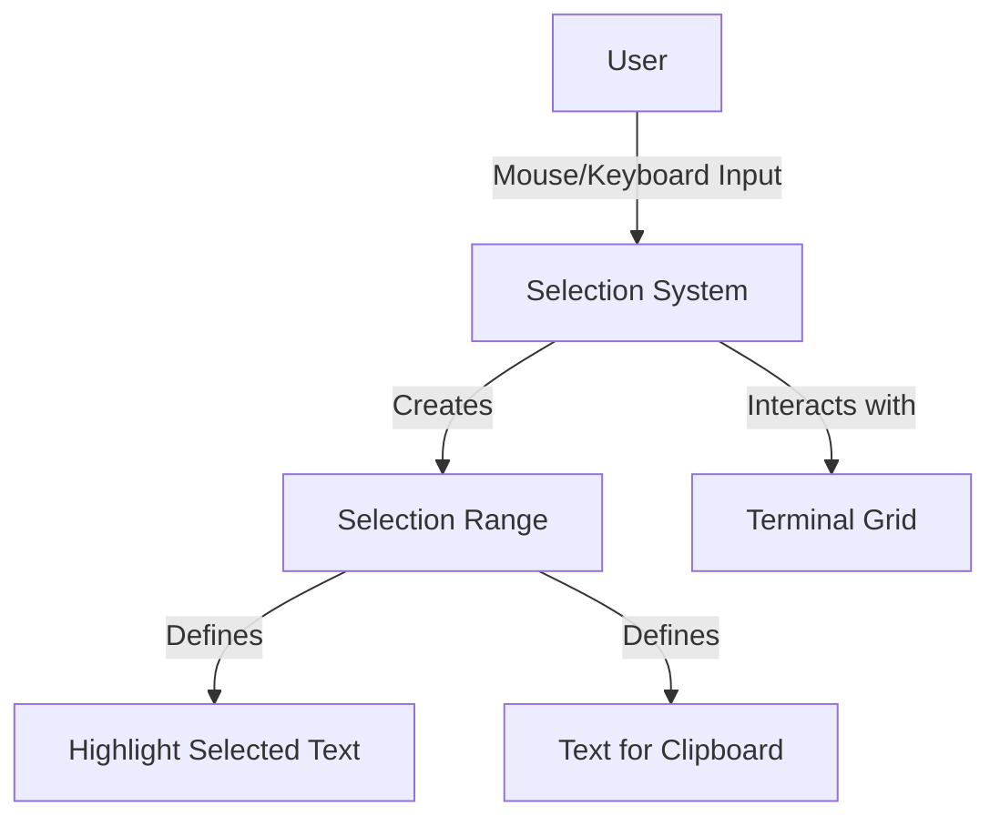
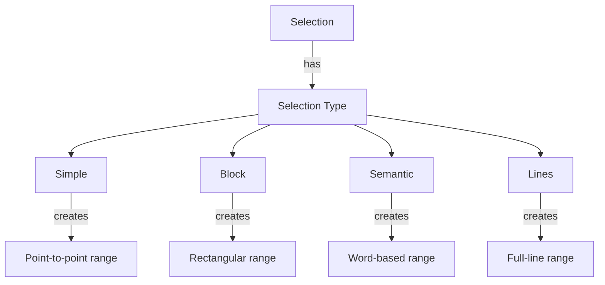
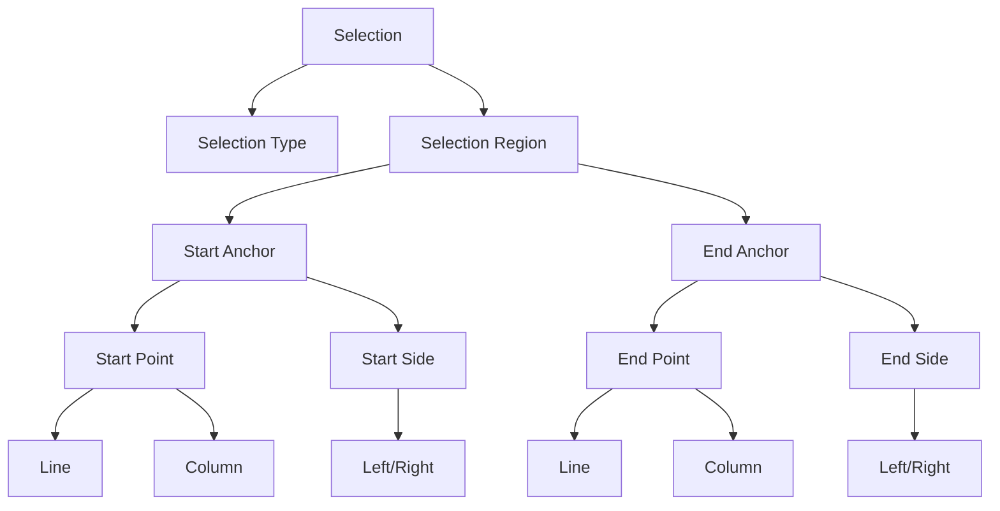
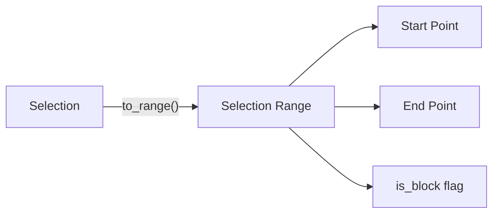
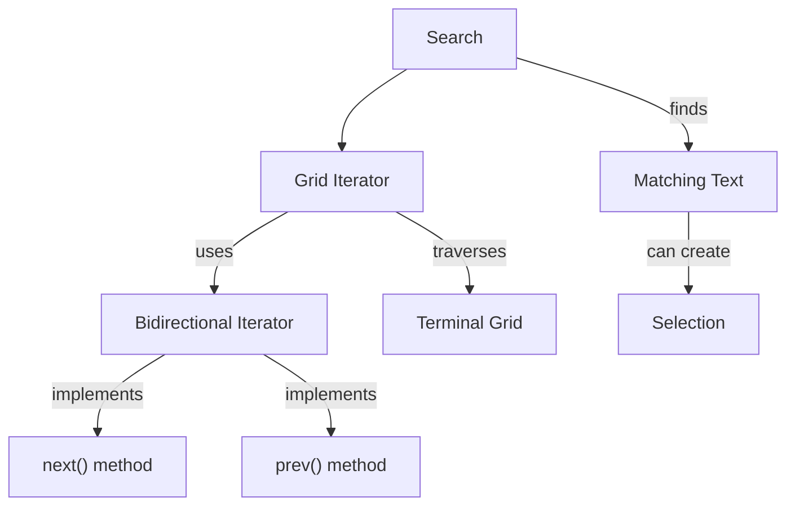
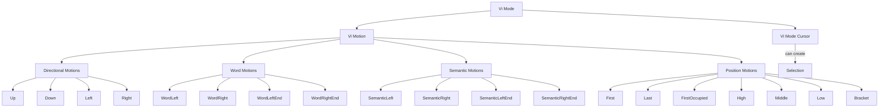
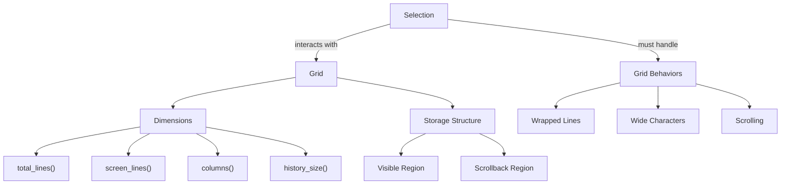

# Search and Selection

Relevant source files

The following files were used as context for generating this wiki page:

- [alacritty_terminal/src/grid/mod.rs](https://github.com/alacritty/alacritty/blob/a0c4dfe9/alacritty_terminal/src/grid/mod.rs)
- [alacritty_terminal/src/grid/resize.rs](https://github.com/alacritty/alacritty/blob/a0c4dfe9/alacritty_terminal/src/grid/resize.rs)
- [alacritty_terminal/src/grid/row.rs](https://github.com/alacritty/alacritty/blob/a0c4dfe9/alacritty_terminal/src/grid/row.rs)
- [alacritty_terminal/src/grid/storage.rs](https://github.com/alacritty/alacritty/blob/a0c4dfe9/alacritty_terminal/src/grid/storage.rs)
- [alacritty_terminal/src/grid/tests.rs](https://github.com/alacritty/alacritty/blob/a0c4dfe9/alacritty_terminal/src/grid/tests.rs)
- [alacritty_terminal/src/index.rs](https://github.com/alacritty/alacritty/blob/a0c4dfe9/alacritty_terminal/src/index.rs)
- [alacritty_terminal/src/selection.rs](https://github.com/alacritty/alacritty/blob/a0c4dfe9/alacritty_terminal/src/selection.rs)
- [alacritty_terminal/src/term/cell.rs](https://github.com/alacritty/alacritty/blob/a0c4dfe9/alacritty_terminal/src/term/cell.rs)
- [alacritty_terminal/src/vi_mode.rs](https://github.com/alacritty/alacritty/blob/a0c4dfe9/alacritty_terminal/src/vi_mode.rs)

This page explains Alacritty's search and selection systems, which allow users to find, highlight, and interact with text in the terminal. For information about key bindings and mouse actions that control search and selection, see [Key and Mouse Bindings](#4.1) and [Vi Mode](#4.2).

## Selection System Overview

The selection system in Alacritty enables users to select and interact with text displayed in the terminal. Selections can be used to copy text to the clipboard, highlight information, or as targets for commands.

Sources: [alacritty_terminal/src/selection.rs:1-7](https://github.com/alacritty/alacritty/blob/a0c4dfe9/alacritty_terminal/src/selection.rs#L1-L7)

## Selection Types

Alacritty supports four types of selections, each with different behaviors:

| Selection Type | Description | Behavior |
|----------------|-------------|----------|
| Simple | Basic point-to-point selection | Selects all cells between start and end points |
| Block | Rectangular selection | Selects a rectangular region defined by start and end corners |
| Semantic | Semantic selection | Expands to semantic boundaries (like word boundaries) |
| Lines | Line selection | Always selects entire lines |

Sources: [alacritty_terminal/src/selection.rs:92-98](https://github.com/alacritty/alacritty/blob/a0c4dfe9/alacritty_terminal/src/selection.rs#L92-L98), [alacritty_terminal/src/selection.rs:101-117](https://github.com/alacritty/alacritty/blob/a0c4dfe9/alacritty_terminal/src/selection.rs#L101-L117)

## Selection Architecture

A selection in Alacritty is represented by the `Selection` struct, which contains a selection type and a region. The region is defined by two anchors: a start anchor and an end anchor. Each anchor consists of a point (line and column) and a side (left or right).

When a selection is used (e.g., for rendering or copying), it's converted to a `SelectionRange` using the `to_range` method. The `SelectionRange` contains a start point, an end point, and a flag indicating whether it's a block selection.

Sources: [alacritty_terminal/src/selection.rs:19-29](https://github.com/alacritty/alacritty/blob/a0c4dfe9/alacritty_terminal/src/selection.rs#L19-L29), [alacritty_terminal/src/selection.rs:33-40](https://github.com/alacritty/alacritty/blob/a0c4dfe9/alacritty_terminal/src/selection.rs#L33-L40), [alacritty_terminal/src/selection.rs:119-122](https://github.com/alacritty/alacritty/blob/a0c4dfe9/alacritty_terminal/src/selection.rs#L119-L122), [alacritty_terminal/src/selection.rs:271-296](https://github.com/alacritty/alacritty/blob/a0c4dfe9/alacritty_terminal/src/selection.rs#L271-L296)

## Selection Operations

The `Selection` struct provides several methods to manipulate selections:

- `new`: Creates a new selection at a specific point with a given selection type
- `update`: Updates the end point of the selection when the user moves the cursor
- `rotate`: Adjusts the selection when the grid content scrolls
- `is_empty`: Checks if the selection contains no cells
- `intersects_range`: Determines if the selection overlaps with a range of lines
- `include_all`: Expands the selection to include all cells between the start and end points
- `to_range`: Converts the selection to a `SelectionRange` for rendering or copying

The `SelectionRange` struct provides methods to check if a point or cell is part of the selection:

- `contains`: Checks if a point falls within the selection boundaries
- `contains_cell`: Checks if a cell is part of the selection, handling special cases like wide characters

Sources: [alacritty_terminal/src/selection.rs:124-297](https://github.com/alacritty/alacritty/blob/a0c4dfe9/alacritty_terminal/src/selection.rs#L124-L297), [alacritty_terminal/src/selection.rs:50-88](https://github.com/alacritty/alacritty/blob/a0c4dfe9/alacritty_terminal/src/selection.rs#L50-L88)

## Search Functionality

Alacritty allows users to search for text within the terminal buffer. The search functionality traverses the terminal grid to find matching text.

The `GridIterator` in `grid/mod.rs` provides methods to iterate through the grid in both forward and backward directions, which enables bidirectional text searching. The `BidirectionalIterator` trait adds the `prev()` method to complement the standard iterator's `next()` method, allowing backward traversal.

Sources: [alacritty_terminal/src/grid/mod.rs:569-638](https://github.com/alacritty/alacritty/blob/a0c4dfe9/alacritty_terminal/src/grid/mod.rs#L569-L638), [alacritty_terminal/src/grid/mod.rs:614-619](https://github.com/alacritty/alacritty/blob/a0c4dfe9/alacritty_terminal/src/grid/mod.rs#L614-L619)

## Vi Mode Integration

Alacritty includes a Vi mode that provides Vi-like navigation and selection capabilities. Vi mode is closely integrated with the selection system, allowing for efficient text selection using keyboard commands.

The `ViModeCursor` struct represents the cursor position in Vi mode and provides methods for moving the cursor, such as `motion` and `scroll`. These methods can be used in combination with selection commands to create and modify selections.

Sources: [alacritty_terminal/src/vi_mode.rs:13-55](https://github.com/alacritty/alacritty/blob/a0c4dfe9/alacritty_terminal/src/vi_mode.rs#L13-L55), [alacritty_terminal/src/vi_mode.rs:58-176](https://github.com/alacritty/alacritty/blob/a0c4dfe9/alacritty_terminal/src/vi_mode.rs#L58-L176)

## Selection and Grid Interaction

Selections in Alacritty must account for various terminal grid behaviors, including wrapped lines, wide characters, and scrolling. The grid is a specialized 2D structure optimized for terminal display, and selections interact closely with it.

When the grid scrolls, the `rotate` method of the `Selection` struct is called to adjust the selection's position. This ensures that selections remain attached to the correct content even as the terminal scrolls.

Sources: [alacritty_terminal/src/grid/mod.rs:81-138](https://github.com/alacritty/alacritty/blob/a0c4dfe9/alacritty_terminal/src/grid/mod.rs#L81-L138), [alacritty_terminal/src/selection.rs:137-191](https://github.com/alacritty/alacritty/blob/a0c4dfe9/alacritty_terminal/src/selection.rs#L137-L191)

## Common Use Cases

The search and selection functionality in Alacritty enables several common workflows:

1. **Basic Text Selection**: Click and drag with the mouse to create a simple selection for copying text.
2. **Block Selection**: Use keyboard shortcuts or mouse modifiers to create a rectangular block selection, useful for selecting columns of text.
3. **Semantic Selection**: Quickly select entire words or semantic units with double-click or semantic selection commands.
4. **Line Selection**: Select entire lines with triple-click or line selection commands.
5. **Text Search**: Search for specific text patterns within the terminal buffer.
6. **Vi Mode Navigation and Selection**: Use Vi-style commands to efficiently navigate and select text without requiring the mouse.

Sources: [alacritty_terminal/src/selection.rs:1-7](https://github.com/alacritty/alacritty/blob/a0c4dfe9/alacritty_terminal/src/selection.rs#L1-L7)

## Handling Edge Cases

The selection system handles several edge cases to ensure consistent behavior:

1. **Empty Selections**: The `is_empty` method determines if a selection contains any cells, which depends on the selection type.
2. **Wide Characters**: The `contains_cell` method in `SelectionRange` properly handles wide characters that span multiple cells.
3. **Line Wrapping**: Selections can span across wrapped lines and handle the line wrap markers correctly.
4. **Grid Boundaries**: Selections are clamped to the grid boundaries when converted to a `SelectionRange`.
5. **Scrolling Content**: The `rotate` method adjusts selections when the grid content scrolls.