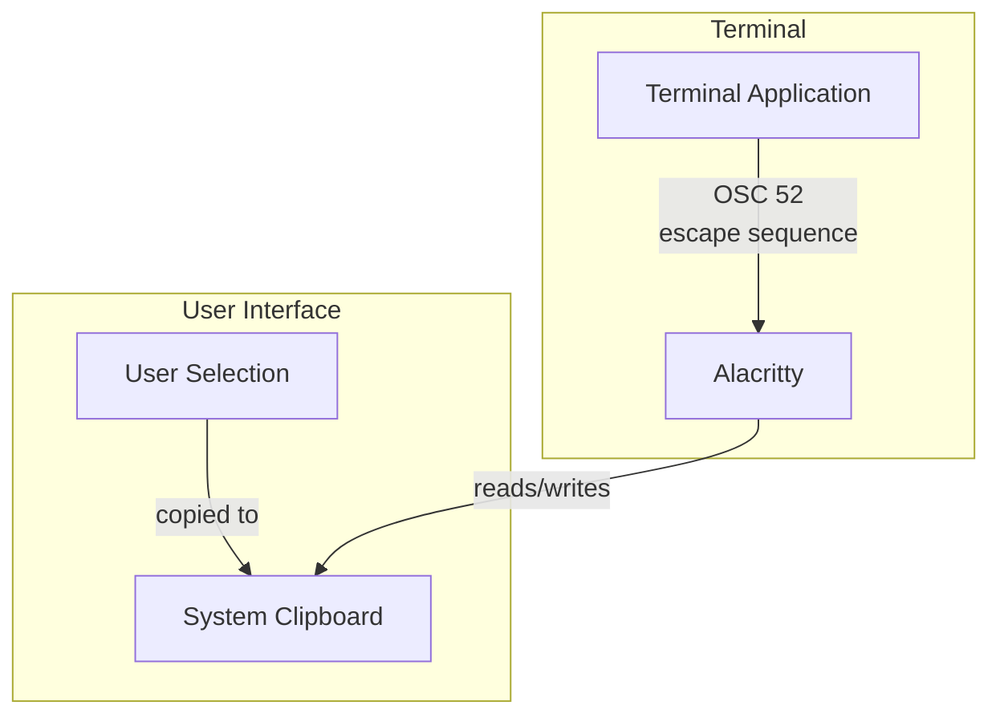
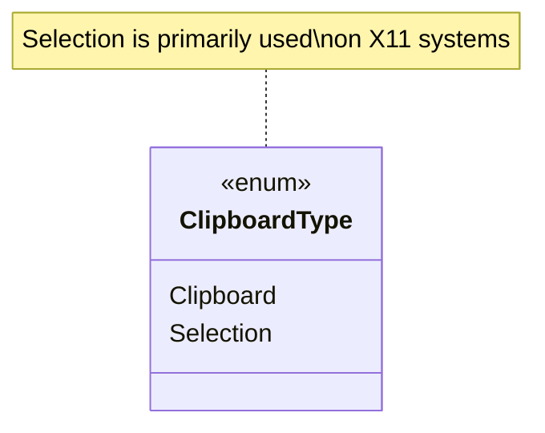
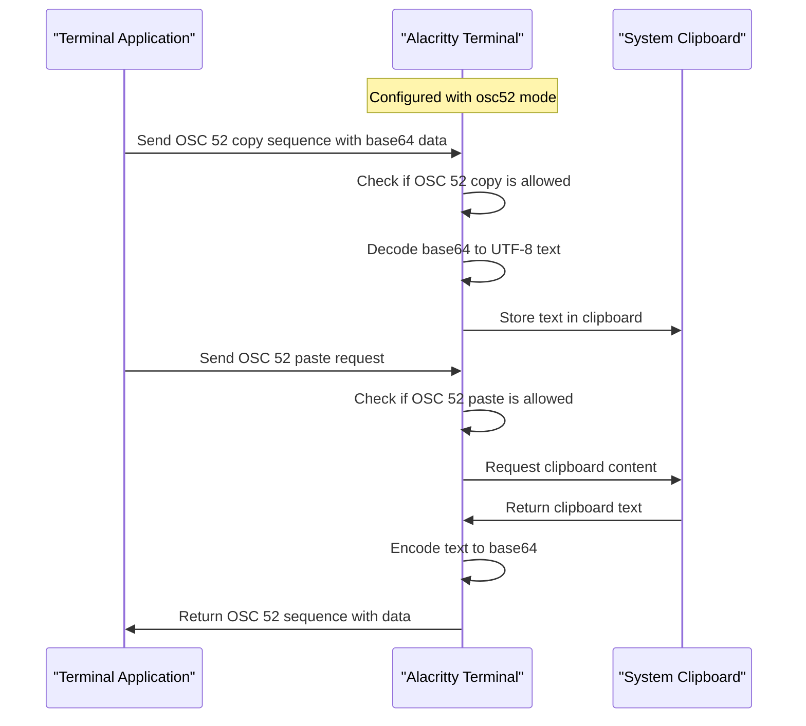
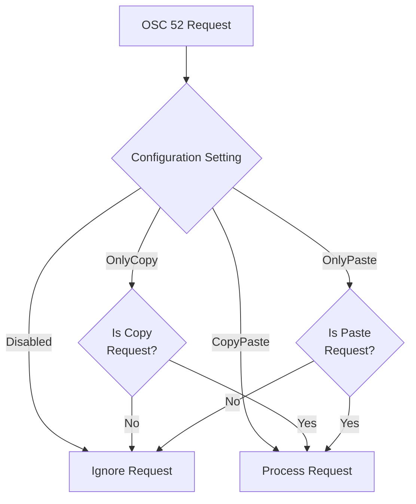
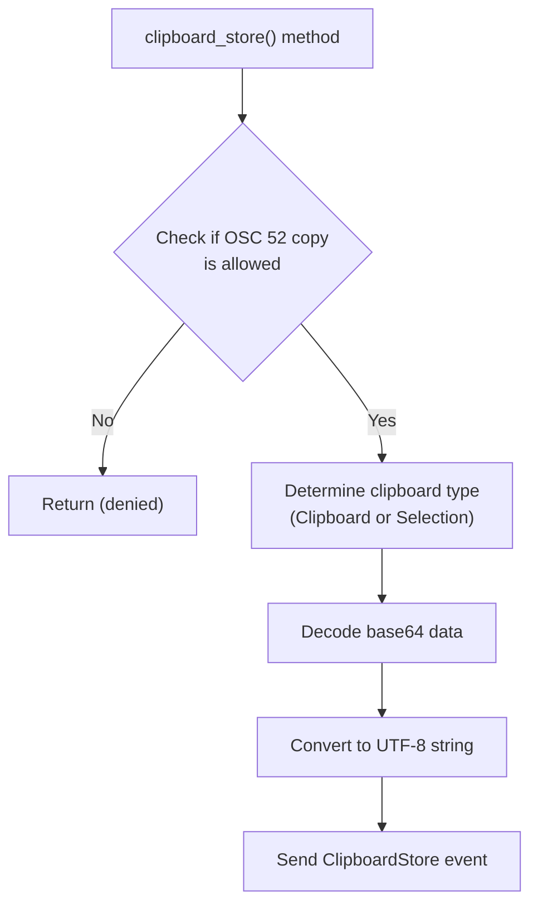
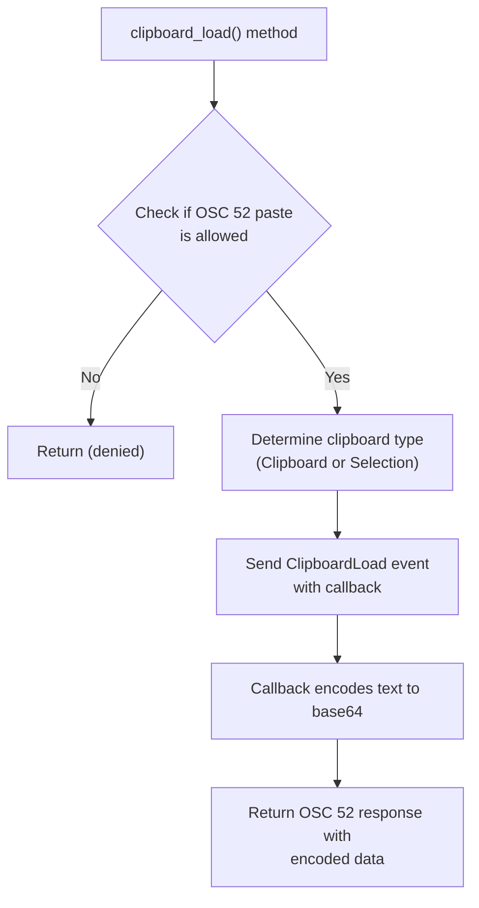
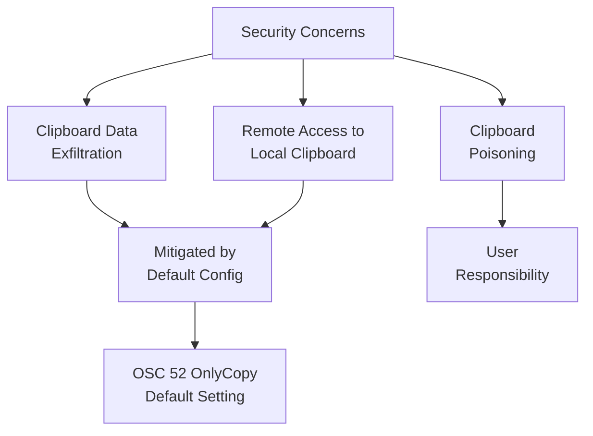

# Clipboard Integration

<details>
<summary>Relevant source files</summary>

The following files were used as context for generating this wiki page:

- [alacritty_terminal/src/term/mod.rs](https://github.com/alacritty/alacritty/blob/a0c4dfe9/alacritty_terminal/src/term/mod.rs)
- [alacritty_terminal/tests/ref.rs](https://github.com/alacritty/alacritty/blob/a0c4dfe9/alacritty_terminal/tests/ref.rs)

</details>


This page explains how Alacritty integrates with the system clipboard, including both direct clipboard access and support for the OSC 52 escape sequence. This allows terminal applications to read from and write to the clipboard, enabling powerful workflows, particularly for terminal-based text editors and remote sessions.

## Overview

Alacritty supports two primary methods of clipboard integration:

1. **Selection-based copying**: Text selected in the terminal can be copied to the system clipboard
2. **OSC 52 escape sequence**: A standardized way for terminal applications to directly access the clipboard



Sources: [alacritty_terminal/src/term/mod.rs:529-555](https://github.com/alacritty/alacritty/blob/a0c4dfe9/alacritty_terminal/src/term/mod.rs#L529-L555), [alacritty_terminal/src/term/mod.rs:1705-1747](https://github.com/alacritty/alacritty/blob/a0c4dfe9/alacritty_terminal/src/term/mod.rs#L1705-L1747)

## Clipboard Types

Alacritty supports two types of clipboards, defined in the `ClipboardType` enum:



- **Clipboard**: The standard system clipboard (accessed via Ctrl+C/Ctrl+V)
- **Selection**: The X11 primary selection clipboard (accessed via middle-click)

Sources: [alacritty_terminal/src/term/mod.rs:2316-2319](https://github.com/alacritty/alacritty/blob/a0c4dfe9/alacritty_terminal/src/term/mod.rs#L2316-L2319)

## OSC 52 Escape Sequence

OSC 52 is an escape sequence that enables terminal applications to interact with the system clipboard. This is particularly useful for terminal applications like Vim, Emacs, or when working in remote SSH sessions.

### Format

The OSC 52 escape sequence follows this format:

```
ESC]52;<clipboard-type>;<base64-data>ST
```

Where:
- `ESC` is the escape character (0x1B)
- `52` indicates clipboard operation
- `<clipboard-type>` is one of:
  - `c` for system clipboard
  - `p` or `s` for selection clipboard
- `<base64-data>` is the clipboard data encoded in base64
- `ST` is the string terminator (ESC\\ or BEL)

### Implementation Flow



Sources: [alacritty_terminal/src/term/mod.rs:1705-1722](https://github.com/alacritty/alacritty/blob/a0c4dfe9/alacritty_terminal/src/term/mod.rs#L1705-L1722), [alacritty_terminal/src/term/mod.rs:1726-1747](https://github.com/alacritty/alacritty/blob/a0c4dfe9/alacritty_terminal/src/term/mod.rs#L1726-L1747)

## Configuration

Alacritty's clipboard integration can be configured through the `osc52` option in the terminal configuration. This controls how OSC 52 escape sequences are handled for security reasons.

The `Osc52` enum defines four possible settings:

| Setting | Description |
|---------|-------------|
| `Disabled` | OSC 52 escape sequences are completely ignored |
| `OnlyCopy` | Only writing to clipboard is allowed (default) |
| `OnlyPaste` | Only reading from clipboard is allowed |
| `CopyPaste` | Both reading and writing are allowed |

The default setting (`OnlyCopy`) is designed as a security compromise - allowing applications to copy data to the clipboard but not read potentially sensitive clipboard contents.



Sources: [alacritty_terminal/src/term/mod.rs:370-385](https://github.com/alacritty/alacritty/blob/a0c4dfe9/alacritty_terminal/src/term/mod.rs#L370-L385), [alacritty_terminal/src/term/mod.rs:1706-1709](https://github.com/alacritty/alacritty/blob/a0c4dfe9/alacritty_terminal/src/term/mod.rs#L1706-L1709), [alacritty_terminal/src/term/mod.rs:1727-1730](https://github.com/alacritty/alacritty/blob/a0c4dfe9/alacritty_terminal/src/term/mod.rs#L1727-L1730)

## Implementation Details

### Clipboard Store Operation

When an OSC 52 store (copy) operation is received:

1. The terminal checks if the operation is allowed based on configuration
2. The base64-encoded data is decoded
3. The data is converted to a UTF-8 string
4. An event is sent to store the text in the appropriate clipboard



Sources: [alacritty_terminal/src/term/mod.rs:1705-1722](https://github.com/alacritty/alacritty/blob/a0c4dfe9/alacritty_terminal/src/term/mod.rs#L1705-L1722)

### Clipboard Load Operation

When an OSC 52 load (paste) operation is received:

1. The terminal checks if the operation is allowed based on configuration
2. The clipboard type is determined (system clipboard or selection)
3. A clipboard load event is sent with a callback function
4. The callback encodes the clipboard content as base64
5. The encoded data is returned in an OSC 52 response



Sources: [alacritty_terminal/src/term/mod.rs:1726-1747](https://github.com/alacritty/alacritty/blob/a0c4dfe9/alacritty_terminal/src/term/mod.rs#L1726-L1747)

### Selection to Clipboard

Alacritty provides functionality to convert terminal selection to text that can be copied:

1. The `selection_to_string` method converts the current selection to a string
2. Different selection types (simple, line, block) are handled appropriately
3. The resulting string can then be copied to the clipboard

Sources: [alacritty_terminal/src/term/mod.rs:529-555](https://github.com/alacritty/alacritty/blob/a0c4dfe9/alacritty_terminal/src/term/mod.rs#L529-L555)

## Security Considerations

The clipboard integration features have important security implications:

1. **Reading from clipboard**: Applications could potentially steal sensitive information from the clipboard
2. **Remote machines**: When connected via SSH, remote servers could access the local machine's clipboard
3. **Untrusted content**: Terminal applications could write malicious content to the clipboard

These concerns are addressed through the configurable `osc52` setting, with the default `OnlyCopy` setting preventing clipboard reading while allowing writing.



Sources: [alacritty_terminal/src/term/mod.rs:1705-1722](https://github.com/alacritty/alacritty/blob/a0c4dfe9/alacritty_terminal/src/term/mod.rs#L1705-L1722), [alacritty_terminal/src/term/mod.rs:1726-1747](https://github.com/alacritty/alacritty/blob/a0c4dfe9/alacritty_terminal/src/term/mod.rs#L1726-L1747), [alacritty_terminal/src/term/mod.rs:370-385](https://github.com/alacritty/alacritty/blob/a0c4dfe9/alacritty_terminal/src/term/mod.rs#L370-L385)

## Related Features

The clipboard integration works alongside other terminal features:

- **Selection System**: Different selection modes determine what text gets copied
- **Event System**: Clipboard events are processed through the terminal event system
- **Key Bindings**: Keyboard shortcuts can be configured for clipboard operations