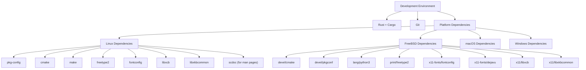
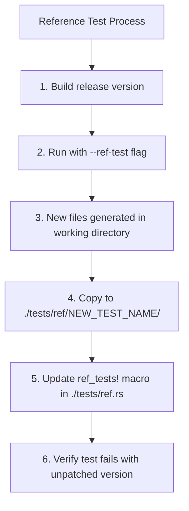
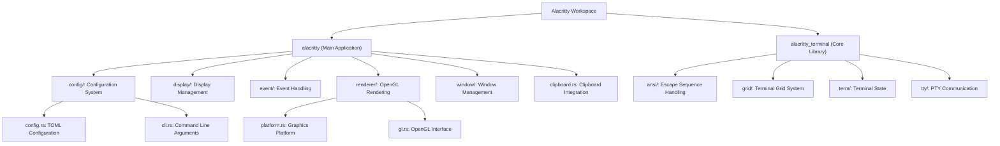
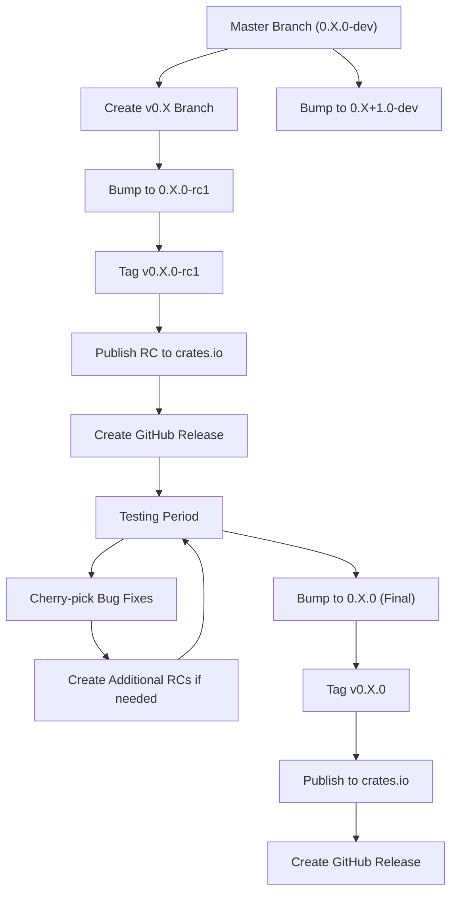

# Developer Guide

<details>
<summary>Relevant source files</summary>

The following files were used as context for generating this wiki page:

- [.builds/freebsd.yml](https://github.com/alacritty/alacritty/blob/a0c4dfe9/.builds/freebsd.yml)
- [.builds/linux.yml](https://github.com/alacritty/alacritty/blob/a0c4dfe9/.builds/linux.yml)
- [.github/workflows/ci.yml](https://github.com/alacritty/alacritty/blob/a0c4dfe9/.github/workflows/ci.yml)
- [CONTRIBUTING.md](https://github.com/alacritty/alacritty/blob/a0c4dfe9/CONTRIBUTING.md)
- [alacritty/build.rs](https://github.com/alacritty/alacritty/blob/a0c4dfe9/alacritty/build.rs)
- [alacritty/src/clipboard.rs](https://github.com/alacritty/alacritty/blob/a0c4dfe9/alacritty/src/clipboard.rs)
- [alacritty/src/renderer/platform.rs](https://github.com/alacritty/alacritty/blob/a0c4dfe9/alacritty/src/renderer/platform.rs)

</details>


This document provides essential information for developers who want to contribute to or modify the Alacritty terminal emulator. It covers development environment setup, building and testing processes, project structure, contribution guidelines, and the release workflow.

For detailed instructions on building and testing Alacritty, see [Building and Testing](#5.1). For information about the release process, see [Release Process](#5.2).

## Development Environment Setup

To contribute to Alacritty, you'll need the following components:

1. **Rust and Cargo**: Alacritty specifies a minimum supported Rust version (MSRV) in `alacritty/Cargo.toml`. The project must always build with this version.
2. **Git**: For version control and contributions
3. **Platform-specific dependencies**: Required libraries vary by operating system

### Platform-Specific Dependencies



Sources: [.builds/linux.yml:3-11](https://github.com/alacritty/alacritty/blob/a0c4dfe9/.builds/linux.yml#L3-L11), [.builds/freebsd.yml:3-11](https://github.com/alacritty/alacritty/blob/a0c4dfe9/.builds/freebsd.yml#L3-L11)

#### Linux (Arch Linux example)
```
pacman -S pkg-config cmake make freetype2 fontconfig libxcb libxkbcommon scdoc
```

#### FreeBSD
```
pkg install cmake pkgconf python3 freetype2 fontconfig dejavu libxcb libxkbcommon
```

## Building and Testing

### Basic Build Commands

```
cargo build          # Debug build
cargo build --release  # Release build
```

Sources: [.github/workflows/ci.yml:18-19](https://github.com/alacritty/alacritty/blob/a0c4dfe9/.github/workflows/ci.yml#L18-L19)

### Running Tests

```
cargo test  # Run all tests
```

For testing specific features on Linux:
```
cargo test --no-default-features --features=x11      # X11 only
cargo test --no-default-features --features=wayland  # Wayland only
```

Sources: [CONTRIBUTING.md:52-59](https://github.com/alacritty/alacritty/blob/a0c4dfe9/CONTRIBUTING.md#L52-L59), [.builds/linux.yml:32-50](https://github.com/alacritty/alacritty/blob/a0c4dfe9/.builds/linux.yml#L32-L50), [.builds/freebsd.yml:19-40](https://github.com/alacritty/alacritty/blob/a0c4dfe9/.builds/freebsd.yml#L19-L40)

### Reference Testing

Alacritty uses reference tests to verify terminal behavior:



Sources: [CONTRIBUTING.md:64-70](https://github.com/alacritty/alacritty/blob/a0c4dfe9/CONTRIBUTING.md#L64-L70)

### Code Quality Tools

```
# Run Clippy (Rust linter)
rustup component add clippy
cargo clippy --all-targets

# Check code formatting
rustup toolchain install nightly -c rustfmt
cargo +nightly fmt -- --check

# Apply formatting
cargo +nightly fmt
```

Sources: [CONTRIBUTING.md:100-104](https://github.com/alacritty/alacritty/blob/a0c4dfe9/CONTRIBUTING.md#L100-L104), [.builds/linux.yml:22-25](https://github.com/alacritty/alacritty/blob/a0c4dfe9/.builds/linux.yml#L22-L25), [.github/workflows/ci.yml:26-29](https://github.com/alacritty/alacritty/blob/a0c4dfe9/.github/workflows/ci.yml#L26-L29)

## Project Structure

Alacritty is organized as a workspace with two main crates:



Sources: [alacritty/src/renderer/platform.rs:1-167](https://github.com/alacritty/alacritty/blob/a0c4dfe9/alacritty/src/renderer/platform.rs#L1-L167), [alacritty/src/clipboard.rs:1-83](https://github.com/alacritty/alacritty/blob/a0c4dfe9/alacritty/src/clipboard.rs#L1-L83), [alacritty/build.rs:1-38](https://github.com/alacritty/alacritty/blob/a0c4dfe9/alacritty/build.rs#L1-L38)

### Key Components

| Component | Description | Key Files |
|-----------|-------------|-----------|
| Terminal Core | Terminal state, grid management, escape sequence processing | `alacritty_terminal/src/term/`, `alacritty_terminal/src/grid/` |
| Event System | Input and window event processing | `alacritty/src/event/` |
| Rendering | OpenGL rendering of terminal content | `alacritty/src/renderer/` |
| PTY System | Communication with shell processes | `alacritty_terminal/src/tty/` |
| Configuration | TOML config loading and CLI argument handling | `alacritty/src/config/` |
| Clipboard | Cross-platform clipboard integration | `alacritty/src/clipboard.rs` |
| Build System | Version info and OpenGL bindings generation | `alacritty/build.rs` |

## Contribution Guidelines

### Finding Issues to Work On

Look for issues labeled [help wanted](https://github.com/alacritty/alacritty/issues?q=is%3Aopen+is%3Aissue+label%3A%22help+wanted%22) or [easy](https://github.com/alacritty/alacritty/issues?q=is%3Aopen+is%3Aissue+label%3A%22D+-+easy%22) to get started.

Sources: [CONTRIBUTING.md:35-43](https://github.com/alacritty/alacritty/blob/a0c4dfe9/CONTRIBUTING.md#L35-L43)

### Pull Request Workflow

```mermaid
flowchart LR
    Find["Find/Create Issue"] --> Fork["Fork Repository"]
    Fork --> Branch["Create Branch"]
    Branch --> Change["Implement Changes"]
    Change --> Test["Run Tests"]
    Test --> Clippy["Run Clippy"]
    Clippy --> Format["Check Formatting"]
    Format --> Doc["Update Documentation"]
    Doc --> PR["Submit Pull Request"]
```



Sources: [CONTRIBUTING.md:35-43](https://github.com/alacritty/alacritty/blob/a0c4dfe9/CONTRIBUTING.md#L35-L43)

### Code Style Requirements

- Follow [Rust API Guidelines](https://rust-lang.github.io/api-guidelines)
- All comments must be fully punctuated with a trailing period
- Use `rustfmt` for consistent formatting

Sources: [CONTRIBUTING.md:100-111](https://github.com/alacritty/alacritty/blob/a0c4dfe9/CONTRIBUTING.md#L100-L111)

### Documentation Requirements

When making changes, update the appropriate documentation:

- Code comments for implementation details
- `CHANGELOG.md` for user-facing changes
- Man pages for configuration option changes
- `alacritty_terminal/CHANGELOG.md` for library changes

Sources: [CONTRIBUTING.md:85-98](https://github.com/alacritty/alacritty/blob/a0c4dfe9/CONTRIBUTING.md#L85-L98)

## Performance Testing

Alacritty prioritizes performance, so changes that could affect throughput or latency must be benchmarked:

| Tool | Purpose | Platform Support |
|------|---------|------------------|
| [vtebench](https://github.com/alacritty/vtebench) | Terminal throughput testing | All platforms |
| [typometer](https://github.com/pavelfatin/typometer) | Keyboard latency measurement | X11, Windows, macOS |

Performance tests should be run on the latest Rust stable release to ensure consistency.

Sources: [CONTRIBUTING.md:72-83](https://github.com/alacritty/alacritty/blob/a0c4dfe9/CONTRIBUTING.md#L72-L83)

## Release Process

Alacritty follows a structured release process using separate branches for releases while development continues on the main branch.



### Major/Minor Release Process

1. Create a new branch `v0.X` from master
2. In the branch, bump version to `0.X.0-rc1` and tag as `v0.X.0-rc1`
3. On master, bump version to `0.X+1.0-dev`
4. Cherry-pick bug fixes from master to the release branch
5. Create additional release candidates as needed
6. When ready, bump to `0.X.0`, tag, and publish final release

### Patch Release Process

1. Check out existing release branch (e.g., `v0.2` for a `0.2.3` release)
2. Cherry-pick bug fixes from master
3. Follow the same RC and release process as for major versions

The `alacritty_terminal` crate is released in synchronization with `alacritty`, using identical version suffixes.

Sources: [CONTRIBUTING.md:113-158](https://github.com/alacritty/alacritty/blob/a0c4dfe9/CONTRIBUTING.md#L113-L158)

## Community Resources

- [Alacritty Issue Tracker](https://github.com/alacritty/alacritty/issues) for questions and bug reports
- IRC: #alacritty on Libera.Chat for direct communication with contributors